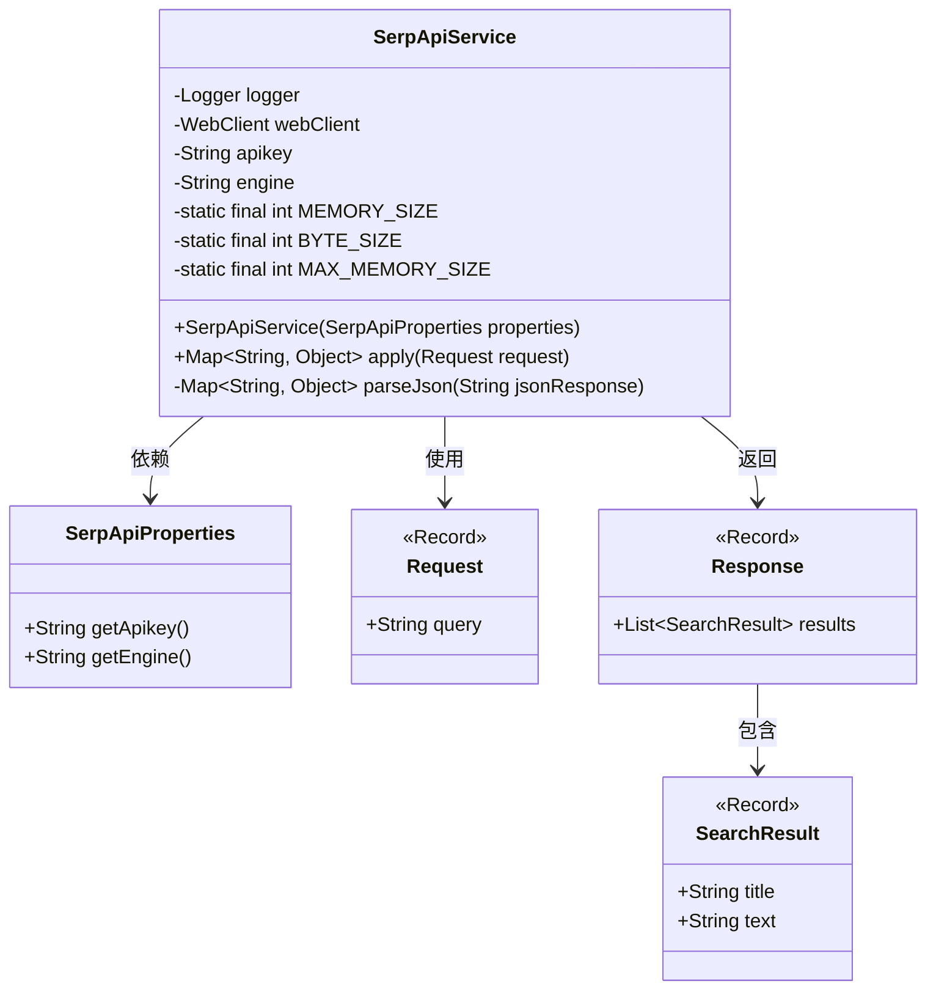
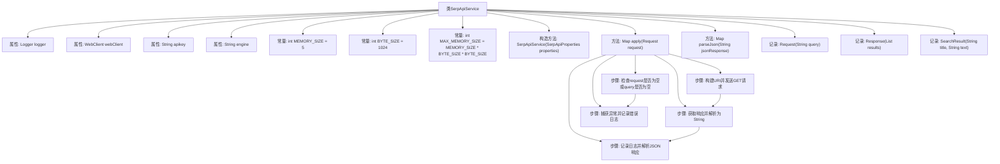

# 基础信息

|      |      |
|------|------|
| 名称 | SerpApiService |
| 编码语言 | .java |
| 代码路径 | spring-ai-alibaba/community/openmanus/src/main/java/com/alibaba/cloud/ai/example/manus/tool/support/serpapi/SerpApiService.java |
| 包名 | com.alibaba.cloud.ai.example.manus.tool.support.serpapi |
| 依赖项 | ['java.util.ArrayList', 'java.util.List', 'java.util.Map', 'java.util.function.Function', 'com.fasterxml.jackson.annotation.JsonClassDescription', 'com.fasterxml.jackson.annotation.JsonInclude', 'com.fasterxml.jackson.annotation.JsonProperty', 'com.fasterxml.jackson.annotation.JsonPropertyDescription', 'com.google.gson.Gson', 'com.google.gson.JsonArray', 'com.google.gson.JsonElement', 'com.google.gson.JsonObject', 'org.jsoup.Jsoup', 'org.jsoup.nodes.Document', 'org.slf4j.Logger', 'org.slf4j.LoggerFactory', 'reactor.core.publisher.Mono', 'org.springframework.http.HttpHeaders', 'org.springframework.http.HttpMethod', 'org.springframework.util.StringUtils', 'org.springframework.web.reactive.function.client.WebClient', 'com.alibaba.cloud.ai.example.manus.tool.support.serpapi.SerpApiProperties.SERP_API_URL', 'com.alibaba.cloud.ai.example.manus.tool.support.serpapi.SerpApiProperties.USER_AGENT_VALUE'] |
| 概述说明 | SerpApiService类调用SerpApi搜索，管理API密钥、引擎配置和WebClient，支持GET请求和JSON解析。 |

# 说明

SerpApiService类是一个用于调用SerpApi搜索服务的工具类。它主要负责处理API密钥的配置、搜索引擎的设置以及WebClient的初始化工作。该类支持通过GET请求方式向SerpApi发送搜索请求，并能够解析返回的JSON格式响应数据，从而实现与SerpApi的交互和数据获取。

# 类列表 Class Summary

| 名称   | 类型  | 说明 |
|-------|------|-------------|
| SerpApiService | class | SerpApiService类用于调用SerpApi进行搜索，包含API密钥、引擎配置及WebClient初始化，支持GET请求并解析JSON响应。 |

## 类 SerpApiService

|      |      |
|------|------|
| 访问范围 | public |
| 类型 | class |
| 名称 | SerpApiService |
| 说明 | SerpApiService类用于调用SerpApi进行搜索，包含API密钥、引擎配置及WebClient初始化，支持GET请求并解析JSON响应。 |

### UML类图

### 描述
`SerpApiService` 类是一个用于与 SerpAPI 进行交互的服务类，包含初始化 WebClient 的构造函数和用于执行搜索的 `apply` 方法。`SerpApiProperties` 类提供了 API 密钥和搜索引擎的配置。`Request` 和 `Response` 是记录类，分别表示搜索请求和响应，`SearchResult` 表示搜索结果的具体内容。类之间的关系清晰，`SerpApiService` 依赖于 `SerpApiProperties`，并使用 `Request` 和 `Response` 进行数据交互。

### 内部方法调用关系图

**描述：**
该流程图展示了`SerpApiService`类的结构及其主要方法的执行流程。类包含多个属性和常量，构造方法用于初始化`webClient`、`apikey`和`engine`。`apply`方法负责处理搜索请求，首先检查请求是否有效，然后构建URI并发送GET请求，获取响应后解析JSON并记录日志。如果发生异常，则捕获并记录错误日志。`parseJson`方法用于将JSON字符串解析为Map对象。

### 字段列表 Field List

| 名称  | 类型  | 说明 |
|-------|-------|------|
| logger = LoggerFactory.getLogger(SerpApiService.class) | Logger | SerpApiService类中定义了一个私有的静态Logger对象。 |
| webClient | WebClient | 私有WebClient实例用于网络请求。 |
| BYTE_SIZE = 1024 | int | 定义了一个私有的静态常量BYTE_SIZE，值为1024。 |
| apikey | String | 私有不可变字符串变量apikey。 |
| MAX_MEMORY_SIZE = MEMORY_SIZE * BYTE_SIZE * BYTE_SIZE | int | 定义常量MAX_MEMORY_SIZE为MEMORY_SIZE乘以BYTE_SIZE的平方。 |
| MEMORY_SIZE = 5 | int | 定义了一个私有静态常量MEMORY_SIZE，值为5。 |
| engine | String | 定义了一个私有且不可变的字符串类型变量engine。 |

### 方法列表 Method List

| 名称  | 类型  | 说明 |
|-------|-------|------|
| parseJson | Map<String, Object> | 使用Gson库将JSON字符串解析为Map对象。 |
| apply | Map<String, Object> | 处理请求，调用API获取响应并解析JSON，异常时记录错误。 |

