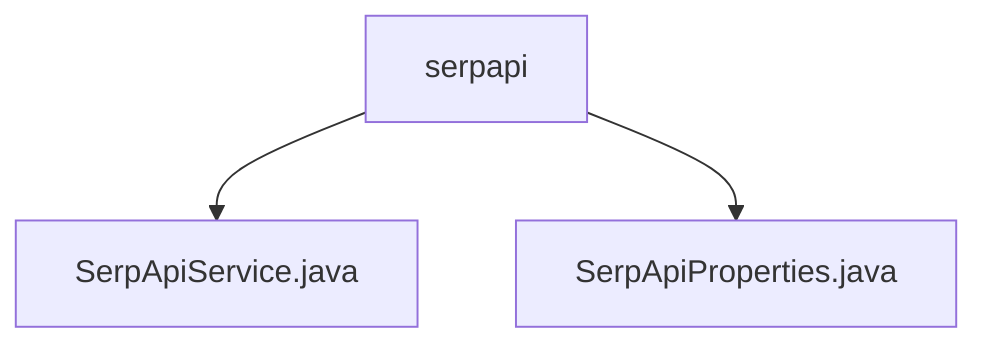

# 基础信息

|      |      |
|------|------|
| 名称 | serpapi |
| 编码语言 | .java |
| 代码路径 | spring-ai-alibaba/community/openmanus/src/main/java/com/alibaba/cloud/ai/example/manus/tool/support/serpapi |
| 包名 | spring-ai-alibaba.community.openmanus.src.main.java.com.alibaba.cloud.ai.example.manus.tool.support.serpapi |
| 概述说明 | SerpApiService类处理API密钥、搜索引擎设置及WebClient初始化，支持GET请求和JSON解析。SerpApiProperties类管理API配置，包括URL、用户代理和搜索引擎参数。 |

# 说明

## 概述
该代码模块主要围绕与SerpApi搜索服务的交互展开，包含两个核心类：`SerpApiService`和`SerpApiProperties`。`SerpApiService`负责处理API的调用、请求发送以及响应数据的解析，而`SerpApiProperties`则用于管理API相关的配置信息。这两个类共同协作，提供了灵活且高效的SerpApi搜索服务集成能力。

## 主要业务场景
1. **API调用与数据获取**：通过`SerpApiService`类，用户可以发起GET请求向SerpApi发送搜索请求，并解析返回的JSON格式响应数据，从而获取所需的搜索结果。
2. **API配置管理**：`SerpApiProperties`类负责管理API的URL地址、用户代理设置以及搜索引擎的配置参数，确保API调用的准确性和有效性，同时为用户提供了灵活的配置选项。
3. **WebClient初始化与使用**：`SerpApiService`类中集成了WebClient的初始化工作，支持高效的HTTP请求发送，提升了与SerpApi交互的性能和稳定性。

该模块适用于需要集成SerpApi搜索服务的应用场景，能够帮助开发者快速实现搜索功能，同时通过灵活的配置管理优化API的使用体验。

### 包内部结构视图

该流程图展示了`serpapi`文件夹与其内部的两个Java文件之间的层级关系。`serpapi`作为父节点，包含了`SerpApiService.java`和`SerpApiProperties.java`两个子节点，清晰地表示了文件在目录结构中的位置关系。

# 文件列表 File List

| 名称   | 类型  | 说明 |
|-------|------|-------------|
| [SerpApiProperties.java](SerpApiProperties.md) | file | SerpApiProperties类包含API URL、用户代理和引擎配置。 |
| [SerpApiService.java](SerpApiService.md) | file | SerpApiService类调用SerpApi搜索，管理API密钥、引擎配置和WebClient，支持GET请求和JSON解析。 |

