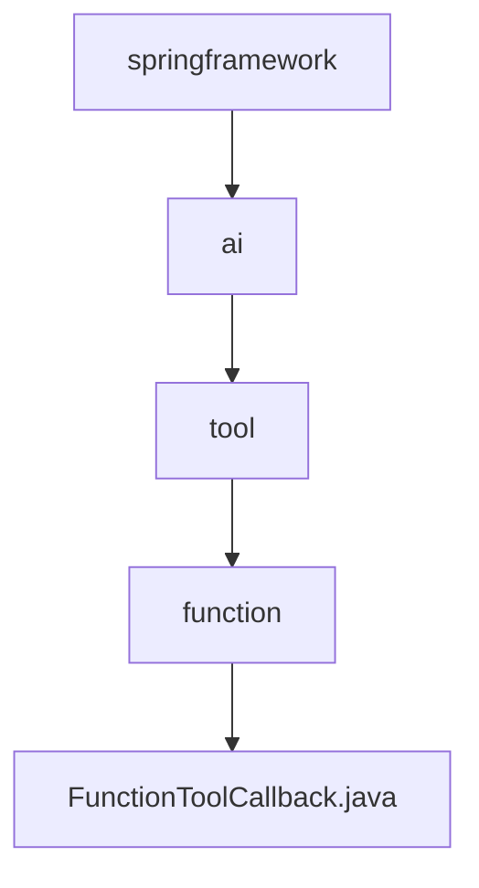

# 基础信息

|      |      |
|------|------|
| 名称 | springframework |
| 编码语言 | .java |
| 代码路径 | spring-ai-alibaba/community/openmanus/src/main/java/org/springframework |
| 包名 | spring-ai-alibaba.community.openmanus.src.main.java.org.springframework |
| 概述说明 | FunctionToolCallback类实现ToolCallback接口，封装工具定义、元数据、输入类型、函数及结果转换器，提供工具调用功能。 |

# 说明

FunctionToolCallback类实现了ToolCallback接口，主要用于封装工具的相关定义、元数据、输入类型、函数以及结果转换器。该类提供了工具调用的功能，确保工具在使用过程中能够正确处理输入数据，并通过结果转换器将输出转换为所需格式。通过这一设计，FunctionToolCallback类增强了工具的灵活性和可扩展性，使其能够适应不同的应用场景和需求。

### 包内部结构视图

该流程图展示了`spring-ai-alibaba`项目中从`springframework`到`FunctionToolCallback.java`的层级关系。路径从根目录`springframework`开始，逐步深入到`ai`、`tool`、`function`，最终到达具体的Java文件`FunctionToolCallback.java`。每个节点代表路径中的一个文件夹或文件，清晰地展示了项目的结构层次。

# 文件列表 File List

| 名称   | 类型  | 说明 |
|-------|------|-------------|
| [ai](ai/_module.md) | package | FunctionToolCallback类实现ToolCallback接口，封装工具定义、元数据、输入类型、函数及结果转换器，提供工具调用功能。 |

