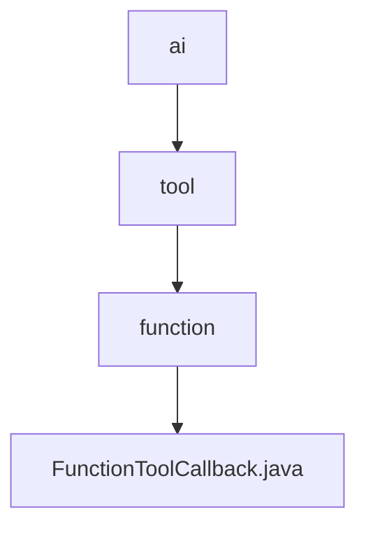

# 基础信息

|      |      |
|------|------|
| 名称 | ai |
| 编码语言 | .java |
| 代码路径 | spring-ai-alibaba/community/openmanus/src/main/java/org/springframework/ai |
| 包名 | spring-ai-alibaba.community.openmanus.src.main.java.org.springframework.ai |
| 概述说明 | FunctionToolCallback类实现ToolCallback接口，封装工具定义、元数据、输入类型、函数及结果转换器，提供工具调用功能。 |

# 说明

FunctionToolCallback类实现了ToolCallback接口，主要用于封装工具的相关定义、元数据、输入类型、函数以及结果转换器。该类提供了工具调用的功能，确保工具在使用过程中能够正确处理输入数据，并通过结果转换器将输出转换为所需格式。通过这一设计，FunctionToolCallback类增强了工具的灵活性和可扩展性，使其能够适应不同的应用场景和需求。

### 包内部结构视图

该流程图展示了从 `ai` 目录到 `FunctionToolCallback.java` 文件的层级关系。首先，`ai` 目录包含 `tool` 子目录，`tool` 目录下又包含 `function` 子目录，最后 `function` 目录中包含 `FunctionToolCallback.java` 文件。整个结构清晰地反映了文件在项目中的嵌套关系。

# 文件列表 File List

| 名称   | 类型  | 说明 |
|-------|------|-------------|
| [tool](tool/_module.md) | package | FunctionToolCallback类实现ToolCallback接口，封装工具定义、元数据、输入类型、函数及结果转换器，提供工具调用功能。 |

