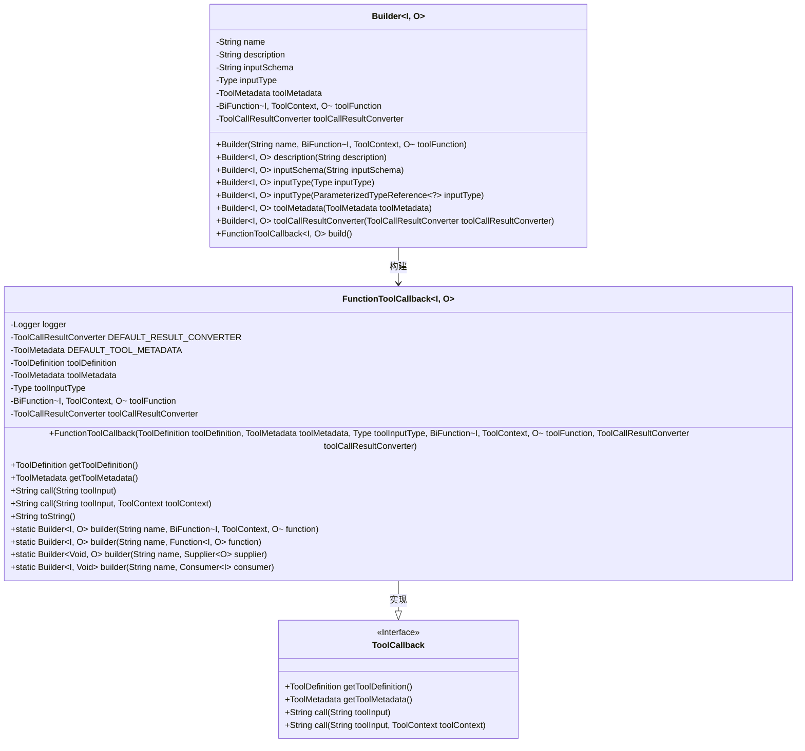

# 基础信息

|      |      |
|------|------|
| 名称 | FunctionToolCallback |
| 编码语言 | .java |
| 代码路径 | spring-ai-alibaba/community/openmanus/src/main/java/org/springframework/ai/tool/function/FunctionToolCallback.java |
| 包名 | org.springframework.ai.tool.function |
| 依赖项 | ['java.lang.reflect.Type', 'java.util.function.BiFunction', 'java.util.function.Consumer', 'java.util.function.Function', 'java.util.function.Supplier', 'org.slf4j.Logger', 'org.slf4j.LoggerFactory', 'org.springframework.ai.chat.model.ToolContext', 'org.springframework.ai.tool.ToolCallback', 'org.springframework.ai.tool.definition.ToolDefinition', 'org.springframework.ai.tool.execution.DefaultToolCallResultConverter', 'org.springframework.ai.tool.execution.ToolCallResultConverter', 'org.springframework.ai.tool.metadata.ToolMetadata', 'org.springframework.ai.tool.util.ToolUtils', 'org.springframework.ai.util.json.JsonParser', 'org.springframework.ai.util.json.schema.JsonSchemaGenerator', 'org.springframework.core.ParameterizedTypeReference', 'org.springframework.lang.Nullable', 'org.springframework.util.Assert', 'org.springframework.util.StringUtils'] |
| 概述说明 | FunctionToolCallback类实现ToolCallback接口，封装工具定义、元数据、输入类型、函数及结果转换器，提供工具调用功能。 |

# 说明

FunctionToolCallback类实现了ToolCallback接口，主要用于封装工具的相关定义、元数据、输入类型、函数以及结果转换器。该类提供了工具调用的功能，确保工具在使用过程中能够正确处理输入数据，并通过结果转换器将输出转换为所需格式。通过这一设计，FunctionToolCallback类增强了工具的灵活性和可扩展性，使其能够适应不同的应用场景和需求。

# 类列表 Class Summary

| 名称   | 类型  | 说明 |
|-------|------|-------------|
| FunctionToolCallback | class | FunctionToolCallback类实现ToolCallback接口，封装工具定义、元数据、输入类型、函数及结果转换器，提供工具调用功能。 |

## 类 FunctionToolCallback

|      |      |
|------|------|
| 访问范围 | public |
| 类型 | class |
| 名称 | FunctionToolCallback |
| 说明 | FunctionToolCallback类实现ToolCallback接口，封装工具定义、元数据、输入类型、函数及结果转换器，提供工具调用功能。 |

### UML类图

### 描述
`FunctionToolCallback` 是一个泛型类，实现了 `ToolCallback` 接口，用于处理工具调用的回调逻辑。它包含工具定义、元数据、输入类型、工具函数和结果转换器等成员，并通过 `Builder` 类进行构建。`Builder` 类提供了链式调用的方法，用于设置工具的名称、描述、输入模式、输入类型、元数据和结果转换器，并最终构建 `FunctionToolCallback` 实例。该类通过 `call` 方法执行工具调用，并根据输入类型和工具函数处理请求，最终返回转换后的结果。

### 内部方法调用关系图

```mermaid
graph TD
    A["类FunctionToolCallback<I, O>"]
    B["属性: Logger logger"]
    C["属性: ToolCallResultConverter DEFAULT_RESULT_CONVERTER"]
    D["属性: ToolMetadata DEFAULT_TOOL_METADATA"]
    E["属性: ToolDefinition toolDefinition"]
    F["属性: ToolMetadata toolMetadata"]
    G["属性: Type toolInputType"]
    H["属性: BiFunction<I, ToolContext, O> toolFunction"]
    I["属性: ToolCallResultConverter toolCallResultConverter"]
    J["构造方法: FunctionToolCallback(ToolDefinition, ToolMetadata, Type, BiFunction, ToolCallResultConverter)"]
    K["方法: ToolDefinition getToolDefinition()"]
    L["方法: ToolMetadata getToolMetadata()"]
    M["方法: String call(String)"]
    N["方法: String call(String, ToolContext)"]
    O["方法: String toString()"]
    P["静态方法: Builder<I, O> builder(String, BiFunction)"]
    Q["静态方法: Builder<I, O> builder(String, Function)"]
    R["静态方法: Builder<Void, O> builder(String, Supplier)"]
    S["静态方法: Builder<I, Void> builder(String, Consumer)"]
    T["内部类: Builder<I, O>"]
    U["属性: String name"]
    V["属性: String description"]
    W["属性: String inputSchema"]
    X["属性: Type inputType"]
    Y["属性: ToolMetadata toolMetadata"]
    Z["属性: BiFunction<I, ToolContext, O> toolFunction"]
    AA["属性: ToolCallResultConverter toolCallResultConverter"]
    AB["构造方法: Builder(String, BiFunction)"]
    AC["方法: Builder<I, O> description(String)"]
    AD["方法: Builder<I, O> inputSchema(String)"]
    AE["方法: Builder<I, O> inputType(Type)"]
    AF["方法: Builder<I, O> inputType(ParameterizedTypeReference)"]
    AG["方法: Builder<I, O> toolMetadata(ToolMetadata)"]
    AH["方法: Builder<I, O> toolCallResultConverter(ToolCallResultConverter)"]
    AI["方法: FunctionToolCallback<I, O> build()"]

    A --> B
    A --> C
    A --> D
    A --> E
    A --> F
    A --> G
    A --> H
    A --> I
    A --> J
    A --> K
    A --> L
    A --> M
    A --> N
    A --> O
    A --> P
    A --> Q
    A --> R
    A --> S
    A --> T
    T --> U
    T --> V
    T --> W
    T --> X
    T --> Y
    T --> Z
    T --> AA
    T --> AB
    T --> AC
    T --> AD
    T --> AE
    T --> AF
    T --> AG
    T --> AH
    T --> AI
```

该流程图展示了`FunctionToolCallback`类及其内部类`Builder`的结构和方法调用关系。`FunctionToolCallback`类包含多个属性和方法，用于处理工具调用和结果转换。内部类`Builder`用于构建`FunctionToolCallback`实例，提供了一系列方法来设置构建参数并最终生成实例。流程图清晰地展示了各个方法和属性之间的依赖关系和调用顺序。

### 字段列表 Field List

| 名称  | 类型  | 说明 |
|-------|-------|------|
| toolDefinition | ToolDefinition | 私有工具定义对象实例。 |
| toolCallResultConverter | ToolCallResultConverter | 私有工具调用结果转换器实例。 |
| toolMetadata | ToolMetadata | 私有不可变的工具元数据对象。 |
| logger = LoggerFactory.getLogger(FunctionToolCallback.class) | Logger | FunctionToolCallback类中定义了一个静态的日志记录器。 |
| DEFAULT_RESULT_CONVERTER = new DefaultToolCallResultConverter() | ToolCallResultConverter | 默认工具调用结果转换器实例化。 |
| toolInputType | Type | 私有最终类型变量toolInputType |
| DEFAULT_TOOL_METADATA = ToolMetadata.builder().build() | ToolMetadata | 默认工具元数据通过构建器创建并初始化。 |
| toolFunction | BiFunction<I, ToolContext, O> | 私有工具函数，输入I和ToolContext，输出O。 |

### 方法列表 Method List

| 名称  | 类型  | 说明 |
|-------|-------|------|
| builder | Builder<Void, O> | 静态方法创建Builder实例，接受名称和Supplier参数，返回Void类型输入。 |
| builder | Builder<I, O> | 静态方法`builder`创建并返回`Builder`对象，接受名称和函数参数。 |
| getToolDefinition | ToolDefinition | 该方法返回工具定义对象。 |
| call | String | 重写call方法，支持带参数调用。 |
| getToolMetadata | ToolMetadata | 重写方法获取工具元数据并返回。 |
| toString | String | 重写toString方法，返回FunctionToolCallback对象及内部属性。 |
| builder | Builder<I, Void> | 静态方法builder接收名称和消费者参数，返回Builder实例。 |
| call | String | 重写call方法，验证输入，执行工具函数并返回结果。 |
| builder | Builder<I, O> | 静态方法创建Builder对象，接收名称和函数参数，确保函数非空。 |

