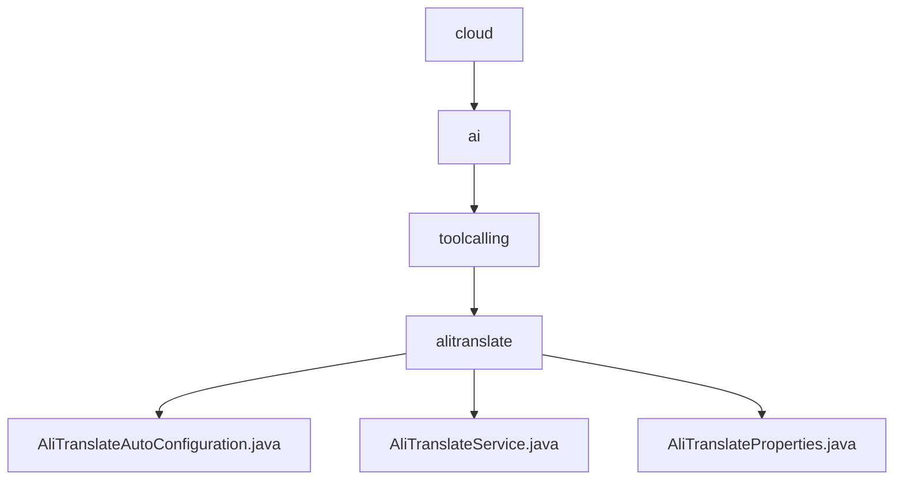

# 基础信息

|      |      |
|------|------|
| 名称 | cloud |
| 编码语言 | .java |
| 代码路径 | spring-ai-alibaba/community/tool-calls/spring-ai-alibaba-starter-tool-calling-alitranslate/src/main/java/com/alibaba/cloud |
| 包名 | spring-ai-alibaba.community.tool-calls.spring-ai-alibaba-starter-tool-calling-alitranslate.src.main.java.com.alibaba.cloud |
| 概述说明 | 该配置类启用阿里翻译服务，支持动态注入和多语言处理。 |

# 说明

## 概述
该代码模块旨在集成阿里翻译服务，提供自然语言翻译功能。通过条件注入的方式，系统能够根据预设条件动态注入相关服务，确保翻译功能在不同环境下能够灵活启用和配置。模块包含三个主要组件：`AliTranslateAutoConfiguration`、`AliTranslateService`和`AliTranslateProperties`，分别负责服务的自动配置、翻译功能的实现以及翻译工具的参数配置。

## 主要业务场景
1. **多语言翻译**：通过`AliTranslateService`实现文本内容的翻译，默认目标语言为英语，适用于需要多语言支持的应用程序或系统。
2. **异步请求处理**：`AliTranslateService`支持异步请求，能够高效处理翻译任务，提升系统响应速度。
3. **动态服务注入**：`AliTranslateAutoConfiguration`通过条件注入的方式，确保翻译服务在不同环境下能够灵活启用和配置，满足多样化的部署需求。
4. **API连接配置**：`AliTranslateProperties`类用于配置阿里翻译工具的区域、访问密钥ID和密钥，确保翻译工具能够正确连接并调用阿里翻译API。

### 包内部结构视图

该流程图展示了`spring-ai-alibaba`项目中`tool-calls`模块的层级结构。从`cloud`节点开始，依次展开到`ai`、`toolcalling`和`alitranslate`，最终指向三个具体的Java类文件：`AliTranslateAutoConfiguration.java`、`AliTranslateService.java`和`AliTranslateProperties.java`。这种结构清晰地反映了代码的组织方式，便于理解和维护。

# 文件列表 File List

| 名称   | 类型  | 说明 |
|-------|------|-------------|
| [ai](ai/_module.md) | package | 该配置类启用阿里翻译服务，支持动态注入和多语言处理。 |

