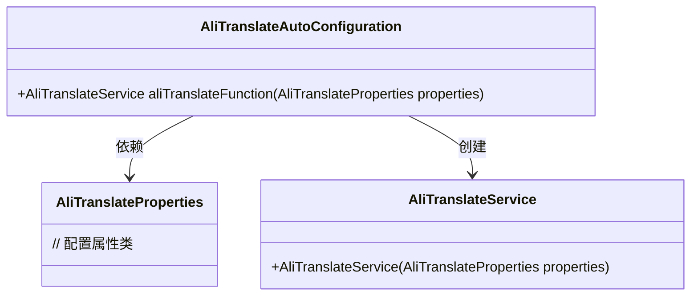
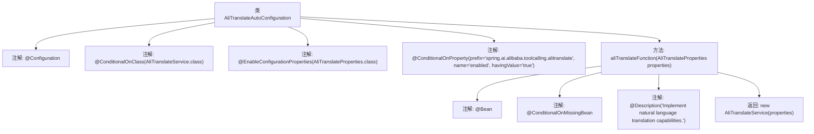

# 基础信息

|      |      |
|------|------|
| 名称 | AliTranslateAutoConfiguration |
| 编码语言 | .java |
| 代码路径 | spring-ai-alibaba/community/tool-calls/spring-ai-alibaba-starter-tool-calling-alitranslate/src/main/java/com/alibaba/cloud/ai/toolcalling/alitranslate/AliTranslateAutoConfiguration.java |
| 包名 | com.alibaba.cloud.ai.toolcalling.alitranslate |
| 依赖项 | ['org.springframework.boot.autoconfigure.condition.ConditionalOnClass', 'org.springframework.boot.autoconfigure.condition.ConditionalOnMissingBean', 'org.springframework.boot.autoconfigure.condition.ConditionalOnProperty', 'org.springframework.boot.context.properties.EnableConfigurationProperties', 'org.springframework.context.annotation.Bean', 'org.springframework.context.annotation.Configuration', 'org.springframework.context.annotation.Description'] |
| 概述说明 | 配置类启用阿里翻译，通过条件注入实现自然语言翻译。 |

# 说明

该配置类旨在启用阿里翻译服务，通过条件注入的方式实现自然语言翻译功能。具体来说，系统会根据预设条件动态注入相关服务，确保翻译功能在不同环境下能够灵活启用和配置。这一设计使得翻译服务能够高效集成到现有系统中，提供准确且可靠的自然语言翻译能力，满足多语言处理需求。

# 类列表 Class Summary

| 名称   | 类型  | 说明 |
|-------|------|-------------|
| AliTranslateAutoConfiguration | class | 配置类启用阿里翻译服务，基于条件注入实现自然语言翻译功能。 |

## 类 AliTranslateAutoConfiguration

|      |      |
|------|------|
| 访问范围 | @Configuration;@ConditionalOnClass(AliTranslateService.class);@EnableConfigurationProperties(AliTranslateProperties.class);@ConditionalOnProperty(prefix = "spring.ai.alibaba.toolcalling.alitranslate", name = "enabled", havingValue = "true");public |
| 类型 | class |
| 名称 | AliTranslateAutoConfiguration |
| 说明 | 配置类启用阿里翻译服务，基于条件注入实现自然语言翻译功能。 |

### UML类图

类图描述：`AliTranslateAutoConfiguration` 是一个自动配置类，依赖于 `AliTranslateProperties` 配置属性类，并在条件满足时创建 `AliTranslateService` 实例。`AliTranslateService` 提供了自然语言翻译功能，其构造函数接收 `AliTranslateProperties` 作为参数。整个配置类通过条件注解确保在特定条件下自动加载和配置。

### 内部方法调用关系图

该流程图展示了`AliTranslateAutoConfiguration`类的结构和主要方法`aliTranslateFunction`的调用关系。该类通过多个条件注解控制配置的加载，并在满足条件时创建`AliTranslateService`实例。`aliTranslateFunction`方法负责实现自然语言翻译功能，并在缺少`AliTranslateService`实例时自动创建。

### 字段列表 Field List

| 名称  | 类型  | 说明 |
|-------|-------|------|

### 方法列表 Method List

| 名称  | 类型  | 说明 |
|-------|-------|------|
| aliTranslateFunction | AliTranslateService | 实现自然语言翻译功能的阿里翻译服务类。 |

