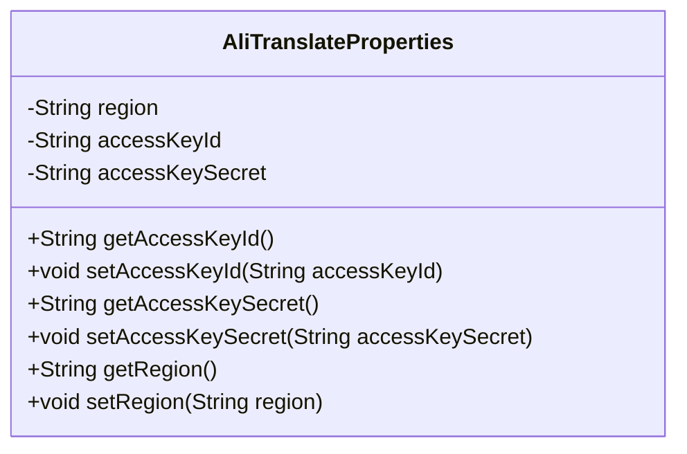
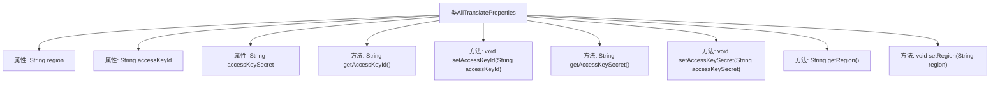

# 基础信息

|      |      |
|------|------|
| 名称 | AliTranslateProperties |
| 编码语言 | .java |
| 代码路径 | spring-ai-alibaba/community/tool-calls/spring-ai-alibaba-starter-tool-calling-alitranslate/src/main/java/com/alibaba/cloud/ai/toolcalling/alitranslate/AliTranslateProperties.java |
| 包名 | com.alibaba.cloud.ai.toolcalling.alitranslate |
| 依赖项 | ['org.springframework.boot.context.properties.ConfigurationProperties'] |
| 概述说明 | AliTranslateProperties类配置阿里翻译工具的区域和密钥信息。 |

# 说明

AliTranslateProperties类用于配置阿里翻译工具，主要包含三个关键参数：区域、访问密钥ID和密钥。这些参数用于设置翻译服务的区域位置以及身份验证所需的访问凭证，确保翻译工具能够正确连接并调用阿里翻译API。

# 类列表 Class Summary

| 名称   | 类型  | 说明 |
|-------|------|-------------|
| AliTranslateProperties | class | AliTranslateProperties类用于配置阿里翻译工具，包含区域、访问密钥ID和密钥。 |

## 类 AliTranslateProperties

|      |      |
|------|------|
| 访问范围 | @ConfigurationProperties(prefix = "spring.ai.alibaba.toolcalling.alitranslate");public |
| 类型 | class |
| 名称 | AliTranslateProperties |
| 说明 | AliTranslateProperties类用于配置阿里翻译工具，包含区域、访问密钥ID和密钥。 |

### UML类图

**描述：**  
`AliTranslateProperties` 类用于配置与阿里云翻译服务相关的属性，包括区域 (`region`)、访问密钥 ID (`accessKeyId`) 和访问密钥 (`accessKeySecret`)。通过 `@ConfigurationProperties` 注解，该类能够从配置文件中读取以 `spring.ai.alibaba.toolcalling.alitranslate` 为前缀的属性值，并提供相应的 getter 和 setter 方法，以便在应用程序中动态管理和使用这些配置。

### 内部方法调用关系图

这段代码定义了一个名为 `AliTranslateProperties` 的类，用于管理阿里翻译工具的配置属性。类中包含三个私有属性：`region`、`accessKeyId` 和 `accessKeySecret`，分别表示区域、访问密钥ID和访问密钥。类中提供了这些属性的getter和setter方法，以便外部代码可以获取和设置这些属性的值。通过 `@ConfigurationProperties` 注解，该类可以与Spring Boot的配置管理机制集成，从而方便地从配置文件中加载这些属性。

### 字段列表 Field List

| 名称  | 类型  | 说明 |
|-------|-------|------|
| region | String | 定义了一个私有字符串变量region。 |
| accessKeyId | String | 声明了一个私有的字符串变量accessKeyId。 |
| accessKeySecret | String | 定义了一个私有字符串变量accessKeySecret。 |

### 方法列表 Method List

| 名称  | 类型  | 说明 |
|-------|-------|------|
| setRegion | void | 设置对象的区域属性。 |
| getAccessKeySecret | String | 获取accessKeySecret的字符串方法。 |
| setAccessKeyId | void | 设置访问密钥ID的方法。 |
| getRegion | String | 获取区域信息的字符串方法。 |
| getAccessKeyId | String | 该方法返回accessKeyId字符串。 |
| setAccessKeySecret | void | 设置访问密钥的私有方法。 |

