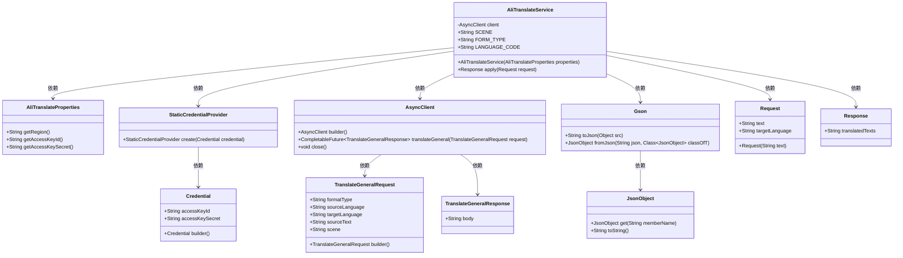

# 基础信息

|      |      |
|------|------|
| 名称 | AliTranslateService |
| 编码语言 | .java |
| 代码路径 | spring-ai-alibaba/community/tool-calls/spring-ai-alibaba-starter-tool-calling-alitranslate/src/main/java/com/alibaba/cloud/ai/toolcalling/alitranslate/AliTranslateService.java |
| 包名 | com.alibaba.cloud.ai.toolcalling.alitranslate |
| 依赖项 | ['com.aliyun.auth.credentials.Credential', 'com.aliyun.auth.credentials.provider.StaticCredentialProvider', 'com.aliyun.sdk.service.alimt20181012.AsyncClient', 'com.aliyun.sdk.service.alimt20181012.models.TranslateGeneralRequest', 'com.aliyun.sdk.service.alimt20181012.models.TranslateGeneralResponse', 'com.fasterxml.jackson.annotation.JsonClassDescription', 'com.fasterxml.jackson.annotation.JsonProperty', 'com.fasterxml.jackson.annotation.JsonPropertyDescription', 'com.google.gson.Gson', 'com.google.gson.JsonObject', 'darabonba.core.client.ClientOverrideConfiguration', 'org.springframework.util.StringUtils', 'java.util.concurrent.CompletableFuture', 'java.util.function.Function'] |
| 概述说明 | AliTranslateService提供异步翻译功能，默认目标语言为英语。 |

# 说明

AliTranslateService是一个实现翻译功能的工具，支持异步请求，能够高效处理翻译任务。默认情况下，该服务的目标语言设置为英语，用户可以通过该服务将文本内容翻译成英语。该工具的设计旨在提供便捷的翻译体验，适用于需要多语言支持的应用程序或系统。

# 类列表 Class Summary

| 名称   | 类型  | 说明 |
|-------|------|-------------|
| AliTranslateService | class | AliTranslateService实现翻译功能，支持异步请求，默认目标语言为英语。 |

## 类 AliTranslateService

|      |      |
|------|------|
| 访问范围 | public |
| 类型 | class |
| 名称 | AliTranslateService |
| 说明 | AliTranslateService实现翻译功能，支持异步请求，默认目标语言为英语。 |

### UML类图

**描述：**
`AliTranslateService` 类实现了 `Function` 接口，用于将文本翻译为目标语言。它依赖于 `AliTranslateProperties` 获取配置信息，并通过 `StaticCredentialProvider` 和 `Credential` 进行身份验证。`AsyncClient` 用于发送翻译请求并接收响应，`TranslateGeneralRequest` 和 `TranslateGeneralResponse` 分别表示请求和响应对象。`Gson` 和 `JsonObject` 用于处理 JSON 数据。`Request` 和 `Response` 类分别表示翻译请求和响应的数据结构。

### 内部方法调用关系图

```mermaid
graph TD
    A["类AliTranslateService"]
    B["属性: AsyncClient client"]
    C["常量: String SCENE = 'general'"]
    D["常量: String FORM_TYPE = 'text'"]
    E["常量: String LANGUAGE_CODE = 'zh'"]
    F["构造方法: AliTranslateService(AliTranslateProperties properties)"]
    G["方法: Response apply(Request request)"]
    H["内部类: Request"]
    I["内部类: Response"]

    A --> B
    A --> C
    A --> D
    A --> E
    A --> F
    A --> G
    A --> H
    A --> I

    F --> F1["验证properties.getRegion()"]
    F --> F2["验证properties.getAccessKeyId()"]
    F --> F3["验证properties.getAccessKeySecret()"]
    F --> F4["创建StaticCredentialProvider"]
    F --> F5["创建AsyncClient"]

    G --> G1["检查request是否有效"]
    G --> G2["创建TranslateGeneralRequest"]
    G --> G3["调用client.translateGeneral(translateGeneralRequest)"]
    G --> G4["获取TranslateGeneralResponse"]
    G --> G5["将response转换为JsonObject"]
    G --> G6["提取翻译结果"]
    G --> G7["关闭client"]
    G --> G8["返回Response对象"]

    H --> H1["属性: String text"]
    H --> H2["属性: String targetLanguage"]
    H --> H3["构造方法: Request(String text)"]

    I --> I1["属性: String translatedTexts"]
```

**描述：**  
`AliTranslateService` 类实现了一个翻译服务，通过阿里云的API将文本翻译为目标语言。类中包含构造方法用于初始化客户端，`apply` 方法用于处理翻译请求并返回翻译结果。内部类 `Request` 和 `Response` 分别用于封装翻译请求和响应数据。流程图展示了类的结构、方法调用顺序以及数据流动过程。

### 字段列表 Field List

| 名称  | 类型  | 说明 |
|-------|-------|------|
| client | AsyncClient | 私有且不可变的异步客户端实例。 |
| LANGUAGE_CODE = "zh" | String | 定义常量LANGUAGE_CODE，值为"zh"。 |
| FORM_TYPE = "text" | String | 定义静态常量FORM_TYPE，值为"text"。 |
| SCENE = "general" | String | 定义静态常量SCENE，值为"general"。 |

### 方法列表 Method List

| 名称  | 类型  | 说明 |
|-------|-------|------|
| apply | Response | 方法处理请求，验证输入后构建翻译请求，调用翻译服务并返回结果。 |

