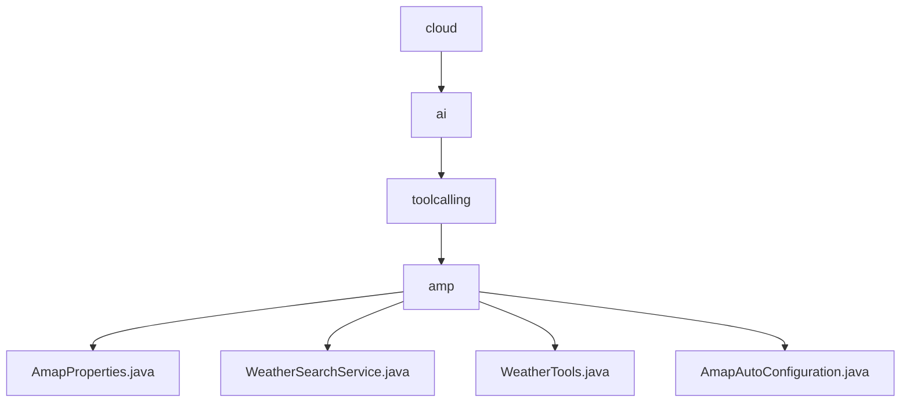

# 基础信息

|      |      |
|------|------|
| 名称 | cloud |
| 编码语言 | .java |
| 代码路径 | spring-ai-alibaba/community/tool-calls/spring-ai-alibaba-starter-tool-calling-amap/src/main/java/com/alibaba/cloud |
| 包名 | spring-ai-alibaba.community.tool-calls.spring-ai-alibaba-starter-tool-calling-amap.src.main.java.com.alibaba.cloud |
| 概述说明 | AmapProperties类管理高德地图API密钥，WeatherSearchService提供基于地址的天气查询，WeatherTools获取城市编码和天气信息，AmapAutoConfiguration自动加载天气搜索服务。 |

# 说明

## 概述
该代码模块主要用于集成高德地图API，提供基于地理位置的天气查询服务。模块通过管理高德地图API密钥、获取城市编码和天气信息等功能，实现了从地址解析到天气数据获取的自动化流程。模块的设计旨在简化与高德地图API的交互，确保服务的便捷性、准确性和高效性。

## 主要业务场景
1. **API密钥管理**：通过`AmapProperties`类，用户可以配置和管理高德地图API密钥，确保应用程序能够正确调用高德地图的API接口。该类的设计支持灵活更新和修改密钥，保障了密钥管理的便捷性和安全性。
2. **天气查询服务**：`WeatherSearchService`服务通过输入地址信息，自动获取该地址对应的城市编码，并查询该城市的天气情况。该服务为用户提供了基于地理位置的详细天气信息，确保查询结果的准确性和相关性。
3. **工具类支持**：`WeatherTools`类提供了获取城市编码和天气信息的工具方法。通过配置高德地图API密钥，用户可以便捷地访问高德地图的相关服务，简化了与API的交互过程。
4. **自动配置**：`AmapAutoConfiguration`类在系统初始化时，根据条件自动加载与高德地图相关的天气搜索服务。这种设计提高了系统的灵活性和效率，确保服务在需要时可用，同时避免了不必要的资源消耗。

### 包内部结构视图

该流程图展示了 `spring-ai-alibaba-starter-tool-calling-amap` 项目的目录结构。从 `cloud` 目录开始，依次进入 `ai`、`toolcalling` 和 `amp` 子目录。`amp` 目录下包含四个文件：`AmapProperties.java`、`WeatherSearchService.java`、`WeatherTools.java` 和 `AmapAutoConfiguration.java`。这些文件构成了项目的核心功能模块，用于处理与地图相关的工具调用和配置。

# 文件列表 File List

| 名称   | 类型  | 说明 |
|-------|------|-------------|
| [ai](ai/_module.md) | package | AmapProperties类管理高德地图API密钥，WeatherSearchService提供基于地址的天气查询，WeatherTools获取城市编码和天气信息，AmapAutoConfiguration自动加载天气搜索服务。 |

