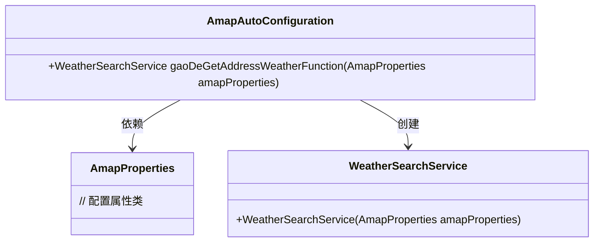
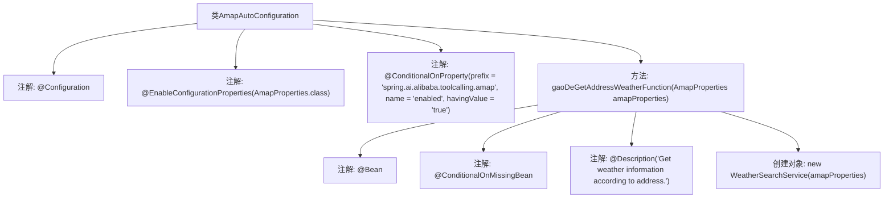

# 基础信息

|      |      |
|------|------|
| 名称 | AmapAutoConfiguration |
| 编码语言 | .java |
| 代码路径 | spring-ai-alibaba/community/tool-calls/spring-ai-alibaba-starter-tool-calling-amap/src/main/java/com/alibaba/cloud/ai/toolcalling/amp/AmapAutoConfiguration.java |
| 包名 | com.alibaba.cloud.ai.toolcalling.amp |
| 依赖项 | ['org.springframework.boot.autoconfigure.condition.ConditionalOnMissingBean', 'org.springframework.boot.autoconfigure.condition.ConditionalOnProperty', 'org.springframework.boot.context.properties.EnableConfigurationProperties', 'org.springframework.context.annotation.Bean', 'org.springframework.context.annotation.Configuration', 'org.springframework.context.annotation.Description'] |
| 概述说明 | 配置类启用Amap属性，条件加载天气搜索服务。 |

# 说明

配置类启用了Amap属性，并根据条件加载天气搜索服务。这意味着系统在初始化时，会检查特定条件，如果满足则自动加载与Amap相关的天气搜索功能，确保服务在需要时可用。这种设计提高了系统的灵活性和效率，避免了不必要的资源消耗。

# 类列表 Class Summary

| 名称   | 类型  | 说明 |
|-------|------|-------------|
| AmapAutoConfiguration | class | 配置类启用Amap属性，条件加载天气搜索服务。 |

## 类 AmapAutoConfiguration

|      |      |
|------|------|
| 访问范围 | @Configuration;@EnableConfigurationProperties(AmapProperties.class);@ConditionalOnProperty(prefix = "spring.ai.alibaba.toolcalling.amap", name = "enabled", havingValue = "true");public |
| 类型 | class |
| 名称 | AmapAutoConfiguration |
| 说明 | 配置类启用Amap属性，条件加载天气搜索服务。 |

### UML类图

这段代码定义了一个名为 `AmapAutoConfiguration` 的配置类，它依赖于 `AmapProperties` 类，并通过 `gaoDeGetAddressWeatherFunction` 方法创建并返回一个 `WeatherSearchService` 实例。`AmapAutoConfiguration` 类使用了 `@Configuration` 注解，表示它是一个配置类，并且通过 `@EnableConfigurationProperties` 注解启用了 `AmapProperties` 的配置属性。`@ConditionalOnProperty` 注解用于在特定条件下启用该配置类，而 `@ConditionalOnMissingBean` 注解确保在没有其他 `WeatherSearchService` bean 的情况下才会创建该 bean。

### 内部方法调用关系图

这段代码是一个Spring Boot的自动配置类，名为`AmapAutoConfiguration`。它通过`@Configuration`注解标记为配置类，并使用`@EnableConfigurationProperties`注解启用`AmapProperties`类的配置属性。`@ConditionalOnProperty`注解确保只有在配置文件中`spring.ai.alibaba.toolcalling.amap.enabled`属性为`true`时，该类才会生效。类中定义了一个`gaoDeGetAddressWeatherFunction`方法，该方法返回一个`WeatherSearchService`对象，并通过`@Bean`注解将其注册为Spring Bean。该方法还使用了`@ConditionalOnMissingBean`注解，确保只有在没有其他`WeatherSearchService` Bean存在时才会创建该Bean。`@Description`注解为该方法提供了描述信息。

### 字段列表 Field List

| 名称  | 类型  | 说明 |
|-------|-------|------|

### 方法列表 Method List

| 名称  | 类型  | 说明 |
|-------|-------|------|
| gaoDeGetAddressWeatherFunction | WeatherSearchService | 根据地址获取天气信息的服务，使用AmapProperties配置。 |

