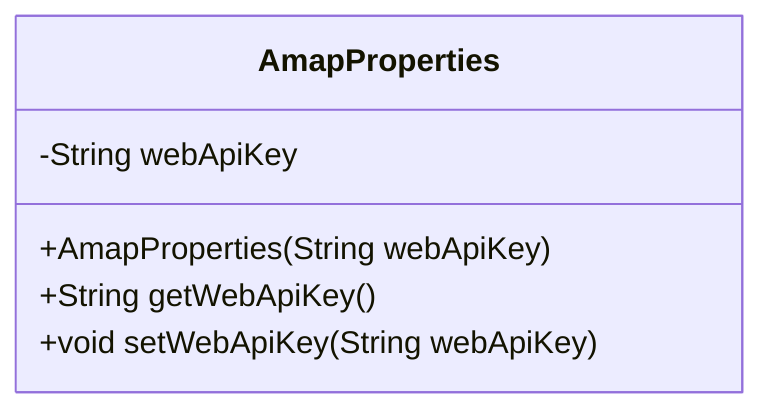
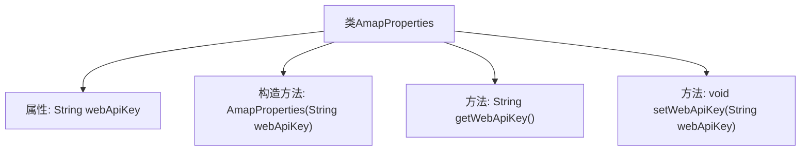

# 基础信息

|      |      |
|------|------|
| 名称 | AmapProperties |
| 编码语言 | .java |
| 代码路径 | spring-ai-alibaba/community/tool-calls/spring-ai-alibaba-starter-tool-calling-amap/src/main/java/com/alibaba/cloud/ai/toolcalling/amp/AmapProperties.java |
| 包名 | com.alibaba.cloud.ai.toolcalling.amp |
| 依赖项 | ['org.springframework.boot.context.properties.ConfigurationProperties'] |
| 概述说明 | AmapProperties类配置高德地图API密钥，支持获取和设置操作。 |

# 说明

AmapProperties类用于配置高德地图API密钥，提供了获取和设置API密钥的方法。该类的主要功能是管理高德地图服务的认证密钥，确保应用程序能够正确调用高德地图的API接口。通过该类的设置方法，用户可以灵活地更新或修改API密钥，而获取方法则用于在需要时检索当前配置的密钥值。这一设计使得密钥管理更加便捷和安全，适用于需要集成高德地图服务的各类应用场景。

# 类列表 Class Summary

| 名称   | 类型  | 说明 |
|-------|------|-------------|
| AmapProperties | class | AmapProperties类配置高德地图API密钥，提供获取和设置方法。 |

## 类 AmapProperties

|      |      |
|------|------|
| 访问范围 | @ConfigurationProperties(prefix = "spring.ai.alibaba.functioncalling.amap");public |
| 类型 | class |
| 名称 | AmapProperties |
| 说明 | AmapProperties类配置高德地图API密钥，提供获取和设置方法。 |

### UML类图

**描述：**  
`AmapProperties` 类是一个配置属性类，用于管理与高德地图相关的 API 密钥。它包含一个私有成员 `webApiKey`，用于存储 API 密钥，并提供了相应的构造函数、getter 和 setter 方法。通过 `@ConfigurationProperties` 注解，该类能够从配置文件中读取前缀为 `spring.ai.alibaba.functioncalling.amap` 的属性，并将其映射到 `webApiKey` 字段中。

### 内部方法调用关系图

这段代码定义了一个名为 `AmapProperties` 的类，该类包含一个私有属性 `webApiKey`，并提供了相应的构造方法、getter 和 setter 方法。类通过 `@ConfigurationProperties` 注解与配置文件中的 `spring.ai.alibaba.functioncalling.amap` 前缀绑定，用于读取和设置配置属性。流程图展示了类的结构及其方法之间的调用关系。

### 字段列表 Field List

| 名称  | 类型  | 说明 |
|-------|-------|------|
| webApiKey | String | 私有字符串变量webApiKey用于存储API密钥。 |

### 方法列表 Method List

| 名称  | 类型  | 说明 |
|-------|-------|------|
| getWebApiKey | String | 获取webApiKey的方法。 |
| setWebApiKey | void | 设置webApiKey方法用于赋值webApiKey变量。 |

