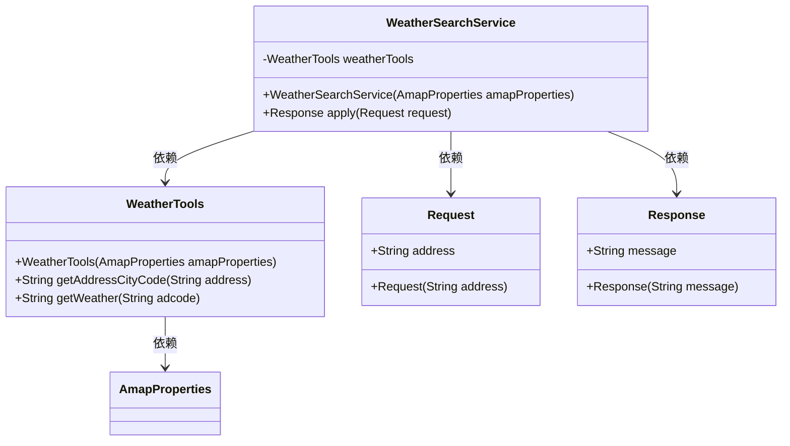
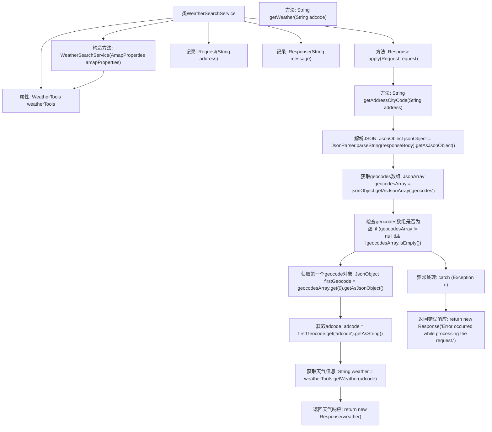

# 基础信息

|      |      |
|------|------|
| 名称 | WeatherSearchService |
| 编码语言 | .java |
| 代码路径 | spring-ai-alibaba/community/tool-calls/spring-ai-alibaba-starter-tool-calling-amap/src/main/java/com/alibaba/cloud/ai/toolcalling/amp/WeatherSearchService.java |
| 包名 | com.alibaba.cloud.ai.toolcalling.amp |
| 依赖项 | ['com.fasterxml.jackson.annotation.JsonClassDescription', 'com.fasterxml.jackson.annotation.JsonProperty', 'com.fasterxml.jackson.annotation.JsonPropertyDescription', 'com.google.gson.JsonArray', 'com.google.gson.JsonObject', 'com.google.gson.JsonParser', 'java.util.function.Function'] |
| 概述说明 | WeatherSearchService根据地址获取城市编码并查询天气。 |

# 说明

WeatherSearchService是一项服务，通过输入地址信息，首先获取该地址对应的城市编码，然后利用该编码查询该城市的天气情况。该服务旨在为用户提供基于地理位置的具体天气信息，确保查询结果的准确性和相关性。整个过程从地址解析到天气数据获取，实现了自动化和高效性。

# 类列表 Class Summary

| 名称   | 类型  | 说明 |
|-------|------|-------------|
| WeatherSearchService | class | WeatherSearchService通过地址获取城市编码并查询天气。 |

## 类 WeatherSearchService

|      |      |
|------|------|
| 访问范围 | public |
| 类型 | class |
| 名称 | WeatherSearchService |
| 说明 | WeatherSearchService通过地址获取城市编码并查询天气。 |

### UML类图

**描述**：  
`WeatherSearchService` 是一个服务类，负责根据指定的地址查询天气情况。它依赖于 `WeatherTools` 类来获取城市编码和天气信息。`WeatherTools` 类进一步依赖于 `AmapProperties` 类来配置相关参数。`Request` 类用于封装查询请求，包含一个地址字段；`Response` 类用于封装查询结果，包含一个消息字段。整个流程通过 `apply` 方法实现，处理请求并返回天气信息。

### 内部方法调用关系图

**描述：**
`WeatherSearchService`类用于根据指定地址获取天气信息。首先，通过`WeatherTools`获取地址对应的城市代码（`adcode`），然后解析JSON响应以提取`adcode`。如果解析过程中发生异常，则返回错误信息。最后，使用`adcode`获取天气信息并返回响应。类中包含两个记录类型`Request`和`Response`，分别用于封装请求和响应数据。

### 字段列表 Field List

| 名称  | 类型  | 说明 |
|-------|-------|------|
| weatherTools | WeatherTools | 私有且不可变的WeatherTools对象。 |

### 方法列表 Method List

| 名称  | 类型  | 说明 |
|-------|-------|------|
| apply | Response | 通过地址获取城市编码，解析JSON获取adcode，再查询天气并返回结果。 |

