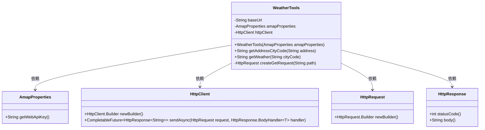
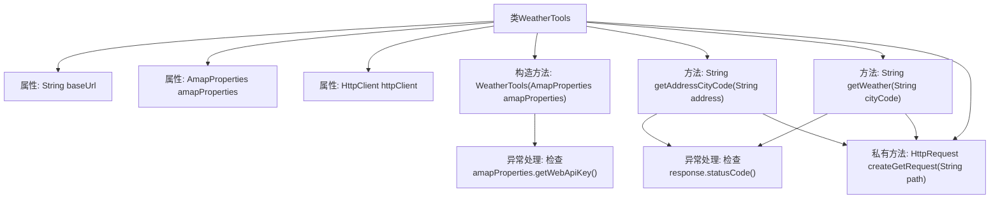

# 基础信息

|      |      |
|------|------|
| 名称 | WeatherTools |
| 编码语言 | .java |
| 代码路径 | spring-ai-alibaba/community/tool-calls/spring-ai-alibaba-starter-tool-calling-amap/src/main/java/com/alibaba/cloud/ai/toolcalling/amp/WeatherTools.java |
| 包名 | com.alibaba.cloud.ai.toolcalling.amp |
| 依赖项 | ['java.net.URI', 'java.net.http.HttpClient', 'java.net.http.HttpRequest', 'java.net.http.HttpResponse', 'java.util.Objects', 'java.util.concurrent.CompletableFuture'] |
| 概述说明 | WeatherTools类通过高德地图API获取城市编码和天气信息，需配置API密钥。 |

# 说明

WeatherTools类是一个用于获取高德地图API地址城市编码和天气信息的工具类。使用该类前，需要配置高德地图API的密钥。该工具类的主要功能是通过高德地图API获取指定城市的编码信息以及该城市的天气数据。通过配置API密钥，用户可以访问高德地图的相关服务，从而获取所需的城市编码和天气信息。该类的设计旨在简化与高德地图API的交互过程，提供便捷的天气数据获取方式。

# 类列表 Class Summary

| 名称   | 类型  | 说明 |
|-------|------|-------------|
| WeatherTools | class | WeatherTools类用于获取高德地图API的地址城市编码和天气信息，需配置API密钥。 |

## 类 WeatherTools

|      |      |
|------|------|
| 访问范围 | public |
| 类型 | class |
| 名称 | WeatherTools |
| 说明 | WeatherTools类用于获取高德地图API的地址城市编码和天气信息，需配置API密钥。 |

### UML类图

### 描述
`WeatherTools` 类用于与高德地图的API进行交互，获取地理编码和天气信息。它依赖于 `AmapProperties` 类来获取API密钥，使用 `HttpClient` 发送HTTP请求，并通过 `HttpRequest` 和 `HttpResponse` 处理请求和响应。`getAddressCityCode` 方法用于获取地址的城市代码，`getWeather` 方法用于获取指定城市的天气信息。`createGetRequest` 是一个私有方法，用于构建HTTP GET请求。

### 内部方法调用关系图

**描述：**
`WeatherTools`类用于与高德地图API进行交互，获取地理编码和天气信息。类中包含三个主要方法：`getAddressCityCode`用于获取地址的城市编码，`getWeather`用于获取指定城市的天气信息，`createGetRequest`用于创建HTTP GET请求。构造方法`WeatherTools`初始化了`amapProperties`和`httpClient`，并在缺少API密钥时抛出异常。每个API请求都会检查响应状态码，确保请求成功。

### 字段列表 Field List

| 名称  | 类型  | 说明 |
|-------|-------|------|
| httpClient | HttpClient | 定义了一个私有的HttpClient实例变量。 |
| amapProperties | AmapProperties | 私有不可变的AmapProperties实例变量。 |
| baseUrl = "https://restapi.amap.com/v3" | String | 私有常量baseUrl定义为高德地图API基础URL。 |

### 方法列表 Method List

| 名称  | 类型  | 说明 |
|-------|-------|------|
| getAddressCityCode | String | 通过HTTP请求获取地址的城市代码，失败时抛出异常。 |
| getWeather | String | 通过HTTP请求异步获取指定城市的天气信息并返回响应体。 |
| createGetRequest | HttpRequest | 创建GET请求方法，基于基础URL和路径构建URI并返回请求对象。 |

