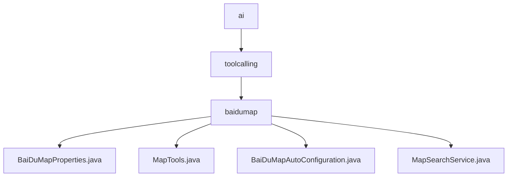

# 基础信息

|      |      |
|------|------|
| 名称 | ai |
| 编码语言 | .java |
| 代码路径 | spring-ai-alibaba/community/tool-calls/spring-ai-alibaba-starter-tool-calling-baidumap/src/main/java/com/alibaba/cloud/ai |
| 包名 | spring-ai-alibaba.community.tool-calls.spring-ai-alibaba-starter-tool-calling-baidumap.src.main.java.com.alibaba.cloud.ai |
| 概述说明 | 百度地图API相关类用于配置密钥、调用功能、自动加载服务及处理数据查询。 |

# 说明

## 概述
该代码模块主要用于集成和调用百度地图API，提供了一系列工具和服务来简化地图相关功能的开发。模块包括配置管理、工具类、自动配置类以及服务类，涵盖了从密钥配置到地图搜索、天气查询、公共设施查询等功能的实现。通过这些组件，开发者可以快速集成百度地图功能，提升应用的地理定位和地图展示能力。

## 主要业务场景
1. **百度地图API密钥配置**：通过`BaiDuMapProperties`类，开发者可以方便地管理和设置百度地图API的密钥信息，确保应用程序能够正确调用百度地图服务。
2. **地图功能工具类**：`MapTools`类提供了地址城市编码、天气信息查询以及公共设施查询等功能，帮助开发者快速实现与地图相关的需求。
3. **自动配置地图搜索服务**：`BaiDuMapAutoConfiguration`类负责在满足特定条件时自动加载并创建地图搜索服务的Bean，简化了地图功能的集成过程，提高了开发效率和系统的可维护性。
4. **地图搜索服务**：`MapSearchService`类通过用户提供的地址和设施类型来获取相关的天气信息和设施信息，处理JSON格式的响应数据，并返回用户所需的结果，确保用户能够快速准确地获取所需信息。

### 包内部结构视图

该流程图展示了 `spring-ai-alibaba` 项目中 `tool-calls` 模块的路径层级关系。从 `ai` 目录开始，逐步深入到 `toolcalling` 和 `baidumap` 子目录，最终展示了 `baidumap` 目录下的四个 Java 文件。每个节点仅显示路径的最后一级元素，清晰地反映了文件与目录之间的从属关系。

# 文件列表 File List

| 名称   | 类型  | 说明 |
|-------|------|-------------|
| [toolcalling](toolcalling/_module.md) | package | 百度地图API相关类用于配置密钥、调用功能、自动加载服务及处理数据查询。 |

