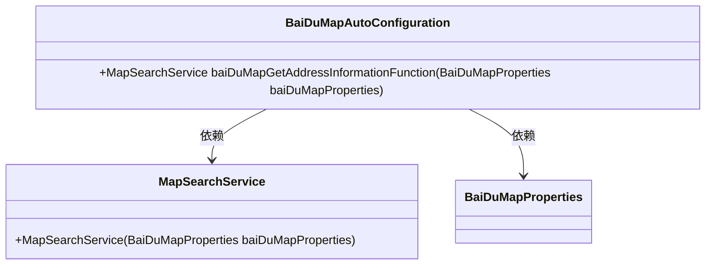
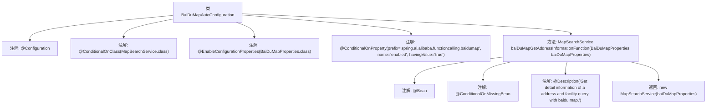

# 基础信息

|      |      |
|------|------|
| 名称 | BaiDuMapAutoConfiguration |
| 编码语言 | .java |
| 代码路径 | spring-ai-alibaba/community/tool-calls/spring-ai-alibaba-starter-tool-calling-baidumap/src/main/java/com/alibaba/cloud/ai/toolcalling/baidumap/BaiDuMapAutoConfiguration.java |
| 包名 | com.alibaba.cloud.ai.toolcalling.baidumap |
| 依赖项 | ['org.springframework.boot.autoconfigure.condition.ConditionalOnClass', 'org.springframework.boot.autoconfigure.condition.ConditionalOnMissingBean', 'org.springframework.boot.autoconfigure.condition.ConditionalOnProperty', 'org.springframework.boot.context.properties.EnableConfigurationProperties', 'org.springframework.context.annotation.Bean', 'org.springframework.context.annotation.Configuration', 'org.springframework.context.annotation.Description'] |
| 概述说明 | 百度地图自动配置类实现条件加载并创建地图搜索服务Bean。 |

# 说明

百度地图自动配置类负责在满足特定条件时加载并创建地图搜索服务的Bean。该配置类通过自动化流程，确保地图搜索服务能够在需要时被正确初始化并注入到应用程序中，从而简化了地图功能的集成过程。通过这种方式，开发者无需手动配置地图搜索服务，提高了开发效率和系统的可维护性。

# 类列表 Class Summary

| 名称   | 类型  | 说明 |
|-------|------|-------------|
| BaiDuMapAutoConfiguration | class | 百度地图自动配置类，条件加载并创建地图搜索服务Bean。 |

## 类 BaiDuMapAutoConfiguration

|      |      |
|------|------|
| 访问范围 | @Configuration;@ConditionalOnClass(MapSearchService.class);@EnableConfigurationProperties(BaiDuMapProperties.class);@ConditionalOnProperty(prefix = "spring.ai.alibaba.functioncalling.baidumap", name = "enabled", havingValue = "true");public |
| 类型 | class |
| 名称 | BaiDuMapAutoConfiguration |
| 说明 | 百度地图自动配置类，条件加载并创建地图搜索服务Bean。 |

### UML类图

这段代码定义了一个Spring Boot的自动配置类 `BaiDuMapAutoConfiguration`，用于在特定条件下创建 `MapSearchService` 的Bean。`MapSearchService` 类依赖于 `BaiDuMapProperties` 类，后者可能包含百度地图相关的配置属性。`BaiDuMapAutoConfiguration` 类通过 `@ConditionalOnClass` 和 `@ConditionalOnProperty` 注解确保只有在满足特定条件时才会生效，从而自动配置 `MapSearchService` Bean。

### 内部方法调用关系图

这段代码定义了一个名为 `BaiDuMapAutoConfiguration` 的配置类，用于在满足特定条件时自动配置 `MapSearchService` Bean。该类使用了多个条件注解，如 `@ConditionalOnClass` 和 `@ConditionalOnProperty`，以确保只有在特定类存在且属性启用时才会进行配置。`baiDuMapGetAddressInformationFunction` 方法负责创建并返回 `MapSearchService` 实例，且仅在当前上下文中不存在该 Bean 时才会执行。

### 字段列表 Field List

| 名称  | 类型  | 说明 |
|-------|-------|------|

### 方法列表 Method List

| 名称  | 类型  | 说明 |
|-------|-------|------|
| baiDuMapGetAddressInformationFunction | MapSearchService | 基于百度地图获取地址和设施详细信息的服务。 |

