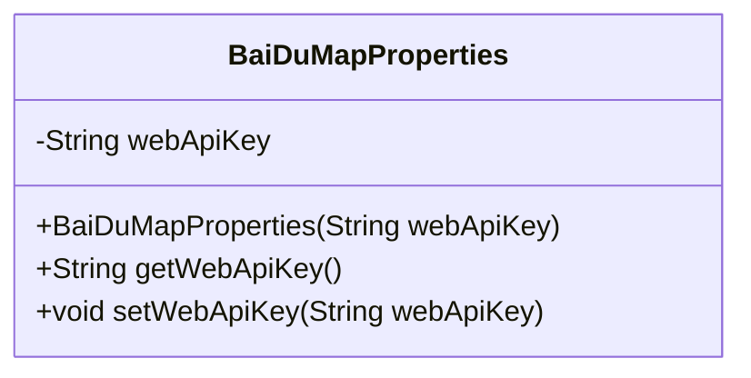
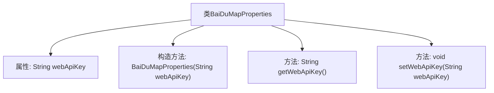

# 基础信息

|      |      |
|------|------|
| 名称 | BaiDuMapProperties |
| 编码语言 | .java |
| 代码路径 | spring-ai-alibaba/community/tool-calls/spring-ai-alibaba-starter-tool-calling-baidumap/src/main/java/com/alibaba/cloud/ai/toolcalling/baidumap/BaiDuMapProperties.java |
| 包名 | com.alibaba.cloud.ai.toolcalling.baidumap |
| 依赖项 | ['org.springframework.boot.context.properties.ConfigurationProperties'] |
| 概述说明 | BaiDuMapProperties类用于配置百度地图API密钥。 |

# 说明

BaiDuMapProperties类主要用于配置百度地图API密钥。该类的主要功能是管理和设置与百度地图API相关的密钥信息，确保应用程序能够正确调用百度地图服务。通过此类，开发者可以方便地集成百度地图功能，提升应用的地理定位和地图展示能力。

# 类列表 Class Summary

| 名称   | 类型  | 说明 |
|-------|------|-------------|
| BaiDuMapProperties | class | BaiDuMapProperties类用于配置百度地图API密钥。 |

## 类 BaiDuMapProperties

|      |      |
|------|------|
| 访问范围 | @ConfigurationProperties(prefix = "spring.ai.alibaba.functioncalling.baidumap");public |
| 类型 | class |
| 名称 | BaiDuMapProperties |
| 说明 | BaiDuMapProperties类用于配置百度地图API密钥。 |

### UML类图

类图描述：
`BaiDuMapProperties` 类用于配置百度地图的Web API密钥。它包含一个私有属性 `webApiKey`，用于存储API密钥，并提供了构造函数、getter和setter方法来访问和修改该属性。该类通过 `@ConfigurationProperties` 注解与Spring Boot的配置属性绑定，使得可以通过配置文件动态设置API密钥。

### 内部方法调用关系图

该流程图描述了`BaiDuMapProperties`类的结构和功能。该类包含一个属性`webApiKey`，用于存储百度地图的API密钥。类中定义了一个构造方法，用于初始化`webApiKey`，并提供了`getWebApiKey`和`setWebApiKey`方法，分别用于获取和设置该属性的值。这些方法确保了`webApiKey`的可访问性和可修改性。

### 字段列表 Field List

| 名称  | 类型  | 说明 |
|-------|-------|------|
| webApiKey | String | 声明一个私有字符串变量webApiKey。 |

### 方法列表 Method List

| 名称  | 类型  | 说明 |
|-------|-------|------|
| getWebApiKey | String | 获取Web API密钥的方法。 |
| setWebApiKey | void | 设置webApiKey的方法。 |

