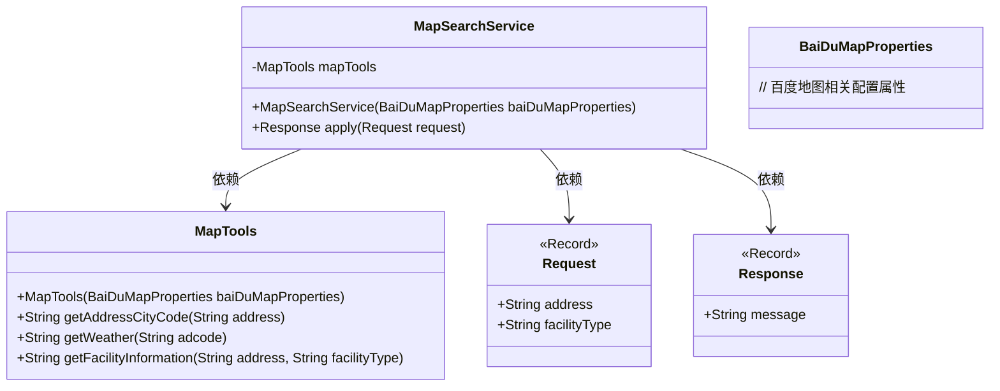
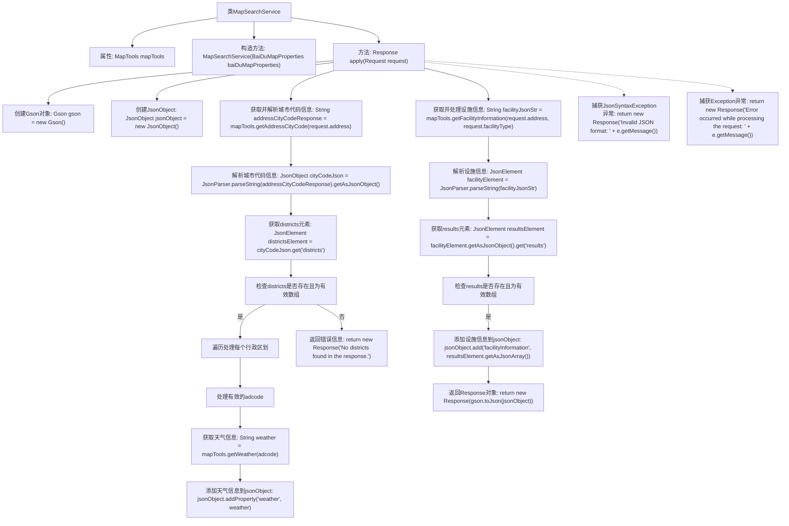

# 基础信息

|      |      |
|------|------|
| 名称 | MapSearchService |
| 编码语言 | .java |
| 代码路径 | spring-ai-alibaba/community/tool-calls/spring-ai-alibaba-starter-tool-calling-baidumap/src/main/java/com/alibaba/cloud/ai/toolcalling/baidumap/MapSearchService.java |
| 包名 | com.alibaba.cloud.ai.toolcalling.baidumap |
| 依赖项 | ['com.fasterxml.jackson.annotation.JsonClassDescription', 'com.fasterxml.jackson.annotation.JsonProperty', 'com.fasterxml.jackson.annotation.JsonPropertyDescription', 'com.google.gson', 'java.util.function.Function'] |
| 概述说明 | MapSearchService根据地址和设施类型查询天气及设施信息，处理JSON响应后返回结果。 |

# 说明

MapSearchService 是一个服务，它通过用户提供的地址和设施类型来获取相关的天气信息和设施信息。该服务能够处理 JSON 格式的响应数据，并最终返回用户所需的结果。整个过程涉及数据请求、处理和响应，确保用户能够快速准确地获取所需信息。

# 类列表 Class Summary

| 名称   | 类型  | 说明 |
|-------|------|-------------|
| MapSearchService | class | MapSearchService通过地址和设施类型获取天气和设施信息，处理JSON响应并返回结果。 |

## 类 MapSearchService

|      |      |
|------|------|
| 访问范围 | public |
| 类型 | class |
| 名称 | MapSearchService |
| 说明 | MapSearchService通过地址和设施类型获取天气和设施信息，处理JSON响应并返回结果。 |

### UML类图

**描述**：`MapSearchService`类实现了`Function`接口，用于处理地图搜索请求。它依赖于`MapTools`类来获取城市代码、天气信息和设施信息。`Request`和`Response`是记录类，分别用于封装请求参数和响应消息。`MapTools`类负责与百度地图API交互，获取所需数据。

### 内部方法调用关系图

**流程图描述：**  
该流程图描述了`MapSearchService`类中`apply`方法的执行流程。首先，该方法创建`Gson`对象和`JsonObject`，然后获取并解析城市代码信息，检查`districts`元素是否存在且为有效数组。如果是，则遍历处理每个行政区划，获取并添加天气信息到`jsonObject`。接着，获取并处理设施信息，检查`results`元素是否存在且为有效数组，如果是，则添加设施信息到`jsonObject`。最后，返回包含处理结果的`Response`对象。如果过程中出现异常，则返回相应的错误信息。

### 字段列表 Field List

| 名称  | 类型  | 说明 |
|-------|-------|------|
| mapTools | MapTools | 私有不可变地图工具实例。 |

### 方法列表 Method List

| 名称  | 类型  | 说明 |
|-------|-------|------|
| apply | Response | 解析城市代码，获取天气和设施信息，处理JSON数据并返回响应。 |

