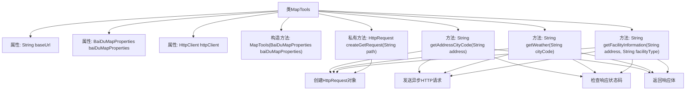

# 基础信息

|      |      |
|------|------|
| 名称 | MapTools |
| 编码语言 | .java |
| 代码路径 | spring-ai-alibaba/community/tool-calls/spring-ai-alibaba-starter-tool-calling-baidumap/src/main/java/com/alibaba/cloud/ai/toolcalling/baidumap/MapTools.java |
| 包名 | com.alibaba.cloud.ai.toolcalling.baidumap |
| 依赖项 | ['java.net.URI', 'java.net.http.HttpClient', 'java.net.http.HttpRequest', 'java.net.http.HttpResponse', 'java.util.Objects', 'java.util.concurrent.CompletableFuture'] |
| 概述说明 | MapTools类调用百度地图API，支持地址编码、天气和设施查询。 |

# 说明

MapTools类是一个用于调用百度地图API的工具类，主要提供三大功能：地址城市编码、天气信息查询以及公共设施查询。通过该类，用户可以方便地获取特定地址对应的城市编码，查询指定地区的天气情况，以及查找附近的公共设施信息。这些功能集成在MapTools类中，便于开发者在项目中快速实现与地图相关的需求。

# 类列表 Class Summary

| 名称   | 类型  | 说明 |
|-------|------|-------------|
| MapTools | class | MapTools类用于调用百度地图API，提供地址城市编码、天气信息和公共设施查询功能。 |


## 类 MapTools

|      |      |
|------|------|
| 访问范围 | public |
| 类型 | class |
| 名称 | MapTools |
| 说明 | MapTools类用于调用百度地图API，提供地址城市编码、天气信息和公共设施查询功能。 |


### UML类图

```mermaid
classDiagram
    class MapTools {
        -String baseUrl
        -BaiDuMapProperties baiDuMapProperties
        -HttpClient httpClient
        +MapTools(BaiDuMapProperties baiDuMapProperties)
        +String getAddressCityCode(String address)
        +String getWeather(String cityCode)
        +String getFacilityInformation(String address, String facilityType)
        -HttpRequest createGetRequest(String path)
    }

    class BaiDuMapProperties {
        +String getWebApiKey()
    }

    class HttpClient {
        +HttpClient newBuilder()
        +CompletableFuture~HttpResponse~String~~ sendAsync(HttpRequest request, HttpResponse.BodyHandler~String~ handler)
    }

    class HttpRequest {
        +HttpRequest.Builder newBuilder()
    }

    class HttpResponse~T~ {
        +int statusCode()
        +T body()
    }

    class CompletableFuture~T~ {
        +T join()
    }

    class URI {
        +URI create(String uri)
    }

    MapTools --> BaiDuMapProperties : 依赖
    MapTools --> HttpClient : 依赖
    MapTools --> HttpRequest : 依赖
    MapTools --> HttpResponse~String~ : 依赖
    MapTools --> CompletableFuture~HttpResponse~String~~ : 依赖
    MapTools --> URI : 依赖
```

这段代码定义了一个`MapTools`类，用于与百度地图API进行交互。该类依赖于`BaiDuMapProperties`来获取API密钥，并使用`HttpClient`发送HTTP请求。`MapTools`类提供了三个主要方法：`getAddressCityCode`用于获取地址的城市代码，`getWeather`用于获取天气信息，`getFacilityInformation`用于获取公共设施信息。每个方法都通过异步HTTP请求获取数据，并在请求失败时抛出异常。`createGetRequest`方法用于构建HTTP GET请求。


### 内部方法调用关系图



这段代码定义了一个名为 `MapTools` 的类，用于与百度地图API进行交互。类中包含三个主要方法：`getAddressCityCode`、`getWeather` 和 `getFacilityInformation`，分别用于获取地址的城市编码、天气信息和公共设施信息。每个方法都会构建一个HTTP请求，发送异步请求并处理响应。如果响应状态码不是200，则抛出异常。私有方法 `createGetRequest` 用于创建HTTP GET请求对象。

### 字段列表 Field List

| 名称  | 类型  | 说明 |
|-------|-------|------|
| baiDuMapProperties | BaiDuMapProperties | 私有百度地图属性对象。 |
| baseUrl = "https://api.map.baidu.com" | String | 私有常量baseUrl存储百度地图API的根地址。 |
| httpClient | HttpClient | 私有且不可变的HttpClient实例。 |

### 方法列表 Method List

| 名称  | 类型  | 说明 |
|-------|-------|------|
| getWeather | String | 该方法通过HTTP请求获取指定城市的天气信息，并返回响应数据。 |
| createGetRequest | HttpRequest | 创建GET请求方法，基于基础URL和路径构建URI并生成请求。 |
| getAddressCityCode | String | 该方法通过HTTP请求获取地址对应的城市代码，并返回响应结果。 |
| getFacilityInformation | String | 该方法通过异步HTTP请求获取指定地址和类型的设施信息，若请求失败则抛出异常。 |


