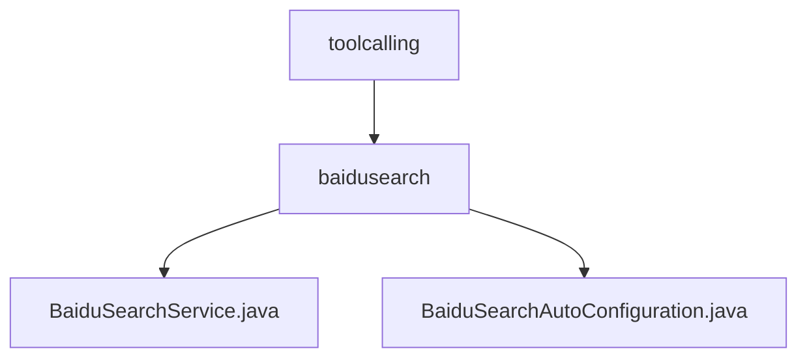

# 基础信息

|      |      |
|------|------|
| 名称 | toolcalling |
| 编码语言 | .java |
| 代码路径 | spring-ai-alibaba/community/tool-calls/spring-ai-alibaba-starter-tool-calling-baidusearch/src/main/java/com/alibaba/cloud/ai/toolcalling |
| 包名 | spring-ai-alibaba.community.tool-calls.spring-ai-alibaba-starter-tool-calling-baidusearch.src.main.java.com.alibaba.cloud.ai.toolcalling |
| 概述说明 | 百度搜索服务类处理搜索请求，解析HTML结果，自动配置启用百度引擎，获取最新新闻，提升用户体验。 |

# 说明

## 概述

该代码模块主要围绕百度搜索引擎的集成与使用，提供了一套完整的搜索服务解决方案。模块的核心功能包括处理用户的搜索请求、执行搜索操作、解析HTML格式的搜索结果，并提取关键信息。通过自动配置功能，模块能够简化搜索引擎的集成过程，确保用户能够便捷地访问和检索最新的新闻内容。整体设计旨在提升搜索效率与用户体验。

## 主要业务场景

1. **搜索请求处理**：模块通过`BaiduSearchService`类接收用户的搜索请求，执行相应的搜索操作，并获取HTML格式的搜索结果。
2. **HTML解析**：在获取到搜索结果后，模块会对HTML内容进行解析，提取出关键信息，确保用户能够获取到准确的搜索结果。
3. **自动配置**：通过`BaiduSearchAutoConfiguration`类，模块能够自动启用百度搜索引擎进行查询操作，主要用于获取最新的新闻资讯。该功能简化了搜索引擎的集成过程，提升了系统的实用性和用户体验。
4. **新闻资讯检索**：模块特别适用于需要频繁获取最新新闻资讯的场景，通过百度搜索引擎，用户能够快速检索到最新的新闻内容。

### 包内部结构视图

该流程图展示了`toolcalling`目录下的层级结构，其中`toolcalling`包含`baidusearch`子目录，而`baidusearch`目录下又包含`BaiduSearchService.java`和`BaiduSearchAutoConfiguration.java`两个文件。这种结构清晰地反映了项目中的模块化设计，便于管理和维护。

# 文件列表 File List

| 名称   | 类型  | 说明 |
|-------|------|-------------|
| [baidusearch](baidusearch/_module.md) | package | 百度搜索服务类处理搜索请求，解析HTML结果，自动配置启用百度引擎，获取最新新闻，提升用户体验。 |

