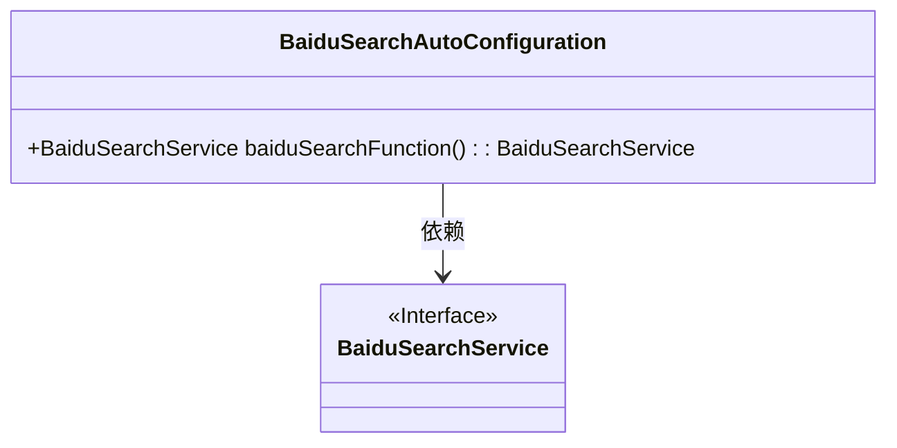
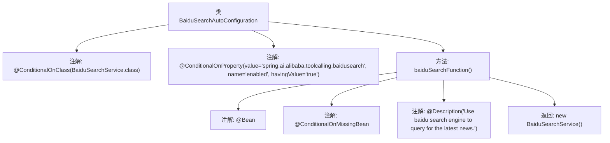

# 基础信息

|      |      |
|------|------|
| 名称 | BaiduSearchAutoConfiguration |
| 编码语言 | .java |
| 代码路径 | spring-ai-alibaba/community/tool-calls/spring-ai-alibaba-starter-tool-calling-baidusearch/src/main/java/com/alibaba/cloud/ai/toolcalling/baidusearch/BaiduSearchAutoConfiguration.java |
| 包名 | com.alibaba.cloud.ai.toolcalling.baidusearch |
| 依赖项 | ['org.springframework.boot.autoconfigure.condition.ConditionalOnClass', 'org.springframework.boot.autoconfigure.condition.ConditionalOnMissingBean', 'org.springframework.boot.autoconfigure.condition.ConditionalOnProperty', 'org.springframework.context.annotation.Bean', 'org.springframework.context.annotation.Description'] |
| 概述说明 | 基于BaiduSearchService自动配置，启用百度搜索查询最新新闻。 |

# 说明

基于BaiduSearchService类的自动配置功能，系统能够自动启用百度搜索引擎进行查询操作，主要用于获取最新的新闻资讯。该配置简化了搜索引擎的集成过程，确保用户能够便捷地访问和检索最新的新闻内容，提升了系统的实用性和用户体验。

# 类列表 Class Summary

| 名称   | 类型  | 说明 |
|-------|------|-------------|
| BaiduSearchAutoConfiguration | class | 基于BaiduSearchService类的自动配置，启用百度搜索引擎查询最新新闻。 |

## 类 BaiduSearchAutoConfiguration

|      |      |
|------|------|
| 访问范围 | @ConditionalOnClass(BaiduSearchService.class);@ConditionalOnProperty(value = "spring.ai.alibaba.toolcalling.baidusearch", name = "enabled", havingValue = "true");public |
| 类型 | class |
| 名称 | BaiduSearchAutoConfiguration |
| 说明 | 基于BaiduSearchService类的自动配置，启用百度搜索引擎查询最新新闻。 |

### UML类图

这段代码定义了一个名为 `BaiduSearchAutoConfiguration` 的类，它通过 `@ConditionalOnClass` 和 `@ConditionalOnProperty` 注解来控制是否自动配置 `BaiduSearchService` 的 Bean。当满足条件时，`baiduSearchFunction` 方法会返回一个 `BaiduSearchService` 的实例。`BaiduSearchService` 是一个接口，`BaiduSearchAutoConfiguration` 类依赖于该接口来实现自动配置功能。

### 内部方法调用关系图

**描述**：  
这段代码定义了一个名为 `BaiduSearchAutoConfiguration` 的类，该类在满足特定条件时自动配置 `BaiduSearchService`。通过 `@ConditionalOnClass` 和 `@ConditionalOnProperty` 注解，确保只有在 `BaiduSearchService` 类存在且配置属性 `spring.ai.alibaba.toolcalling.baidusearch.enabled` 为 `true` 时，才会创建 `BaiduSearchService` 的实例。`@Bean` 注解标记的 `baiduSearchFunction` 方法负责返回该实例，并通过 `@Description` 注解提供方法的功能描述。

### 字段列表 Field List

| 名称  | 类型  | 说明 |
|-------|-------|------|

### 方法列表 Method List

| 名称  | 类型  | 说明 |
|-------|-------|------|
| baiduSearchFunction | BaiduSearchService | 使用百度搜索引擎查询最新新闻的服务。 |

