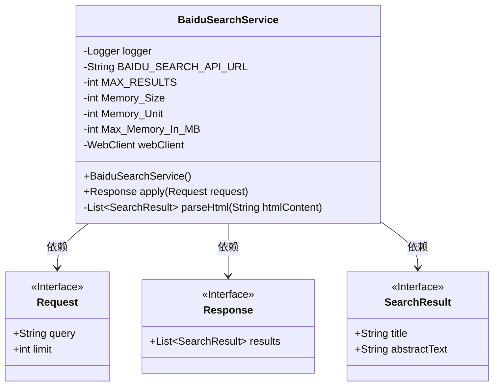

# 基础信息

|      |      |
|------|------|
| 名称 | BaiduSearchService |
| 编码语言 | .java |
| 代码路径 | spring-ai-alibaba/community/tool-calls/spring-ai-alibaba-starter-tool-calling-baidusearch/src/main/java/com/alibaba/cloud/ai/toolcalling/baidusearch/BaiduSearchService.java |
| 包名 | com.alibaba.cloud.ai.toolcalling.baidusearch |
| 依赖项 | ['com.fasterxml.jackson.annotation.JsonClassDescription', 'com.fasterxml.jackson.annotation.JsonInclude', 'com.fasterxml.jackson.annotation.JsonProperty', 'com.fasterxml.jackson.annotation.JsonPropertyDescription', 'org.jsoup.Jsoup', 'org.jsoup.nodes.Document', 'org.jsoup.nodes.Element', 'org.jsoup.select.Elements', 'org.slf4j.Logger', 'org.slf4j.LoggerFactory', 'org.springframework.http.HttpHeaders', 'org.springframework.util.CollectionUtils', 'org.springframework.util.StringUtils', 'org.springframework.web.reactive.function.client.WebClient', 'reactor.core.publisher.Mono', 'java.util.ArrayList', 'java.util.List', 'java.util.function.Function'] |
| 概述说明 | 百度搜索服务处理请求并解析HTML返回结果。 |

# 说明

百度搜索服务类主要用于处理搜索请求，并解析HTML返回结果。该类通过接收用户的搜索请求，执行相应的搜索操作，获取HTML格式的搜索结果，并进行解析以提取关键信息。整个过程包括请求的发送、响应的接收以及HTML内容的解析，确保用户能够获取到准确的搜索结果。该服务类的设计旨在高效、准确地处理搜索需求，提升用户体验。

# 类列表 Class Summary

| 名称   | 类型  | 说明 |
|-------|------|-------------|
| BaiduSearchService | class | 百度搜索服务类，实现搜索请求处理，解析HTML返回结果。 |

## 类 BaiduSearchService

|      |      |
|------|------|
| 访问范围 | public |
| 类型 | class |
| 名称 | BaiduSearchService |
| 说明 | 百度搜索服务类，实现搜索请求处理，解析HTML返回结果。 |

### UML类图

**描述：**

`BaiduSearchService` 类实现了 `Function` 接口，用于处理百度搜索请求。它包含一个 `WebClient` 实例，用于发送 HTTP 请求，并通过 `apply` 方法处理搜索请求，返回搜索结果。`parseHtml` 方法用于解析 HTML 内容并提取搜索结果。`Request` 和 `Response` 是内部记录类，分别表示搜索请求和响应。`SearchResult` 记录类表示单个搜索结果，包含标题和摘要。

### 内部方法调用关系图

```mermaid
graph TD
    A["类BaiduSearchService"]
    B["属性: Logger logger"]
    C["属性: String BAIDU_SEARCH_API_URL"]
    D["属性: int MAX_RESULTS"]
    E["属性: int Memory_Size"]
    F["属性: int Memory_Unit"]
    G["属性: int Max_Memory_In_MB"]
    H["属性: WebClient webClient"]
    I["构造方法: BaiduSearchService()"]
    J["方法: Response apply(Request request)"]
    K["方法: List<SearchResult> parseHtml(String htmlContent)"]
    L["内部类: Request"]
    M["内部类: Response"]
    N["内部类: SearchResult"]

    A --> B
    A --> C
    A --> D
    A --> E
    A --> F
    A --> G
    A --> H
    A --> I
    A --> J
    A --> K
    A --> L
    A --> M
    A --> N

    I --> H1["WebClient.builder()"]
    H1 --> H2["defaultHeader(HttpHeaders.USER_AGENT, 'Mozilla/5.0...')"]
    H1 --> H3["defaultHeader(HttpHeaders.ACCEPT, 'text/html...')"]
    H1 --> H4["defaultHeader(HttpHeaders.ACCEPT_ENCODING, 'gzip, deflate')"]
    H1 --> H5["defaultHeader(HttpHeaders.CONTENT_TYPE, 'application/x-www-form-urlencoded')"]
    H1 --> H6["defaultHeader(HttpHeaders.REFERER, 'https://www.baidu.com/')"]
    H1 --> H7["defaultHeader(HttpHeaders.ACCEPT_LANGUAGE, 'zh-CN,zh;q=0.9,ja;q=0.8')"]
    H1 --> H8["codecs(configurer -> configurer.defaultCodecs().maxInMemorySize(Max_Memory_In_MB))"]
    H1 --> H9["build()"]

    J --> J1["检查request是否为null或query为空"]
    J1 --> J2["返回null"]
    J --> J3["设置limit为request.limit或MAX_RESULTS"]
    J --> J4["构建URL: BAIDU_SEARCH_API_URL + request.query"]
    J --> J5["发送HTTP请求并获取响应"]
    J5 --> J6["解析HTML响应"]
    J6 --> J7["调用parseHtml(html)"]
    J7 --> J8["检查结果是否为空"]
    J8 --> J9["返回null"]
    J7 --> J10["记录日志并返回Response(results.subList(0, Math.min(results.size(), limit)))"]
    J5 --> J11["捕获异常并记录日志"]
    J11 --> J12["返回null"]

    K --> K1["解析HTML内容"]
    K1 --> K2["选择div#content_left"]
    K2 --> K3["遍历子元素"]
    K3 --> K4["检查元素是否具有'c-container'类"]
    K4 --> K5["解析标题和摘要"]
    K5 --> K6["添加SearchResult到列表"]
    K3 --> K7["捕获异常并记录日志"]
    K1 --> K8["捕获异常并记录日志"]
    K8 --> K9["返回null"]
```

**描述：**
该流程图展示了`BaiduSearchService`类的结构和主要方法调用关系。`BaiduSearchService`类负责通过百度搜索API进行搜索，并解析返回的HTML内容以提取搜索结果。流程图详细描述了类的构造方法、`apply`方法和`parseHtml`方法的执行流程，包括HTTP请求的构建、响应的解析以及异常处理。

### 字段列表 Field List

| 名称  | 类型  | 说明 |
|-------|-------|------|
| logger = LoggerFactory.getLogger(BaiduSearchService.class) | Logger | BaiduSearchService类中定义了一个私有静态日志记录器。 |
| MAX_RESULTS = 20 | int | 定义私有静态常量MAX_RESULTS，值为20。 |
| Memory_Unit = 1024 | int | 定义常量Memory_Unit为1024，表示内存单位。 |
| webClient | WebClient | WebClient被声明为私有且不可变的实例变量。 |
| Memory_Size = 5 | int | 定义了一个静态常量Memory_Size，值为5。 |
| BAIDU_SEARCH_API_URL = "https://www.baidu.com/s?wd=" | String | 百度搜索API的URL定义为常量。 |
| Max_Memory_In_MB = Memory_Size * Memory_Unit * Memory_Unit | int | 私有静态常量Max_Memory_In_MB通过计算内存大小与单位的乘积得出。 |

### 方法列表 Method List

| 名称  | 类型  | 说明 |
|-------|-------|------|
| parseHtml | List<SearchResult> | 解析百度搜索结果HTML，提取标题和摘要，生成SearchResult列表。 |
| apply | BaiduSearchService.Response | 处理百度搜索请求，解析结果并返回响应，处理异常。 |

