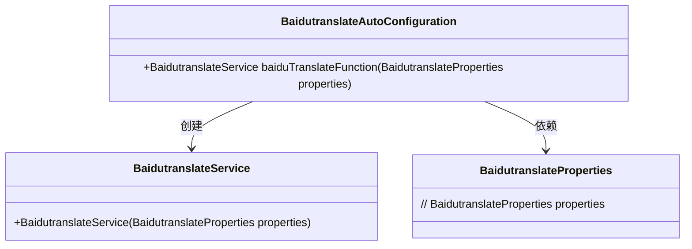
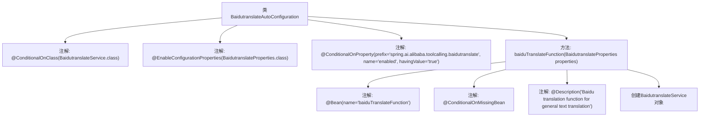

# 基础信息

|      |      |
|------|------|
| 名称 | BaidutranslateAutoConfiguration |
| 编码语言 | .java |
| 代码路径 | spring-ai-alibaba/community/tool-calls/spring-ai-alibaba-starter-tool-calling-baidutranslate/src/main/java/com/alibaba/cloud/ai/toolcalling/baidutranslate/BaidutranslateAutoConfiguration.java |
| 包名 | com.alibaba.cloud.ai.toolcalling.baidutranslate |
| 依赖项 | ['org.springframework.boot.autoconfigure.condition.ConditionalOnClass', 'org.springframework.boot.autoconfigure.condition.ConditionalOnMissingBean', 'org.springframework.boot.autoconfigure.condition.ConditionalOnProperty', 'org.springframework.boot.context.properties.EnableConfigurationProperties', 'org.springframework.context.annotation.Bean', 'org.springframework.context.annotation.Description'] |
| 概述说明 | 百度翻译自动配置类，支持条件加载和翻译函数创建。 |

# 说明

Baidutranslate自动配置类旨在实现翻译服务的条件加载，通过创建百度翻译函数来提供翻译功能。该配置类能够根据特定条件自动加载所需的翻译服务，确保在需要时能够高效地调用百度翻译API。这种方法不仅简化了翻译功能的集成，还提高了系统的灵活性和可维护性。

# 类列表 Class Summary

| 名称   | 类型  | 说明 |
|-------|------|-------------|
| BaidutranslateAutoConfiguration | class | Baidutranslate自动配置类，条件加载翻译服务，创建百度翻译函数。 |

## 类 BaidutranslateAutoConfiguration

|      |      |
|------|------|
| 访问范围 | @ConditionalOnClass(BaidutranslateService.class);@EnableConfigurationProperties(BaidutranslateProperties.class);@ConditionalOnProperty(prefix = "spring.ai.alibaba.toolcalling.baidutranslate", name = "enabled", havingValue = "true");public |
| 类型 | class |
| 名称 | BaidutranslateAutoConfiguration |
| 说明 | Baidutranslate自动配置类，条件加载翻译服务，创建百度翻译函数。 |

### UML类图

**描述：**  
`BaidutranslateAutoConfiguration` 是一个自动配置类，用于在满足特定条件时创建 `BaidutranslateService` 实例。它依赖于 `BaidutranslateProperties` 类来获取配置属性，并通过 `baiduTranslateFunction` 方法返回一个新的 `BaidutranslateService` 对象。该配置类仅在 `BaidutranslateService` 类存在且相关属性启用时生效。

### 内部方法调用关系图

这段代码描述了一个名为`BaidutranslateAutoConfiguration`的自动配置类，用于在特定条件下创建`BaidutranslateService`的Bean。该类通过多个注解来控制其行为，包括`@ConditionalOnClass`、`@EnableConfigurationProperties`和`@ConditionalOnProperty`，确保只有在满足特定条件时才会进行配置。`baiduTranslateFunction`方法负责创建并返回`BaidutranslateService`对象，并且该方法也带有多个注解，如`@Bean`、`@ConditionalOnMissingBean`和`@Description`，进一步定义了Bean的行为和用途。

### 字段列表 Field List

| 名称  | 类型  | 说明 |
|-------|-------|------|

### 方法列表 Method List

| 名称  | 类型  | 说明 |
|-------|-------|------|
| baiduTranslateFunction | BaidutranslateService | 定义百度翻译服务Bean，用于通用文本翻译，依赖属性配置。 |

