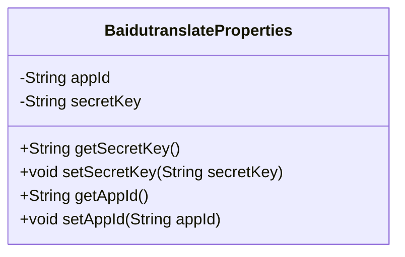
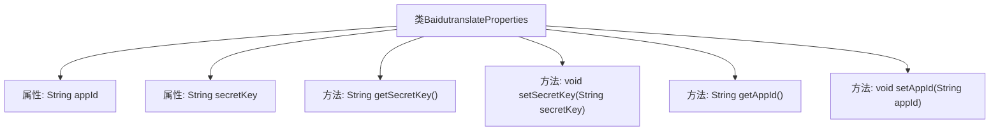

# 基础信息

|      |      |
|------|------|
| 名称 | BaidutranslateProperties |
| 编码语言 | .java |
| 代码路径 | spring-ai-alibaba/community/tool-calls/spring-ai-alibaba-starter-tool-calling-baidutranslate/src/main/java/com/alibaba/cloud/ai/toolcalling/baidutranslate/BaidutranslateProperties.java |
| 包名 | com.alibaba.cloud.ai.toolcalling.baidutranslate |
| 依赖项 | ['org.springframework.boot.context.properties.ConfigurationProperties'] |
| 概述说明 | BaidutranslateProperties类含appId和secretKey，用于百度翻译配置。 |

# 说明

BaidutranslateProperties类包含两个关键属性：appId和secretKey。这两个属性用于配置百度翻译服务，确保应用能够正确调用百度翻译API。appId用于标识应用程序，secretKey则用于身份验证和安全通信。通过设置这两个属性，开发者可以轻松集成百度翻译功能到他们的应用中。

# 类列表 Class Summary

| 名称   | 类型  | 说明 |
|-------|------|-------------|
| BaidutranslateProperties | class | BaidutranslateProperties类包含appId和secretKey属性，用于配置百度翻译。 |

## 类 BaidutranslateProperties

|      |      |
|------|------|
| 访问范围 | @ConfigurationProperties(prefix = "spring.ai.alibaba.toolcalling.baidutranslate");public |
| 类型 | class |
| 名称 | BaidutranslateProperties |
| 说明 | BaidutranslateProperties类包含appId和secretKey属性，用于配置百度翻译。 |

### UML类图

这段代码定义了一个名为 `BaidutranslateProperties` 的类，用于配置与百度翻译相关的属性。类中包含两个私有成员变量 `appId` 和 `secretKey`，分别表示应用的ID和密钥。类提供了这两个变量的公有getter和setter方法，用于获取和设置它们的值。该类通过 `@ConfigurationProperties` 注解与配置文件中的 `spring.ai.alibaba.toolcalling.baidutranslate` 前缀绑定，方便在Spring Boot应用中进行属性注入和配置管理。

### 内部方法调用关系图

该流程图展示了`BaidutranslateProperties`类的结构，包括其属性和方法。类中包含两个私有属性`appId`和`secretKey`，分别用于存储应用程序ID和密钥。类提供了四个公共方法，包括获取和设置这两个属性的方法。这些方法允许外部代码访问和修改这些属性值。

### 字段列表 Field List

| 名称  | 类型  | 说明 |
|-------|-------|------|
| appId | String | 定义了一个私有字符串变量appId。 |
| secretKey | String | 声明了一个私有字符串类型的secretKey变量。 |

### 方法列表 Method List

| 名称  | 类型  | 说明 |
|-------|-------|------|
| getAppId | String | 获取应用程序ID的方法。 |
| getSecretKey | String | 该方法返回私密密钥。 |
| setSecretKey | void | 设置密钥方法，将传入的密钥赋值给类成员变量。 |
| setAppId | void | 该方法用于设置应用程序ID，将传入的appId赋值给当前对象的appId属性。 |

