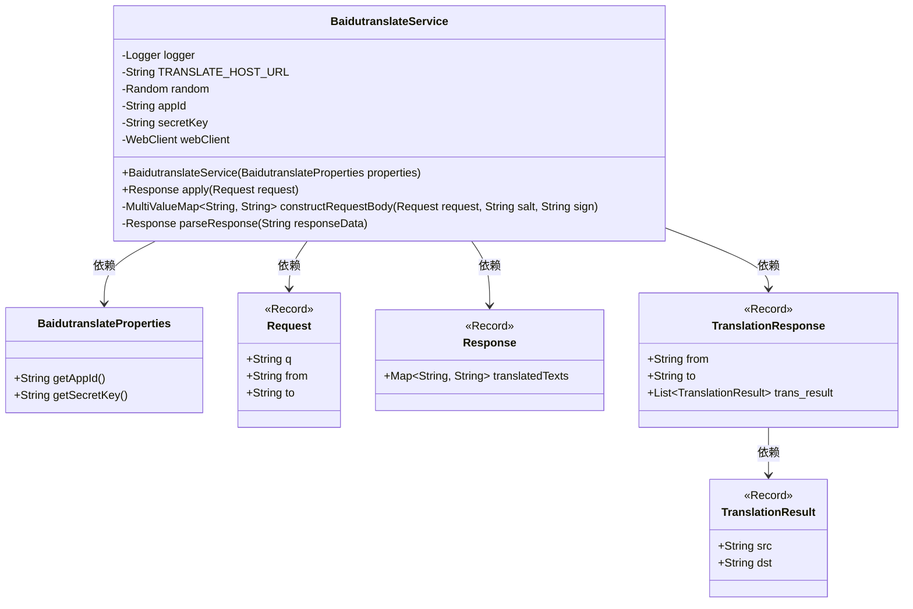

# 基础信息

|      |      |
|------|------|
| 名称 | BaidutranslateService |
| 编码语言 | .java |
| 代码路径 | spring-ai-alibaba/community/tool-calls/spring-ai-alibaba-starter-tool-calling-baidutranslate/src/main/java/com/alibaba/cloud/ai/toolcalling/baidutranslate/BaidutranslateService.java |
| 包名 | com.alibaba.cloud.ai.toolcalling.baidutranslate |
| 依赖项 | ['com.fasterxml.jackson.annotation.JsonClassDescription', 'com.fasterxml.jackson.annotation.JsonProperty', 'com.fasterxml.jackson.annotation.JsonPropertyDescription', 'com.fasterxml.jackson.databind.ObjectMapper', 'org.slf4j.Logger', 'org.slf4j.LoggerFactory', 'org.springframework.http.HttpHeaders', 'org.springframework.util.DigestUtils', 'org.springframework.util.LinkedMultiValueMap', 'org.springframework.util.MultiValueMap', 'org.springframework.util.StringUtils', 'org.springframework.web.reactive.function.client.WebClient', 'org.springframework.web.util.UriComponentsBuilder', 'reactor.core.publisher.Mono', 'java.util.HashMap', 'java.util.List', 'java.util.Map', 'java.util.Random', 'java.util.function.Function'] |
| 概述说明 | BaidutranslateService通过百度API实现翻译功能，处理请求并返回结果。 |

# 说明

BaidutranslateService是一个实现翻译功能的模块，通过调用百度API来处理翻译请求并返回相应的翻译结果。该服务负责与百度API进行交互，确保翻译请求的准确性和高效性，最终将翻译后的文本返回给用户。

# 类列表 Class Summary

| 名称   | 类型  | 说明 |
|-------|------|-------------|
| BaidutranslateService | class | BaidutranslateService实现翻译功能，使用百度API，处理请求并返回翻译结果。 |

## 类 BaidutranslateService

|      |      |
|------|------|
| 访问范围 | public |
| 类型 | class |
| 名称 | BaidutranslateService |
| 说明 | BaidutranslateService实现翻译功能，使用百度API，处理请求并返回翻译结果。 |

### UML类图

这段代码定义了一个 `BaidutranslateService` 类，用于调用百度翻译API进行文本翻译。该类依赖于 `BaidutranslateProperties` 来获取API的认证信息，并通过 `Request` 和 `Response` 记录类来处理翻译请求和响应。`TranslationResponse` 和 `TranslationResult` 记录类用于解析API返回的翻译结果。整个流程包括构造请求、发送请求、解析响应等步骤，确保翻译过程的完整性和准确性。

### 内部方法调用关系图

```mermaid
graph TD
    A["类BaidutranslateService"]
    B["属性: Logger logger"]
    C["属性: String TRANSLATE_HOST_URL"]
    D["属性: Random random"]
    E["属性: String appId"]
    F["属性: String secretKey"]
    G["属性: WebClient webClient"]
    H["构造方法: BaidutranslateService(BaidutranslateProperties properties)"]
    I["方法: Response apply(Request request)"]
    J["方法: MultiValueMap<String, String> constructRequestBody(Request request, String salt, String sign)"]
    K["方法: Response parseResponse(String responseData)"]
    L["内部类: Request"]
    M["内部类: Response"]
    N["内部类: TranslationResult"]
    O["内部类: TranslationResponse"]

    A --> B
    A --> C
    A --> D
    A --> E
    A --> F
    A --> G
    A --> H
    A --> I
    I --> J
    I --> K
    A --> L
    A --> M
    A --> N
    A --> O

    H --> E
    H --> F
    H --> G

    I -->|"request == null || !StringUtils.hasText(request.q) || !StringUtils.hasText(request.from) || !StringUtils.hasText(request.to)"| I1["返回null"]
    I -->|"生成salt"| I2["String salt = String.valueOf(random.nextInt(100000))"]
    I -->|"生成sign"| I3["String sign = DigestUtils.md5DigestAsHex((appId + request.q + salt + secretKey).getBytes())"]
    I -->|"构建url"| I4["String url = UriComponentsBuilder.fromHttpUrl(TRANSLATE_HOST_URL).toUriString()"]
    I -->|"构造请求体"| J
    I -->|"发送请求"| I5["Mono<String> responseMono = webClient.post().uri(url).bodyValue(body).retrieve().bodyToMono(String.class)"]
    I -->|"获取响应"| I6["String responseData = responseMono.block()"]
    I -->|"记录日志"| I7["logger.info('Translation request: {}, response: {}', request.q, responseData)"]
    I -->|"解析响应"| K
    I -->|"异常处理"| I8["logger.error('Failed to invoke translate API due to: {}', e.getMessage)"]
    I -->|"返回null"| I9["返回null"]

    J -->|"添加请求参数"| J1["body.add('q', request.q)"]
    J -->|"添加请求参数"| J2["body.add('from', request.from)"]
    J -->|"添加请求参数"| J3["body.add('to', request.to)"]
    J -->|"添加请求参数"| J4["body.add('appid', appId)"]
    J -->|"添加请求参数"| J5["body.add('salt', salt)"]
    J -->|"添加请求参数"| J6["body.add('sign', sign)"]
    J -->|"返回请求体"| J7["返回body"]

    K -->|"解析JSON"| K1["ObjectMapper mapper = new ObjectMapper()"]
    K -->|"解析翻译结果"| K2["TranslationResponse responseList = mapper.readValue(responseData, TranslationResponse.class)"]
    K -->|"获取目标语言"| K3["String to = responseList.to"]
    K -->|"遍历翻译结果"| K4["List<TranslationResult> translationsList = responseList.trans_result"]
    K -->|"记录日志"| K5["logger.info('Translated text to {}: {}', to, translatedText)"]
    K -->|"返回响应"| K6["返回new Response(translations)"]
    K -->|"异常处理"| K7["logger.error('Failed to parse json due to: {}', ex.getMessage)"]
    K -->|"返回null"| K8["返回null"]
```

这段代码实现了一个百度翻译服务类 `BaidutranslateService`，它通过HTTP请求调用百度翻译API，将输入的文本翻译成目标语言。代码首先通过构造方法初始化服务所需的参数，然后在 `apply` 方法中处理翻译请求，生成签名、构建请求体并发送HTTP请求。接着，解析API返回的JSON响应，提取翻译结果并返回。代码中还包含了对异常情况的处理，确保在出现错误时能够记录日志并返回 `null`。

### 字段列表 Field List

| 名称  | 类型  | 说明 |
|-------|-------|------|
| webClient | WebClient | 私有WebClient实例变量。 |
| secretKey | String | 私有且不可变的字符串类型密钥变量。 |
| appId | String | 私有字符串变量appId。 |
| random = new Random() | Random | 定义了一个私有的静态随机数生成器实例。 |
| logger = LoggerFactory.getLogger(BaidutranslateService.class) | Logger | BaidutranslateService类中定义了一个私有的静态日志记录器。 |
| TRANSLATE_HOST_URL = "https://fanyi-api.baidu.com/api/trans/vip/translate" | String | 百度翻译API的VIP翻译服务地址。 |

### 方法列表 Method List

| 名称  | 类型  | 说明 |
|-------|-------|------|
| parseResponse | Response | 解析翻译响应数据，处理异常并记录日志。 |
| apply | Response | 处理翻译请求，验证参数后生成签名，调用API并解析响应。 |
| constructRequestBody | MultiValueMap<String, String> | 构造请求体，包含查询、源语言、目标语言、应用ID、盐值和签名。 |

