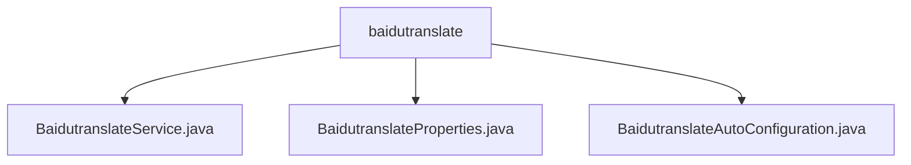

# 基础信息

|      |      |
|------|------|
| 名称 | baidutranslate |
| 编码语言 | .java |
| 代码路径 | spring-ai-alibaba/community/tool-calls/spring-ai-alibaba-starter-tool-calling-baidutranslate/src/main/java/com/alibaba/cloud/ai/toolcalling/baidutranslate |
| 包名 | spring-ai-alibaba.community.tool-calls.spring-ai-alibaba-starter-tool-calling-baidutranslate.src.main.java.com.alibaba.cloud.ai.toolcalling.baidutranslate |
| 概述说明 | BaidutranslateService通过百度API实现翻译，BaidutranslateProperties配置appId和secretKey，BaidutranslateAutoConfiguration自动加载翻译服务。 |

# 说明

## 概述

该代码模块是一个基于Spring框架的翻译功能集成模块，主要用于通过调用百度API实现文本翻译功能。模块包含三个核心类：`BaidutranslateService`、`BaidutranslateProperties`和`BaidutranslateAutoConfiguration`。`BaidutranslateService`负责与百度API进行交互，处理翻译请求并返回翻译结果；`BaidutranslateProperties`用于配置百度翻译服务的必要参数，如`appId`和`secretKey`，以确保应用能够正确调用API；`BaidutranslateAutoConfiguration`则通过自动配置机制，在满足特定条件时加载翻译服务，简化了翻译功能的集成过程。

## 主要业务场景

1. **文本翻译**：该模块的核心功能是通过调用百度API实现文本翻译。`BaidutranslateService`负责处理翻译请求，并将翻译后的文本返回给用户。适用于需要多语言支持的应用程序，如国际化网站、跨语言沟通工具等。

2. **配置管理**：`BaidutranslateProperties`类用于管理百度翻译服务的配置信息，包括`appId`和`secretKey`。这些信息是调用百度API的必要条件，开发者可以通过配置这些属性轻松集成翻译功能。

3. **自动加载翻译服务**：`BaidutranslateAutoConfiguration`类通过条件加载机制，自动创建和配置百度翻译服务。这种设计提高了系统的灵活性和可维护性，确保在需要时能够高效地调用翻译功能，同时减少了手动配置的复杂性。

### 包内部结构视图

该流程图展示了`baidutranslate`目录下的三个Java文件：`BaidutranslateService.java`、`BaidutranslateProperties.java`和`BaidutranslateAutoConfiguration.java`。这些文件均位于同一层级，直接归属于`baidutranslate`目录，体现了该模块的核心功能配置和服务实现。

# 文件列表 File List

| 名称   | 类型  | 说明 |
|-------|------|-------------|
| [BaidutranslateAutoConfiguration.java](BaidutranslateAutoConfiguration.md) | file | 百度翻译自动配置类，支持条件加载和翻译函数创建。 |
| [BaidutranslateProperties.java](BaidutranslateProperties.md) | file | BaidutranslateProperties类含appId和secretKey，用于百度翻译配置。 |
| [BaidutranslateService.java](BaidutranslateService.md) | file | BaidutranslateService通过百度API实现翻译功能，处理请求并返回结果。 |

