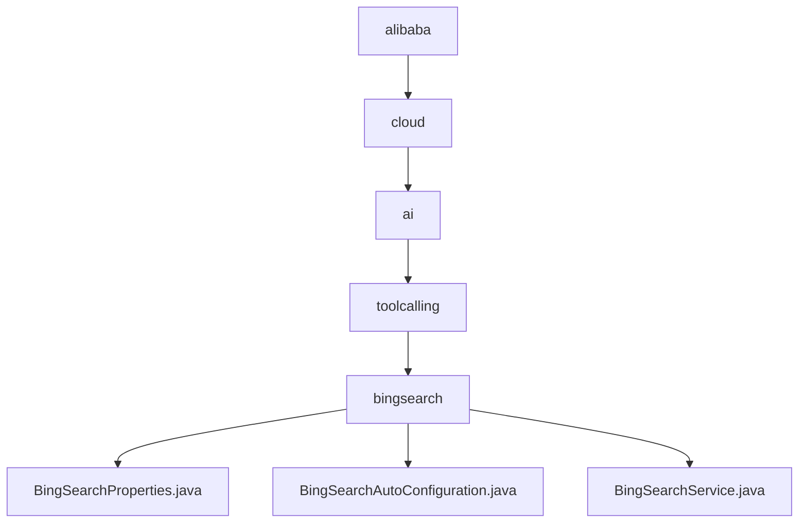

# 基础信息

|      |      |
|------|------|
| 名称 | alibaba |
| 编码语言 | .java |
| 代码路径 | spring-ai-alibaba/community/tool-calls/spring-ai-alibaba-starter-tool-calling-bingsearch/src/main/java/com/alibaba |
| 包名 | spring-ai-alibaba.community.tool-calls.spring-ai-alibaba-starter-tool-calling-bingsearch.src.main.java.com.alibaba |
| 概述说明 | BingSearchProperties类配置Bing搜索token属性，确保搜索请求正确执行。BingSearchAutoConfiguration类自动注册并动态启用Bing搜索服务。BingSearchService通过Bing API执行查询，返回搜索结果。 |

# 说明

## 概述
该代码模块主要用于集成和管理Bing搜索功能，提供了从配置到实际搜索操作的完整解决方案。模块通过`BingSearchProperties`类管理Bing搜索的token属性，确保搜索请求的认证和授权信息正确设置。`BingSearchAutoConfiguration`类实现了Bing搜索服务的自动注册和条件判断，确保在满足特定条件时自动启用搜索功能。`BingSearchService`类则负责实际调用Bing API执行搜索操作，并返回相应的搜索结果。该模块的设计旨在简化Bing搜索的集成过程，提供灵活的配置选项，并确保搜索功能的安全性和有效性。

## 主要业务场景
1. **Bing搜索配置管理**：通过`BingSearchProperties`类，用户可以定义和调整Bing搜索的token获取、验证及使用方式，确保搜索请求的安全性和有效性。
2. **Bing搜索服务自动注册**：`BingSearchAutoConfiguration`类根据预设条件动态控制Bing搜索服务的激活状态，确保在满足特定条件时自动启用搜索功能，提升系统的灵活性和智能化水平。
3. **Bing搜索功能实现**：`BingSearchService`类通过调用Bing API执行查询操作，为用户提供准确和相关的搜索结果，满足各种信息检索需求。

### 包内部结构视图

该流程图展示了从`alibaba`到`bingsearch`的层级关系，最终指向三个Java文件：`BingSearchProperties.java`、`BingSearchAutoConfiguration.java`和`BingSearchService.java`。每个节点代表路径中的一个文件夹或文件，清晰地展示了项目的目录结构和文件组织方式。

# 文件列表 File List

| 名称   | 类型  | 说明 |
|-------|------|-------------|
| [cloud](cloud/_module.md) | package | BingSearchProperties类配置Bing搜索token属性，确保搜索请求正确执行。BingSearchAutoConfiguration类自动注册并动态启用Bing搜索服务。BingSearchService通过Bing API执行查询，返回搜索结果。 |

