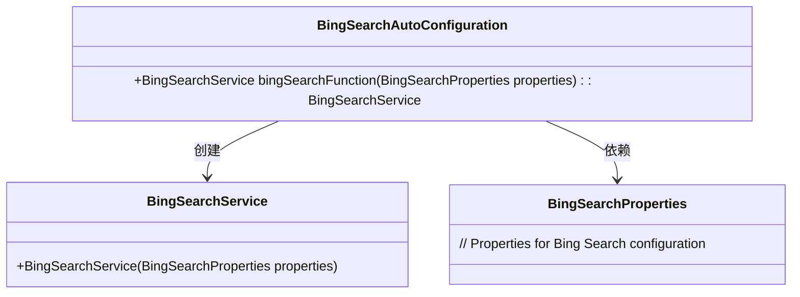
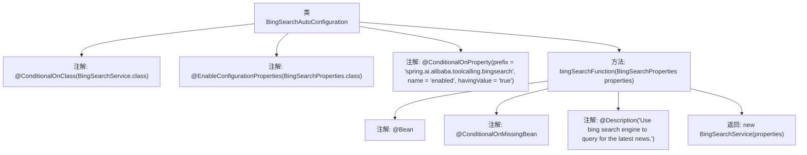

# 基础信息

|      |      |
|------|------|
| 名称 | BingSearchAutoConfiguration |
| 编码语言 | .java |
| 代码路径 | spring-ai-alibaba/community/tool-calls/spring-ai-alibaba-starter-tool-calling-bingsearch/src/main/java/com/alibaba/cloud/ai/toolcalling/bingsearch/BingSearchAutoConfiguration.java |
| 包名 | com.alibaba.cloud.ai.toolcalling.bingsearch |
| 依赖项 | ['org.springframework.boot.autoconfigure.condition.ConditionalOnClass', 'org.springframework.boot.autoconfigure.condition.ConditionalOnMissingBean', 'org.springframework.boot.autoconfigure.condition.ConditionalOnProperty', 'org.springframework.boot.context.properties.EnableConfigurationProperties', 'org.springframework.context.annotation.Bean', 'org.springframework.context.annotation.Description'] |
| 概述说明 | 配置类自动注册Bing搜索服务，条件启用。 |

# 说明

配置类自动注册Bing搜索服务，通过条件判断机制决定是否启用该服务。该功能实现了Bing搜索服务的自动化集成，根据预设条件动态控制服务的激活状态，确保在满足特定条件时自动启用Bing搜索功能，从而提升系统的灵活性和智能化水平。

# 类列表 Class Summary

| 名称   | 类型  | 说明 |
|-------|------|-------------|
| BingSearchAutoConfiguration | class | 配置类自动注册Bing搜索服务，基于条件启用。 |

## 类 BingSearchAutoConfiguration

|      |      |
|------|------|
| 访问范围 | @ConditionalOnClass(BingSearchService.class);@EnableConfigurationProperties(BingSearchProperties.class);@ConditionalOnProperty(prefix = "spring.ai.alibaba.toolcalling.bingsearch", name = "enabled", havingValue = "true");public |
| 类型 | class |
| 名称 | BingSearchAutoConfiguration |
| 说明 | 配置类自动注册Bing搜索服务，基于条件启用。 |

### UML类图

这段代码定义了一个自动配置类 `BingSearchAutoConfiguration`，用于在特定条件下创建 `BingSearchService` 实例。`BingSearchService` 依赖于 `BingSearchProperties` 来获取配置属性。`BingSearchAutoConfiguration` 类通过 `@ConditionalOnClass`、`@EnableConfigurationProperties` 和 `@ConditionalOnProperty` 注解来控制其是否生效，并在缺少 `BingSearchService` 实例时自动创建该服务。

### 内部方法调用关系图

这段代码是一个Spring Boot自动配置类，用于在满足特定条件时自动配置`BingSearchService`。它使用了多个条件注解来确保只有在`BingSearchService`类存在、`BingSearchProperties`配置类启用且`spring.ai.alibaba.toolcalling.bingsearch.enabled`属性为`true`时，才会创建`BingSearchService`的Bean。该方法还使用了`@Description`注解来描述该Bean的作用，即使用Bing搜索引擎查询最新新闻。

### 字段列表 Field List

| 名称  | 类型  | 说明 |
|-------|-------|------|

### 方法列表 Method List

| 名称  | 类型  | 说明 |
|-------|-------|------|
| bingSearchFunction | BingSearchService | 使用Bing搜索引擎查询最新新闻的服务类。 |

