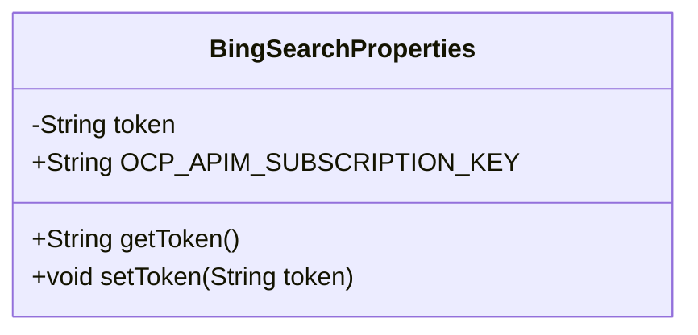
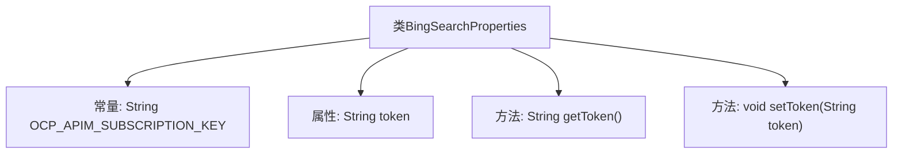

# 基础信息

|      |      |
|------|------|
| 名称 | BingSearchProperties |
| 编码语言 | .java |
| 代码路径 | spring-ai-alibaba/community/tool-calls/spring-ai-alibaba-starter-tool-calling-bingsearch/src/main/java/com/alibaba/cloud/ai/toolcalling/bingsearch/BingSearchProperties.java |
| 包名 | com.alibaba.cloud.ai.toolcalling.bingsearch |
| 依赖项 | ['org.springframework.boot.context.properties.ConfigurationProperties', 'org.springframework.boot.context.properties.EnableConfigurationProperties'] |
| 概述说明 | BingSearchProperties类用于配置Bing搜索的token属性。 |

# 说明

BingSearchProperties类用于配置Bing搜索的token属性。该类负责管理和设置与Bing搜索相关的认证和授权信息，确保搜索请求能够正确执行。通过该类，用户可以定义和调整token的获取、验证及使用方式，从而保障搜索功能的安全性和有效性。该类的设计旨在简化Bing搜索集成过程，提供灵活的配置选项以适应不同的应用场景。

# 类列表 Class Summary

| 名称   | 类型  | 说明 |
|-------|------|-------------|
| BingSearchProperties | class | BingSearchProperties类配置Bing搜索的token属性。 |

## 类 BingSearchProperties

|      |      |
|------|------|
| 访问范围 | @EnableConfigurationProperties;@ConfigurationProperties(prefix = "spring.ai.alibaba.toolcalling.bingsearch");public |
| 类型 | class |
| 名称 | BingSearchProperties |
| 说明 | BingSearchProperties类配置Bing搜索的token属性。 |

### UML类图

这段代码定义了一个名为 `BingSearchProperties` 的类，用于配置与 Bing 搜索相关的属性。类中包含一个私有成员变量 `token` 和其对应的 getter 和 setter 方法。此外，类中还定义了一个公共常量 `OCP_APIM_SUBSCRIPTION_KEY`，用于存储 Bing API 的订阅密钥。该类通过 `@ConfigurationProperties` 注解与配置文件中的 `spring.ai.alibaba.toolcalling.bingsearch` 前缀绑定，使得配置属性可以自动注入到该类的实例中。

### 内部方法调用关系图

这段代码定义了一个名为 `BingSearchProperties` 的配置类，用于管理与 Bing 搜索相关的属性。类中包含一个常量 `OCP_APIM_SUBSCRIPTION_KEY` 和一个私有属性 `token`，并提供了 `getToken` 和 `setToken` 方法来访问和修改 `token` 属性。该类使用了 `@ConfigurationProperties` 注解，以便与配置文件中的属性进行绑定。

### 字段列表 Field List

| 名称  | 类型  | 说明 |
|-------|-------|------|
| token | String | 声明一个私有的字符串变量token。 |
| OCP_APIM_SUBSCRIPTION_KEY = "Ocp-Apim-Subscription-Key" | String | 定义静态常量字符串OCP_APIM_SUBSCRIPTION_KEY，值为"Ocp-Apim-Subscription-Key"。 |

### 方法列表 Method List

| 名称  | 类型  | 说明 |
|-------|-------|------|
| getToken | String | 获取并返回token字符串。 |
| setToken | void | 设置token值为传入的字符串参数。 |

