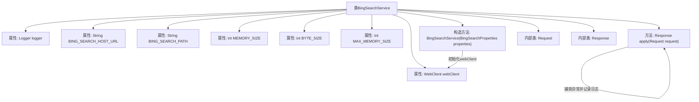

# 基础信息

|      |      |
|------|------|
| 名称 | BingSearchService |
| 编码语言 | .java |
| 代码路径 | spring-ai-alibaba/community/tool-calls/spring-ai-alibaba-starter-tool-calling-bingsearch/src/main/java/com/alibaba/cloud/ai/toolcalling/bingsearch/BingSearchService.java |
| 包名 | com.alibaba.cloud.ai.toolcalling.bingsearch |
| 依赖项 | ['com.fasterxml.jackson.annotation.JsonClassDescription', 'com.fasterxml.jackson.annotation.JsonInclude', 'com.fasterxml.jackson.annotation.JsonProperty', 'com.fasterxml.jackson.annotation.JsonPropertyDescription', 'com.google.gson.Gson', 'com.google.gson.reflect.TypeToken', 'org.slf4j.Logger', 'org.slf4j.LoggerFactory', 'org.springframework.http.HttpHeaders', 'org.springframework.util.StringUtils', 'org.springframework.web.reactive.function.client.WebClient', 'reactor.core.publisher.Mono', 'java.net.URLEncoder', 'java.nio.charset.StandardCharsets', 'java.util.List', 'java.util.Map', 'java.util.function.Function'] |
| 概述说明 | BingSearchService利用Bing API实现搜索功能并返回结果。 |

# 说明

BingSearchService是一个实现搜索功能的服务，它通过调用Bing API来执行查询操作，并返回相应的搜索结果。该服务的核心功能是利用Bing的搜索能力，为用户提供准确和相关的信息。

# 类列表 Class Summary

| 名称   | 类型  | 说明 |
|-------|------|-------------|
| BingSearchService | class | BingSearchService实现搜索功能，通过Bing API查询并返回结果。 |


## 类 BingSearchService

|      |      |
|------|------|
| 访问范围 | public |
| 类型 | class |
| 名称 | BingSearchService |
| 说明 | BingSearchService实现搜索功能，通过Bing API查询并返回结果。 |


### UML类图

```mermaid
classDiagram
    class BingSearchService {
        -Logger logger
        -String BING_SEARCH_HOST_URL
        -String BING_SEARCH_PATH
        -WebClient webClient
        -int MEMORY_SIZE
        -int BYTE_SIZE
        -int MAX_MEMORY_SIZE
        +BingSearchService(BingSearchProperties properties)
        +Response apply(Request request)
    }

    class BingSearchProperties {
        +String getToken()
    }

    class Request {
        <<Interface>>
        +String query
    }

    class Response {
        <<Interface>>
        +String data
    }

    class WebClient {
        +WebClient.Builder builder()
    }

    class Mono~T~ {
        +T block()
    }

    class Gson {
        +Map~String, Object~ fromJson(String json, Type type)
    }

    class TypeToken~T~ {
    }

    class Map~K, V~ {
    }

    class List~T~ {
    }

    BingSearchService --> BingSearchProperties : 依赖
    BingSearchService --> WebClient : 依赖
    BingSearchService --> Mono~String~ : 依赖
    BingSearchService --> Gson : 依赖
    BingSearchService --> TypeToken~Map~String, Object~~ : 依赖
    BingSearchService --> Map~String, Object~ : 依赖
    BingSearchService --> List~Map~String, Object~~ : 依赖
    BingSearchService --> Request : 实现
    BingSearchService --> Response : 实现
```

### 描述：
`BingSearchService` 是一个实现了 `Function` 接口的类，用于处理 Bing 搜索请求并返回搜索结果。它依赖于 `BingSearchProperties` 获取 API 令牌，并使用 `WebClient` 发送 HTTP 请求。通过 `Mono` 处理异步响应，并使用 `Gson` 解析 JSON 数据。`Request` 和 `Response` 是内部记录类，分别表示搜索请求和响应。


### 内部方法调用关系图



**描述**：这段代码实现了一个Bing搜索服务类`BingSearchService`，该类通过`WebClient`发送HTTP请求到Bing搜索API，并处理返回的JSON数据。代码首先检查请求的有效性，然后构建请求URL并发送请求。接着，解析返回的JSON数据，提取有用的信息并返回响应对象。如果过程中发生异常，代码会捕获并记录错误日志。

### 字段列表 Field List

| 名称  | 类型  | 说明 |
|-------|-------|------|
| BING_SEARCH_PATH = "/v7.0/search" | String | Bing搜索API路径为/v7.0/search。 |
| logger = LoggerFactory.getLogger(BingSearchService.class) | Logger | BingSearchService类中定义了一个静态日志记录器。 |
| BING_SEARCH_HOST_URL = "https://api.bing.microsoft.com" | String | Bing搜索API的主机URL设置为https://api.bing.microsoft.com。 |
| BYTE_SIZE = 1024 | int | 定义常量BYTE_SIZE，值为1024。 |
| MEMORY_SIZE = 5 | int | 定义常量MEMORY_SIZE，值为5。 |
| MAX_MEMORY_SIZE = MEMORY_SIZE * BYTE_SIZE * BYTE_SIZE | int | 定义常量MAX_MEMORY_SIZE，值为MEMORY_SIZE乘以BYTE_SIZE的平方。 |
| webClient | WebClient | 私有不可变的WebClient实例。 |

### 方法列表 Method List

| 名称  | 类型  | 说明 |
|-------|-------|------|
| apply | BingSearchService.Response | 方法处理Bing搜索请求，验证并构建URL，获取响应数据，解析并返回结果片段或完整响应，异常时记录错误。 |


