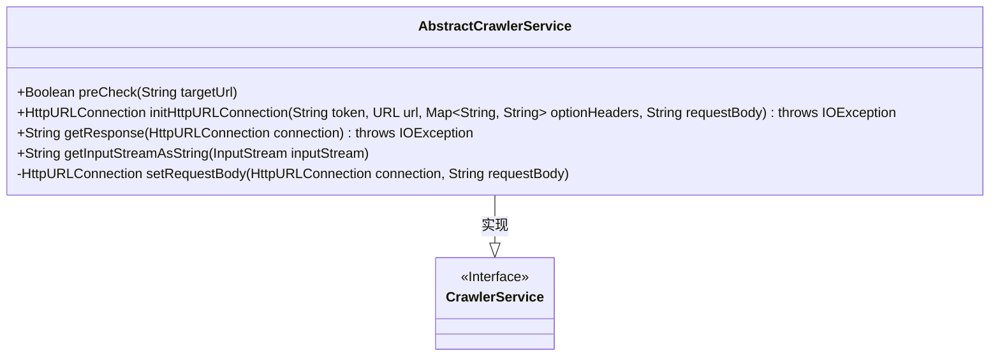
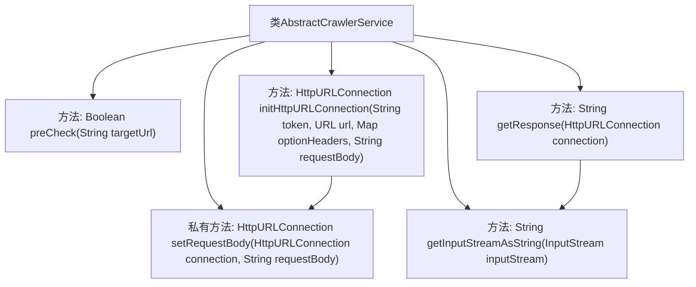

# 基础信息

|      |      |
|------|------|
| 名称 | AbstractCrawlerService |
| 编码语言 | .java |
| 代码路径 | spring-ai-alibaba/community/tool-calls/spring-ai-alibaba-starter-tool-calling-crawler/src/main/java/com/alibaba/cloud/ai/toolcalling/crawler/AbstractCrawlerService.java |
| 包名 | com.alibaba.cloud.ai.toolcalling.crawler |
| 依赖项 | ['java.io.BufferedReader', 'java.io.IOException', 'java.io.InputStream', 'java.io.InputStreamReader', 'java.io.OutputStreamWriter', 'java.net.HttpURLConnection', 'java.net.URL', 'java.util.Map', 'java.util.Objects', 'org.springframework.http.HttpHeaders', 'org.springframework.http.HttpMethod', 'org.springframework.http.MediaType'] |
| 概述说明 | 抽象爬虫服务类实现URL预检、HTTP连接初始化及响应处理。 |

# 说明

抽象爬虫服务类实现了URL预检、HTTP连接初始化和响应处理三大核心功能。URL预检功能用于验证目标URL的有效性和合法性，确保爬取请求的准确性。HTTP连接初始化负责建立与目标服务器的网络连接，配置请求参数，如请求头、超时设置等。响应处理功能则对服务器返回的HTTP响应进行解析，提取有效数据，并处理可能的异常情况，如网络错误或数据格式不符。该服务类通过模块化设计，提高了爬虫系统的可维护性和扩展性。

# 类列表 Class Summary

| 名称   | 类型  | 说明 |
|-------|------|-------------|
| AbstractCrawlerService | class | 抽象爬虫服务类实现URL预检、HTTP连接初始化和响应处理功能。 |

## 类 AbstractCrawlerService

|      |      |
|------|------|
| 访问范围 | public abstract |
| 类型 | class |
| 名称 | AbstractCrawlerService |
| 说明 | 抽象爬虫服务类实现URL预检、HTTP连接初始化和响应处理功能。 |

### UML类图

**描述：**  
`AbstractCrawlerService` 是一个抽象类，实现了 `CrawlerService` 接口。它提供了用于网络爬虫服务的基础功能，包括目标URL的预检查、HTTP连接的初始化、响应的获取以及输入流的处理。`preCheck` 方法用于验证目标URL的有效性，`initHttpURLConnection` 方法用于初始化HTTP连接并设置请求头和请求体，`getResponse` 方法用于获取HTTP响应，`getInputStreamAsString` 方法用于将输入流转换为字符串，`setRequestBody` 方法用于设置HTTP请求体。这些方法共同构成了一个基础的网络爬虫服务框架。

### 内部方法调用关系图

该流程图展示了`AbstractCrawlerService`类的主要方法及其调用关系。`preCheck`方法用于检查目标URL的有效性，`initHttpURLConnection`方法初始化HTTP连接并设置请求头和请求体，`getResponse`方法获取HTTP响应并处理错误，`getInputStreamAsString`方法将输入流转换为字符串，`setRequestBody`方法则负责设置请求体。这些方法共同协作，实现了爬虫服务的基本功能。

### 字段列表 Field List

| 名称  | 类型  | 说明 |
|-------|-------|------|

### 方法列表 Method List

| 名称  | 类型  | 说明 |
|-------|-------|------|
| preCheck | Boolean | 预检查方法，验证目标URL非空且有效。 |
| getResponse | String | 方法处理HTTP响应，异常时抛出错误并返回输入流内容。 |
| getInputStreamAsString | String | 将输入流转换为字符串，捕获异常并抛出服务异常。 |
| initHttpURLConnection | HttpURLConnection | 初始化HTTP连接，设置请求头、授权和内容类型，并处理可选头信息。 |
| setRequestBody | HttpURLConnection | 设置HTTP请求体并处理写入异常。 |

