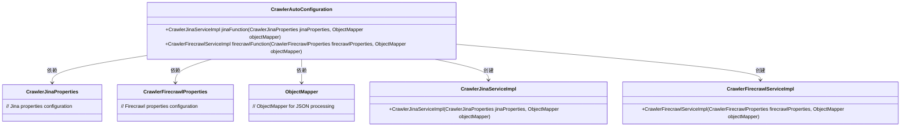
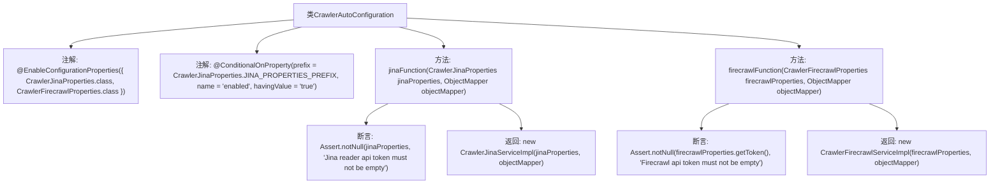

# 基础信息

|      |      |
|------|------|
| 名称 | CrawlerAutoConfiguration |
| 编码语言 | .java |
| 代码路径 | spring-ai-alibaba/community/tool-calls/spring-ai-alibaba-starter-tool-calling-crawler/src/main/java/com/alibaba/cloud/ai/toolcalling/crawler/CrawlerAutoConfiguration.java |
| 包名 | com.alibaba.cloud.ai.toolcalling.crawler |
| 依赖项 | ['com.fasterxml.jackson.databind.ObjectMapper', 'org.springframework.boot.autoconfigure.condition.ConditionalOnMissingBean', 'org.springframework.boot.autoconfigure.condition.ConditionalOnProperty', 'org.springframework.boot.context.properties.EnableConfigurationProperties', 'org.springframework.context.annotation.Bean', 'org.springframework.context.annotation.Description', 'org.springframework.util.Assert'] |
| 概述说明 | 自动配置类定义Jina和Firecrawl服务Bean，需验证API令牌非空。 |

# 说明

该自动配置类主要用于定义和配置Jina和Firecrawl服务的Bean。在配置过程中，需要验证API令牌是否为空，确保服务的正常运行。该配置类确保在应用启动时，相关服务的Bean能够被正确初始化，并且API令牌的有效性得到验证，从而保障服务的可用性和安全性。

# 类列表 Class Summary

| 名称   | 类型  | 说明 |
|-------|------|-------------|
| CrawlerAutoConfiguration | class | 自动配置类，包含Jina和Firecrawl服务的Bean定义，需验证API令牌非空。 |

## 类 CrawlerAutoConfiguration

|      |      |
|------|------|
| 访问范围 | @EnableConfigurationProperties({ CrawlerJinaProperties.class, CrawlerFirecrawlProperties.class });@ConditionalOnProperty(prefix = CrawlerJinaProperties.JINA_PROPERTIES_PREFIX, name = "enabled", havingValue = "true");public |
| 类型 | class |
| 名称 | CrawlerAutoConfiguration |
| 说明 | 自动配置类，包含Jina和Firecrawl服务的Bean定义，需验证API令牌非空。 |

### UML类图

这段代码定义了一个自动配置类 `CrawlerAutoConfiguration`，用于在Spring Boot应用中根据条件自动配置 `CrawlerJinaServiceImpl` 和 `CrawlerFirecrawlServiceImpl` 两个服务类。`CrawlerAutoConfiguration` 依赖于 `CrawlerJinaProperties` 和 `CrawlerFirecrawlProperties` 这两个配置类，以及 `ObjectMapper` 用于JSON处理。通过 `@ConditionalOnProperty` 和 `@ConditionalOnMissingBean` 注解，确保了只有在特定条件下才会创建这些服务类的实例。

### 内部方法调用关系图

这段代码是一个Spring Boot的自动配置类，用于根据条件加载不同的爬虫服务实现。`CrawlerAutoConfiguration`类通过`@EnableConfigurationProperties`注解启用了两个配置类`CrawlerJinaProperties`和`CrawlerFirecrawlProperties`，并通过`@ConditionalOnProperty`注解确保仅在`jina.enabled`为`true`时生效。类中定义了两个Bean方法`jinaFunction`和`firecrawlFunction`，分别用于创建`CrawlerJinaServiceImpl`和`CrawlerFirecrawlServiceImpl`实例，并在创建前对必要的参数进行非空校验。

### 字段列表 Field List

| 名称  | 类型  | 说明 |
|-------|-------|------|

### 方法列表 Method List

| 名称  | 类型  | 说明 |
|-------|-------|------|
| jinaFunction | CrawlerJinaServiceImpl | 创建Jina阅读器服务插件，依赖Jina属性和对象映射器。 |
| firecrawlFunction | CrawlerFirecrawlServiceImpl | Firecrawl服务插件，确保API令牌非空。 |

