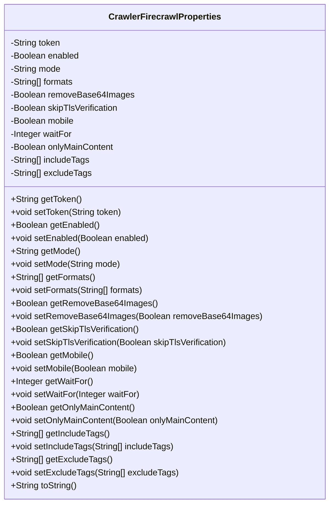

# 基础信息

|      |      |
|------|------|
| 名称 | CrawlerFirecrawlProperties |
| 编码语言 | .java |
| 代码路径 | spring-ai-alibaba/community/tool-calls/spring-ai-alibaba-starter-tool-calling-crawler/src/main/java/com/alibaba/cloud/ai/toolcalling/crawler/CrawlerFirecrawlProperties.java |
| 包名 | com.alibaba.cloud.ai.toolcalling.crawler |
| 依赖项 | ['org.springframework.boot.context.properties.ConfigurationProperties', 'org.springframework.boot.context.properties.EnableConfigurationProperties', 'java.util.Arrays'] |
| 概述说明 | CrawlerFirecrawlProperties类配置爬虫属性，包括token、启用状态、模式和格式等参数。 |

# 说明

CrawlerFirecrawlProperties类用于配置爬虫的相关属性，包括token、启用状态、运行模式和输出格式等关键参数。该类通过定义这些参数，确保爬虫在运行过程中能够根据具体需求进行灵活配置和调整，从而满足不同的爬取任务和场景要求。

# 类列表 Class Summary

| 名称   | 类型  | 说明 |
|-------|------|-------------|
| CrawlerFirecrawlProperties | class | CrawlerFirecrawlProperties类用于配置爬虫属性，包含token、启用状态、模式、格式等参数。 |

## 类 CrawlerFirecrawlProperties

|      |      |
|------|------|
| 访问范围 | @EnableConfigurationProperties;@ConfigurationProperties(prefix = CrawlerFirecrawlProperties.FIRECRAWL_PROPERTIES_PREFIX);public |
| 类型 | class |
| 名称 | CrawlerFirecrawlProperties |
| 说明 | CrawlerFirecrawlProperties类用于配置爬虫属性，包含token、启用状态、模式、格式等参数。 |

### UML类图

**描述：**
`CrawlerFirecrawlProperties` 类是一个配置属性类，用于管理爬虫的相关配置。它包含多个私有属性，如 `token`、`enabled`、`mode` 等，并提供了相应的 `getter` 和 `setter` 方法。这些属性用于控制爬虫的行为，如是否启用、是否跳过TLS验证、是否仅抓取主要内容等。`toString` 方法用于返回对象的字符串表示，便于调试和日志记录。

### 内部方法调用关系图

```mermaid
graph TD
    A["类CrawlerFirecrawlProperties"]
    B["常量: FIRECRAWL_PROPERTIES_PREFIX"]
    C["属性: String token"]
    D["属性: Boolean enabled"]
    E["属性: String mode"]
    F["属性: String[] formats"]
    G["属性: Boolean removeBase64Images"]
    H["属性: Boolean skipTlsVerification"]
    I["属性: Boolean mobile"]
    J["属性: Integer waitFor"]
    K["属性: Boolean onlyMainContent"]
    L["属性: String[] includeTags"]
    M["属性: String[] excludeTags"]
    N["方法: String getToken()"]
    O["方法: void setToken(String token)"]
    P["方法: Boolean getEnabled()"]
    Q["方法: void setEnabled(Boolean enabled)"]
    R["方法: String getMode()"]
    S["方法: void setMode(String mode)"]
    T["方法: String[] getFormats()"]
    U["方法: void setFormats(String[] formats)"]
    V["方法: Boolean getRemoveBase64Images()"]
    W["方法: void setRemoveBase64Images(Boolean removeBase64Images)"]
    X["方法: Boolean getSkipTlsVerification()"]
    Y["方法: void setSkipTlsVerification(Boolean skipTlsVerification)"]
    Z["方法: Boolean getMobile()"]
    AA["方法: void setMobile(Boolean mobile)"]
    AB["方法: Integer getWaitFor()"]
    AC["方法: void setWaitFor(Integer waitFor)"]
    AD["方法: Boolean getOnlyMainContent()"]
    AE["方法: void setOnlyMainContent(Boolean onlyMainContent)"]
    AF["方法: String[] getIncludeTags()"]
    AG["方法: void setIncludeTags(String[] includeTags)"]
    AH["方法: String[] getExcludeTags()"]
    AI["方法: void setExcludeTags(String[] excludeTags)"]
    AJ["重写方法: String toString()"]

    A --> B
    A --> C
    A --> D
    A --> E
    A --> F
    A --> G
    A --> H
    A --> I
    A --> J
    A --> K
    A --> L
    A --> M
    A --> N
    A --> O
    A --> P
    A --> Q
    A --> R
    A --> S
    A --> T
    A --> U
    A --> V
    A --> W
    A --> X
    A --> Y
    A --> Z
    A --> AA
    A --> AB
    A --> AC
    A --> AD
    A --> AE
    A --> AF
    A --> AG
    A --> AH
    A --> AI
    A --> AJ
```

这段代码定义了一个名为 `CrawlerFirecrawlProperties` 的配置类，用于管理爬虫相关的配置属性。类中包含多个属性，如 `token`、`enabled`、`mode` 等，每个属性都有对应的 `getter` 和 `setter` 方法。类中还定义了一个常量 `FIRECRAWL_PROPERTIES_PREFIX`，用于配置属性的前缀。`toString` 方法被重写，用于返回对象的字符串表示。该类的设计旨在通过配置属性来控制爬虫的行为和功能。

### 字段列表 Field List

| 名称  | 类型  | 说明 |
|-------|-------|------|
| onlyMainContent | Boolean | 仅包含主要内容。 |
| removeBase64Images | Boolean | 移除Base64编码的图片。 |
| includeTags | String[] | 定义私有字符串数组变量includeTags。 |
| enabled | Boolean | 定义了一个私有的布尔类型变量enabled。 |
| token | String | 声明了一个私有字符串类型的变量token。 |
| excludeTags | String[] | 定义一个私有字符串数组，用于存储排除的标签。 |
| mode = CrawlerConstants.FirecrawlMode.SCRAPE | String | 私有字符串模式设置为爬虫常量中的抓取模式。 |
| waitFor | Integer | 私有整型变量waitFor用于等待时间。 |
| formats = new String[] { CrawlerConstants.FirecrawlFormats.MARKDOWN } | String[] | 私有字符串数组formats初始化为包含FirecrawlFormats.MARKDOWN的数组。 |
| FIRECRAWL_PROPERTIES_PREFIX = CrawlerConstants.CONFIG_PREFIX + "firecrawl" | String | FIRECRAWL_PROPERTIES_PREFIX定义为CrawlerConstants.CONFIG_PREFIX加"firecrawl"。 |
| mobile | Boolean | 声明一个私有的布尔类型变量mobile。 |
| skipTlsVerification | Boolean | 跳过TLS验证的布尔类型变量。 |

### 方法列表 Method List

| 名称  | 类型  | 说明 |
|-------|-------|------|
| setRemoveBase64Images | void | 设置是否移除Base64图像。 |
| setEnabled | void | 设置启用状态的布尔值方法。 |
| getWaitFor | Integer | 获取等待时间的整数值。 |
| setFormats | void | 设置格式数组的方法。 |
| setToken | void | 设置token值为传入的字符串参数。 |
| getMobile | Boolean | 该方法返回布尔类型的mobile变量值。 |
| setIncludeTags | void | 该方法用于设置包含标签的数组。 |
| getExcludeTags | String[] | 获取排除标签的字符串数组方法。 |
| getFormats | String[] | 该方法返回字符串数组formats。 |
| getOnlyMainContent | Boolean | 获取是否仅显示主内容的布尔值。 |
| setMobile | void | 设置移动设备状态的布尔值方法。 |
| getMode | String | 获取当前模式的字符串方法。 |
| setExcludeTags | void | 设置排除标签数组。 |
| setWaitFor | void | 设置等待时间的整数值。 |
| getIncludeTags | String[] | 获取包含标签的字符串数组方法。 |
| getEnabled | Boolean | 该方法返回布尔值表示是否启用。 |
| getRemoveBase64Images | Boolean | 该方法返回布尔值，表示是否移除Base64编码的图片。 |
| setSkipTlsVerification | void | 设置跳过TLS验证的布尔值。 |
| getToken | String | 该方法返回字符串类型的token值。 |
| toString | String | 重写toString方法，返回CrawlerFirecrawlProperties属性值。 |
| setOnlyMainContent | void | 设置仅包含主内容标志的方法。 |
| getSkipTlsVerification | Boolean | 方法返回布尔值，表示是否跳过TLS验证。 |
| setMode | void | 设置模式属性的方法，接受字符串参数。 |

