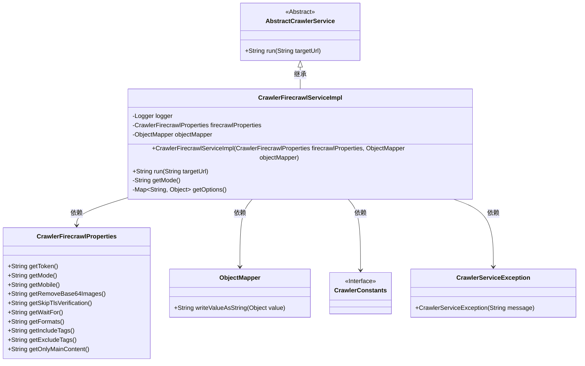
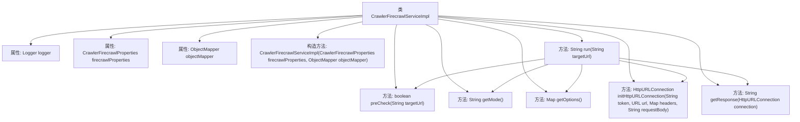

# 基础信息

|      |      |
|------|------|
| 名称 | CrawlerFirecrawlServiceImpl |
| 编码语言 | .java |
| 代码路径 | spring-ai-alibaba/community/tool-calls/spring-ai-alibaba-starter-tool-calling-crawler/src/main/java/com/alibaba/cloud/ai/toolcalling/crawler/CrawlerFirecrawlServiceImpl.java |
| 包名 | com.alibaba.cloud.ai.toolcalling.crawler |
| 依赖项 | ['java.io.IOException', 'java.net.HttpURLConnection', 'java.net.URI', 'java.net.URL', 'java.util.HashMap', 'java.util.Map', 'com.fasterxml.jackson.databind.ObjectMapper', 'org.slf4j.Logger', 'org.slf4j.LoggerFactory'] |
| 概述说明 | CrawlerFirecrawlServiceImpl继承AbstractCrawlerService，实现Firecrawl API请求逻辑。 |

# 说明

CrawlerFirecrawlServiceImpl类继承自AbstractCrawlerService，专门用于实现Firecrawl API的请求逻辑。该类主要包含三个核心功能：首先是对URL进行校验，确保请求的URL符合规范；其次是构建请求，包括设置请求参数和头部信息；最后是处理API响应，解析并处理返回的数据。通过这些功能，该类能够高效地完成Firecrawl API的调用与数据处理任务。

# 类列表 Class Summary

| 名称   | 类型  | 说明 |
|-------|------|-------------|
| CrawlerFirecrawlServiceImpl | class | CrawlerFirecrawlServiceImpl类继承AbstractCrawlerService，实现Firecrawl API请求逻辑，包含URL校验、请求构建和响应处理。 |

## 类 CrawlerFirecrawlServiceImpl

|      |      |
|------|------|
| 访问范围 | public |
| 类型 | class |
| 名称 | CrawlerFirecrawlServiceImpl |
| 说明 | CrawlerFirecrawlServiceImpl类继承AbstractCrawlerService，实现Firecrawl API请求逻辑，包含URL校验、请求构建和响应处理。 |

### UML类图

该代码描述了一个`CrawlerFirecrawlServiceImpl`类，该类继承自`AbstractCrawlerService`，并实现了爬虫服务的核心功能。`CrawlerFirecrawlServiceImpl`依赖于`CrawlerFirecrawlProperties`来获取配置信息，`ObjectMapper`用于序列化请求体，`CrawlerConstants`提供了常量定义，`CrawlerServiceException`用于处理异常。该类的主要功能是通过HTTP请求调用Firecrawl API，并根据配置生成请求参数。

### 内部方法调用关系图

这段代码描述了一个名为`CrawlerFirecrawlServiceImpl`的类，该类继承自`AbstractCrawlerService`。它包含了几个关键方法，如`run`、`getMode`和`getOptions`，用于处理与Firecrawl API的交互。`run`方法是核心，负责执行URL的预检查、构建请求、发送请求并获取响应。`getMode`方法根据配置返回API的模式，而`getOptions`方法则构建请求体中的参数。流程图展示了类中各方法的调用关系，清晰地描述了整个请求处理流程。

### 字段列表 Field List

| 名称  | 类型  | 说明 |
|-------|-------|------|
| objectMapper | ObjectMapper | 私有且不可变的ObjectMapper对象。 |
| firecrawlProperties | CrawlerFirecrawlProperties | 私有常量CrawlerFirecrawlProperties属性。 |
| logger = LoggerFactory.getLogger(CrawlerFirecrawlServiceImpl.class) | Logger | CrawlerFirecrawlServiceImpl类中定义了一个静态的日志记录器。 |

### 方法列表 Method List

| 名称  | 类型  | 说明 |
|-------|-------|------|
| getMode | String | 方法返回Firecrawl模式，不支持CRAWL模式，默认抛出异常。 |
| getOptions | Map<String, Object> | 方法`getOptions`根据`firecrawlProperties`设置生成包含多个配置项的Map。 |
| run | String | 方法检查目标URL，调用Firecrawl API并处理响应，异常时抛出错误。 |

