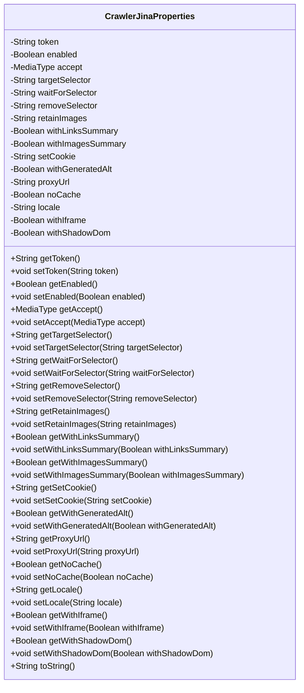

# 基础信息

|      |      |
|------|------|
| 名称 | CrawlerJinaProperties |
| 编码语言 | .java |
| 代码路径 | spring-ai-alibaba/community/tool-calls/spring-ai-alibaba-starter-tool-calling-crawler/src/main/java/com/alibaba/cloud/ai/toolcalling/crawler/CrawlerJinaProperties.java |
| 包名 | com.alibaba.cloud.ai.toolcalling.crawler |
| 依赖项 | ['org.springframework.boot.context.properties.ConfigurationProperties', 'org.springframework.boot.context.properties.EnableConfigurationProperties', 'org.springframework.http.MediaType'] |
| 概述说明 | CrawlerJinaProperties类包含Jina爬虫的token、启用状态、选择器、摘要和代理等配置属性。 |

# 说明

CrawlerJinaProperties类用于配置Jina爬虫的相关属性，主要包括token、enabled、selectors、summary和proxy等关键参数。这些属性分别用于设置爬虫的认证令牌、启用状态、选择器、摘要信息以及代理配置，确保爬虫能够根据需求进行高效、灵活的运作。

# 类列表 Class Summary

| 名称   | 类型  | 说明 |
|-------|------|-------------|
| CrawlerJinaProperties | class | CrawlerJinaProperties类包含Jina爬虫配置，如token、enabled、selectors、summary、proxy等属性。 |

## 类 CrawlerJinaProperties

|      |      |
|------|------|
| 访问范围 | @EnableConfigurationProperties;@ConfigurationProperties(prefix = CrawlerJinaProperties.JINA_PROPERTIES_PREFIX);public |
| 类型 | class |
| 名称 | CrawlerJinaProperties |
| 说明 | CrawlerJinaProperties类包含Jina爬虫配置，如token、enabled、selectors、summary、proxy等属性。 |

### UML类图

**描述：**  
`CrawlerJinaProperties` 类是一个配置属性类，用于管理爬虫的配置参数。它包含了多个私有属性，如 `token`、`enabled`、`accept` 等，并提供了相应的 `getter` 和 `setter` 方法。这些属性用于控制爬虫的行为，如是否启用爬虫、目标选择器、等待选择器等。`toString` 方法用于返回对象的字符串表示，其中 `token` 被隐藏以保护敏感信息。该类通过 `@ConfigurationProperties` 注解与配置文件绑定，以便在应用程序中动态加载和修改配置。

### 内部方法调用关系图

```mermaid
graph TD
    A["类CrawlerJinaProperties"]
    B["属性: String token"]
    C["属性: Boolean enabled"]
    D["属性: MediaType accept"]
    E["属性: String targetSelector"]
    F["属性: String waitForSelector"]
    G["属性: String removeSelector"]
    H["属性: String retainImages"]
    I["属性: Boolean withLinksSummary"]
    J["属性: Boolean withImagesSummary"]
    K["属性: String setCookie"]
    L["属性: Boolean withGeneratedAlt"]
    M["属性: String proxyUrl"]
    N["属性: Boolean noCache"]
    O["属性: String locale"]
    P["属性: Boolean withIframe"]
    Q["属性: Boolean withShadowDom"]
    R["方法: String getToken()"]
    S["方法: void setToken(String token)"]
    T["方法: Boolean getEnabled()"]
    U["方法: void setEnabled(Boolean enabled)"]
    V["方法: MediaType getAccept()"]
    W["方法: void setAccept(MediaType accept)"]
    X["方法: String getTargetSelector()"]
    Y["方法: void setTargetSelector(String targetSelector)"]
    Z["方法: String getWaitForSelector()"]
    AA["方法: void setWaitForSelector(String waitForSelector)"]
    AB["方法: String getRemoveSelector()"]
    AC["方法: void setRemoveSelector(String removeSelector)"]
    AD["方法: String getRetainImages()"]
    AE["方法: void setRetainImages(String retainImages)"]
    AF["方法: Boolean getWithLinksSummary()"]
    AG["方法: void setWithLinksSummary(Boolean withLinksSummary)"]
    AH["方法: Boolean getWithImagesSummary()"]
    AI["方法: void setWithImagesSummary(Boolean withImagesSummary)"]
    AJ["方法: String getSetCookie()"]
    AK["方法: void setSetCookie(String setCookie)"]
    AL["方法: Boolean getWithGeneratedAlt()"]
    AM["方法: void setWithGeneratedAlt(Boolean withGeneratedAlt)"]
    AN["方法: String getProxyUrl()"]
    AO["方法: void setProxyUrl(String proxyUrl)"]
    AP["方法: Boolean getNoCache()"]
    AQ["方法: void setNoCache(Boolean noCache)"]
    AR["方法: String getLocale()"]
    AS["方法: void setLocale(String locale)"]
    AT["方法: Boolean getWithIframe()"]
    AU["方法: void setWithIframe(Boolean withIframe)"]
    AV["方法: Boolean getWithShadowDom()"]
    AW["方法: void setWithShadowDom(Boolean withShadowDom)"]
    AX["重写方法: String toString()"]

    A --> B
    A --> C
    A --> D
    A --> E
    A --> F
    A --> G
    A --> H
    A --> I
    A --> J
    A --> K
    A --> L
    A --> M
    A --> N
    A --> O
    A --> P
    A --> Q
    A --> R
    A --> S
    A --> T
    A --> U
    A --> V
    A --> W
    A --> X
    A --> Y
    A --> Z
    A --> AA
    A --> AB
    A --> AC
    A --> AD
    A --> AE
    A --> AF
    A --> AG
    A --> AH
    A --> AI
    A --> AJ
    A --> AK
    A --> AL
    A --> AM
    A --> AN
    A --> AO
    A --> AP
    A --> AQ
    A --> AR
    A --> AS
    A --> AT
    A --> AU
    A --> AV
    A --> AW
    A --> AX
```

这段代码定义了一个名为 `CrawlerJinaProperties` 的类，用于配置爬虫相关的属性。类中包含多个私有属性，如 `token`、`enabled`、`accept` 等，并为每个属性提供了相应的 `getter` 和 `setter` 方法。此外，类还重写了 `toString` 方法，用于返回对象的字符串表示。该类通过 `@EnableConfigurationProperties` 和 `@ConfigurationProperties` 注解，与外部配置文件进行绑定，以便动态加载和修改这些属性。

### 字段列表 Field List

| 名称  | 类型  | 说明 |
|-------|-------|------|
| waitForSelector | String | 定义私有字符串变量waitForSelector。 |
| setCookie | String | 定义私有字符串变量setCookie。 |
| proxyUrl | String | 定义私有字符串变量proxyUrl。 |
| JINA_PROPERTIES_PREFIX = CrawlerConstants.CONFIG_PREFIX + "jina" | String | Jina属性前缀由Crawler配置前缀与"jina"组成。 |
| withGeneratedAlt | Boolean | 私有布尔变量表示是否生成替代内容。 |
| withIframe | Boolean | 私有布尔变量，用于判断是否包含iframe。 |
| removeSelector | String | 私有字符串变量用于移除选择器。 |
| withImagesSummary | Boolean | 私有布尔变量用于控制是否包含图片摘要。 |
| targetSelector | String | 定义私有字符串变量targetSelector。 |
| locale | String | 定义私有字符串变量locale。 |
| enabled | Boolean | 定义一个私有的布尔类型变量enabled。 |
| accept = MediaType.asMediaType(MediaType.APPLICATION_JSON) | MediaType | 定义私有变量accept，类型为MediaType，初始化为JSON格式。 |
| withShadowDom | Boolean | 包含Shadow DOM的布尔类型私有变量。 |
| withLinksSummary | Boolean | 布尔类型变量用于控制是否显示链接摘要。 |
| retainImages | String | 保留图像属性声明。 |
| noCache | Boolean | 定义了一个布尔类型的私有变量noCache。 |
| token | String | 定义了一个私有字符串变量token。 |

### 方法列表 Method List

| 名称  | 类型  | 说明 |
|-------|-------|------|
| setWithIframe | void | 设置是否包含iframe的布尔值方法。 |
| setWithImagesSummary | void | 设置是否包含图片摘要的布尔值方法。 |
| setRemoveSelector | void | 设置移除选择器的方法。 |
| setRetainImages | void | 设置保留图片属性方法。 |
| getWithLinksSummary | Boolean | 该方法返回布尔值，表示是否包含链接摘要。 |
| setEnabled | void | 设置布尔型变量enabled的值。 |
| getRemoveSelector | String | 获取移除选择器的方法。 |
| setTargetSelector | void | 该方法用于设置目标选择器。 |
| setToken | void | 设置token值为传入参数。 |
| getToken | String | 获取token的方法，返回token值。 |
| getRetainImages | String | 获取保留图像的方法。 |
| setWithLinksSummary | void | 设置是否包含链接摘要的布尔值方法。 |
| getTargetSelector | String | 方法返回目标选择器字符串。 |
| getAccept | MediaType | 获取当前媒体类型的方法。 |
| setWaitForSelector | void | 设置等待选择器的值。 |
| setAccept | void | 设置接收的媒体类型为指定值。 |
| setLocale | void | 设置本地化字符串。 |
| getWithIframe | Boolean | 返回布尔值withIframe的状态。 |
| getWaitForSelector | String | 该方法返回等待选择器的字符串值。 |
| setWithGeneratedAlt | void | 设置是否生成替代文本的布尔值。 |
| getProxyUrl | String | 获取代理URL的公共方法。 |
| getWithImagesSummary | Boolean | 该方法返回布尔值，表示是否包含图片摘要。 |
| getSetCookie | String | 获取setCookie字符串值的方法。 |
| getWithGeneratedAlt | Boolean | 返回布尔值表示是否生成替代文本。 |
| toString | String | CrawlerJinaProperties类toString方法返回包含多个配置项的字符串。 |
| getWithShadowDom | Boolean | 该方法返回布尔值，表示是否包含Shadow DOM。 |
| setWithShadowDom | void | 设置是否使用Shadow DOM的布尔值。 |
| setSetCookie | void | 该方法用于设置Cookie值。 |
| getLocale | String | 获取当前区域设置的字符串值。 |
| getEnabled | Boolean | 该方法返回布尔值表示启用状态。 |
| getNoCache | Boolean | 方法getNoCache返回布尔值noCache。 |
| setProxyUrl | void | 设置代理URL的方法，将输入参数赋值给类成员变量。 |
| setNoCache | void | 设置是否禁用缓存的方法。 |

