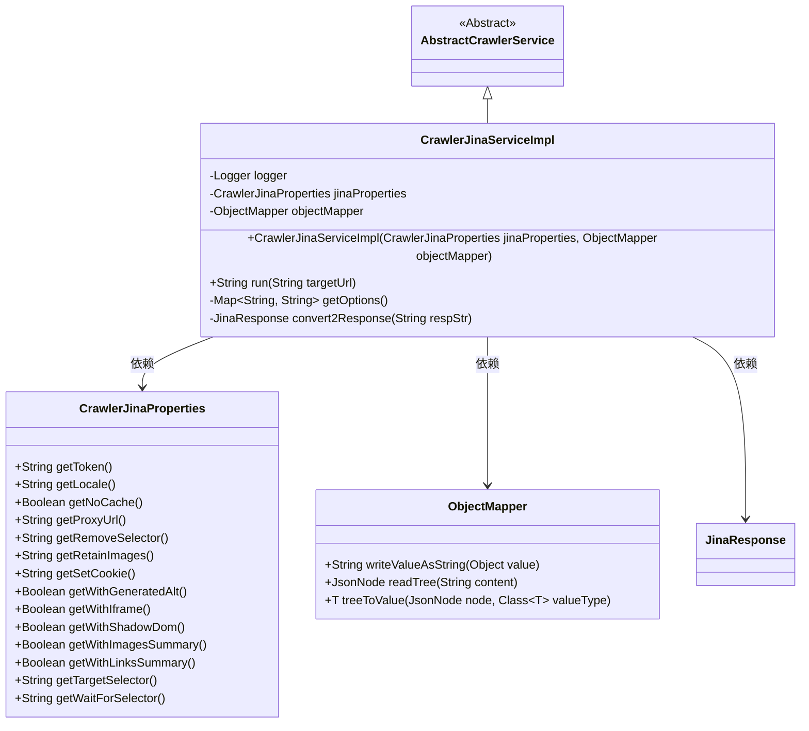
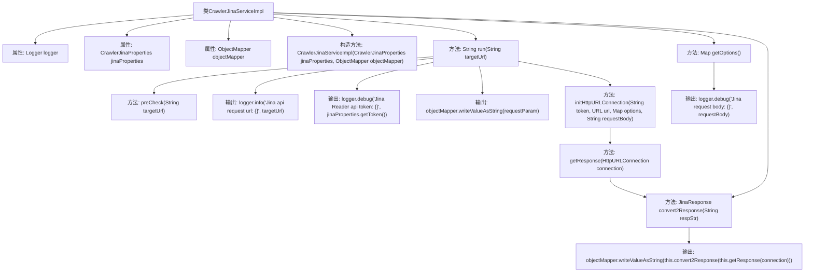

# 基础信息

|      |      |
|------|------|
| 名称 | CrawlerJinaServiceImpl |
| 编码语言 | .java |
| 代码路径 | spring-ai-alibaba/community/tool-calls/spring-ai-alibaba-starter-tool-calling-crawler/src/main/java/com/alibaba/cloud/ai/toolcalling/crawler/CrawlerJinaServiceImpl.java |
| 包名 | com.alibaba.cloud.ai.toolcalling.crawler |
| 依赖项 | ['java.io.IOException', 'java.net.HttpURLConnection', 'java.net.URI', 'java.net.URL', 'java.util.HashMap', 'java.util.Map', 'java.util.Objects', 'com.fasterxml.jackson.databind.JsonNode', 'com.fasterxml.jackson.databind.ObjectMapper', 'org.slf4j.Logger', 'org.slf4j.LoggerFactory'] |
| 概述说明 | CrawlerJinaServiceImpl类处理URL请求，返回JSON响应。 |

# 说明

CrawlerJinaServiceImpl类是一个实现爬虫服务的类，主要负责处理URL请求并返回JSON格式的响应。该类通过接收URL请求，执行爬虫操作，最终将获取的数据以JSON格式返回，便于后续处理和使用。

# 类列表 Class Summary

| 名称   | 类型  | 说明 |
|-------|------|-------------|
| CrawlerJinaServiceImpl | class | CrawlerJinaServiceImpl类实现爬虫服务，处理URL请求并返回JSON响应。 |

## 类 CrawlerJinaServiceImpl

|      |      |
|------|------|
| 访问范围 | public |
| 类型 | class |
| 名称 | CrawlerJinaServiceImpl |
| 说明 | CrawlerJinaServiceImpl类实现爬虫服务，处理URL请求并返回JSON响应。 |

### UML类图

这段代码描述了一个名为 `CrawlerJinaServiceImpl` 的类，它继承自 `AbstractCrawlerService`。该类用于实现一个网络爬虫服务，通过调用 Jina API 来获取目标 URL 的内容。`CrawlerJinaServiceImpl` 依赖于 `CrawlerJinaProperties` 和 `ObjectMapper` 来配置请求参数和解析 JSON 数据。`CrawlerJinaProperties` 类提供了各种配置选项，如代理 URL、缓存设置等，而 `ObjectMapper` 则用于将请求参数和响应数据序列化和反序列化。`JinaResponse` 类表示从 Jina API 返回的响应数据。整个流程通过 `run` 方法执行，包含预处理、请求发送、响应处理和异常捕获等步骤。

### 内部方法调用关系图

这段代码展示了`CrawlerJinaServiceImpl`类的结构及其主要方法。`run`方法是核心，负责执行爬虫任务，包括URL检查、请求发送、响应处理和日志记录。`getOptions`方法用于生成请求参数，`convert2Response`方法用于将响应字符串转换为`JinaResponse`对象。整个流程从URL检查开始，经过请求发送、响应处理，最终返回处理后的结果。

### 字段列表 Field List

| 名称  | 类型  | 说明 |
|-------|-------|------|
| jinaProperties | CrawlerJinaProperties | 私有且不可变的CrawlerJinaProperties属性jinaProperties。 |
| objectMapper | ObjectMapper | 私有且不可变的对象映射器实例。 |
| logger = LoggerFactory.getLogger(CrawlerJinaServiceImpl.class) | Logger | CrawlerJinaServiceImpl类中定义了静态日志记录器。 |

### 方法列表 Method List

| 名称  | 类型  | 说明 |
|-------|-------|------|
| convert2Response | JinaResponse | 将JSON字符串解析为JinaResponse对象，异常时抛出CrawlerServiceException。 |
| run | String | 方法检查目标URL并调用Jina API，处理请求和响应，异常时抛出错误。 |
| getOptions | Map<String, String> | 方法getOptions根据jinaProperties设置生成包含多个配置项的Map。 |

