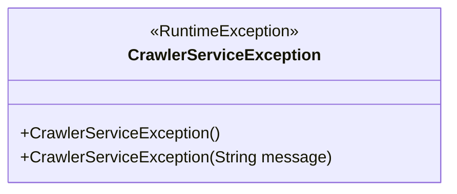
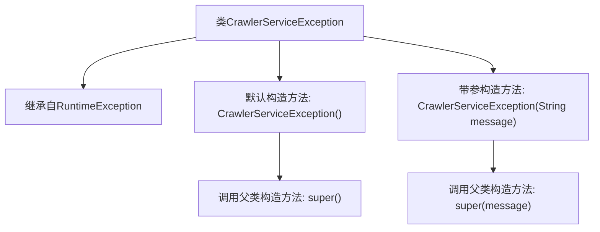

# 基础信息

|      |      |
|------|------|
| 名称 | CrawlerServiceException |
| 编码语言 | .java |
| 代码路径 | spring-ai-alibaba/community/tool-calls/spring-ai-alibaba-starter-tool-calling-crawler/src/main/java/com/alibaba/cloud/ai/toolcalling/crawler/CrawlerServiceException.java |
| 包名 | com.alibaba.cloud.ai.toolcalling.crawler |
| 依赖项 | [] |
| 概述说明 | CrawlerServiceException是继承RuntimeException的自定义异常类。 |

# 说明

CrawlerServiceException是一个自定义的异常类，它继承自RuntimeException。这意味着它属于运行时异常，通常用于处理在程序运行过程中可能出现的错误或异常情况，而不需要在代码中显式地捕获或声明。通过继承RuntimeException，CrawlerServiceException可以在不强制使用try-catch块的情况下抛出，从而简化异常处理流程。

# 类列表 Class Summary

| 名称   | 类型  | 说明 |
|-------|------|-------------|
| CrawlerServiceException | class | CrawlerServiceException是继承RuntimeException的自定义异常类。 |

## 类 CrawlerServiceException

|      |      |
|------|------|
| 访问范围 | public |
| 类型 | class |
| 名称 | CrawlerServiceException |
| 说明 | CrawlerServiceException是继承RuntimeException的自定义异常类。 |

### UML类图

类图描述：`CrawlerServiceException` 是一个自定义的运行时异常类，继承自 `RuntimeException`。它提供了两个构造函数，一个无参构造函数和一个接受字符串参数的构造函数，用于传递异常信息。该类用于在爬虫服务中处理异常情况，确保程序在遇到错误时能够抛出并捕获相应的异常。

### 内部方法调用关系图

这段代码定义了一个名为`CrawlerServiceException`的类，它继承自`RuntimeException`。该类包含两个构造方法：一个默认构造方法，调用父类的默认构造方法`super()`；另一个带参构造方法，接受一个`String`类型的参数`message`，并调用父类的带参构造方法`super(message)`。这段代码主要用于创建自定义的运行时异常，以便在爬虫服务中处理特定的异常情况。

### 字段列表 Field List

| 名称  | 类型  | 说明 |
|-------|-------|------|

### 方法列表 Method List

| 名称  | 类型  | 说明 |
|-------|-------|------|

