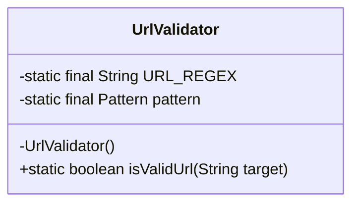
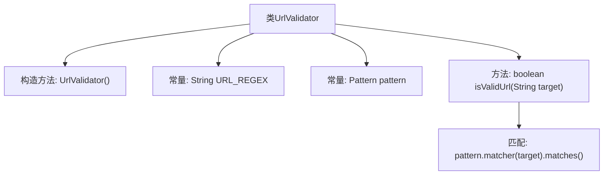

# 基础信息

|      |      |
|------|------|
| 名称 | UrlValidator |
| 编码语言 | .java |
| 代码路径 | spring-ai-alibaba/community/tool-calls/spring-ai-alibaba-starter-tool-calling-crawler/src/main/java/com/alibaba/cloud/ai/toolcalling/crawler/UrlValidator.java |
| 包名 | com.alibaba.cloud.ai.toolcalling.crawler |
| 依赖项 | ['java.util.regex.Pattern'] |
| 概述说明 | UrlValidator类通过正则表达式验证URL格式的有效性。 |

# 说明

UrlValidator类的主要功能是验证URL的格式是否有效。它通过使用正则表达式进行匹配，从而判断给定的URL是否符合标准格式。该类专注于确保URL的结构正确，帮助开发者在处理URL输入时进行有效的格式验证。

# 类列表 Class Summary

| 名称   | 类型  | 说明 |
|-------|------|-------------|
| UrlValidator | class | UrlValidator类用于验证URL格式，通过正则表达式匹配判断URL是否有效。 |

## 类 UrlValidator

|      |      |
|------|------|
| 访问范围 | public final |
| 类型 | class |
| 名称 | UrlValidator |
| 说明 | UrlValidator类用于验证URL格式，通过正则表达式匹配判断URL是否有效。 |

### UML类图

类图描述：`UrlValidator` 是一个工具类，用于验证URL字符串是否符合指定的正则表达式。该类包含一个私有的构造方法，确保无法实例化。`URL_REGEX` 是一个静态常量，存储了用于验证URL的正则表达式。`pattern` 是编译后的正则表达式模式。`isValidUrl` 是一个静态方法，用于验证传入的URL字符串是否匹配正则表达式，并返回布尔值。

### 内部方法调用关系图

这段代码定义了一个`UrlValidator`类，用于验证URL字符串是否符合指定的正则表达式模式。类中包含一个私有的构造方法，防止外部实例化；一个常量`URL_REGEX`定义了URL的正则表达式；另一个常量`pattern`用于编译该正则表达式。`isValidUrl`方法接收一个字符串参数，使用`pattern.matcher(target).matches()`进行匹配，并返回匹配结果。流程图展示了类的结构和方法调用关系。

### 字段列表 Field List

| 名称  | 类型  | 说明 |
|-------|-------|------|
| URL_REGEX = "^(https?://)?"			+ "((([a-zA-Z0-9\\-]+\\.)+[a-zA-Z]{2,})|(([0-9]{1,3}\\.[0-9]{1,3}\\.[0-9]{1,3}\\.[0-9]{1,3})" + // 域名或																											// IP			"(?!(\\.0\\.0\\.0|\\.0\\.0|\\.0|\\.1|\\.2|\\.3|\\.4|\\.5|\\.6|\\.7|\\.8|\\.9))" + // 排除																								// 127.0.0.1			"))" + "(\\:[0-9]{1,5})?" + "(/.*)?$" | String | URL正则表达式验证域名或IP地址格式。 |
| pattern = Pattern.compile(URL_REGEX) | Pattern | 定义静态私有Pattern对象，用于匹配URL正则表达式。 |

### 方法列表 Method List

| 名称  | 类型  | 说明 |
|-------|-------|------|
| isValidUrl | boolean | 该方法用于验证目标字符串是否为有效URL。 |

