# 基础信息

|      |      |
|------|------|
| 名称 | crawler |
| 编码语言 | .java |
| 代码路径 | spring-ai-alibaba/community/tool-calls/spring-ai-alibaba-starter-tool-calling-crawler/src/main/java/com/alibaba/cloud/ai/toolcalling/crawler |
| 包名 | spring-ai-alibaba.community.tool-calls.spring-ai-alibaba-starter-tool-calling-crawler.src.main.java.com.alibaba.cloud.ai.toolcalling.crawler |
| 概述说明 | 自动配置类定义Jina和Firecrawl服务Bean，验证API令牌，确保服务初始化和安全性。 |

# 说明

## 概述
该代码模块主要围绕爬虫服务的配置、实现和异常处理展开，旨在为Jina和Firecrawl爬虫服务提供完整的解决方案。模块通过自动配置类、属性配置类、服务实现类以及URL验证工具等组件，确保爬虫服务在应用启动时能够正确初始化，并根据具体需求进行灵活配置。模块还提供了对API令牌的验证、URL格式的校验以及HTTP请求的构建与响应处理等功能，确保爬虫服务的高效性和安全性。

## 主要业务场景
1. **服务配置与初始化**  
   - `CrawlerAutoConfiguration` 类负责在应用启动时自动配置Jina和Firecrawl服务的Bean，并验证API令牌的有效性，确保服务的正常运行。
   - `CrawlerJinaProperties` 和 `CrawlerFirecrawlProperties` 类分别用于配置Jina和Firecrawl爬虫的相关属性，如token、启用状态、选择器、代理等，确保爬虫服务能够根据需求进行灵活调整。

2. **爬虫服务实现**  
   - `CrawlerJinaServiceImpl` 和 `CrawlerFirecrawlServiceImpl` 类分别实现了Jina和Firecrawl爬虫服务的核心逻辑，包括URL请求处理、数据爬取以及JSON格式的响应返回。
   - `AbstractCrawlerService` 类作为抽象基类，提供了URL预检、HTTP连接初始化和响应处理等通用功能，提高了代码的可维护性和扩展性。

3. **URL验证与异常处理**  
   - `UrlValidator` 类通过正则表达式验证URL的格式，确保爬虫请求的URL符合标准。
   - `CrawlerServiceException` 类作为自定义运行时异常，用于处理爬虫服务运行过程中可能出现的错误，简化异常处理流程。

4. **数据爬取与处理**  
   - 模块通过Jina和Firecrawl服务实现类，能够高效地完成对目标URL的数据爬取，并将获取的数据以JSON格式返回，便于后续处理和使用。

综上所述，该模块为Jina和Firecrawl爬虫服务提供了完整的配置、实现和异常处理机制，适用于需要高效、安全地进行数据爬取的业务场景。

### 包内部结构视图

```mermaid
graph TD
    crawler --> CrawlerAutoConfiguration.java
    crawler --> CrawlerJinaServiceImpl.java
    crawler --> CrawlerFirecrawlProperties.java
    crawler --> JinaUsage.java
    crawler --> JinaResponse.java
    crawler --> CrawlerService.java
    crawler --> UrlValidator.java
    crawler --> CrawlerConstants.java
    crawler --> CrawlerJinaProperties.java
    crawler --> CrawlerServiceException.java
    crawler --> AbstractCrawlerService.java
    crawler --> CrawlerFirecrawlServiceImpl.java
```

该流程图展示了`crawler`目录下的文件层级关系，所有文件都直接位于`crawler`目录下，没有进一步的子目录结构。这些文件包括配置类、服务实现类、属性类、异常类等，涵盖了爬虫工具调用模块的核心功能实现。

# 文件列表 File List

| 名称   | 类型  | 说明 |
|-------|------|-------------|
| [UrlValidator.java](UrlValidator.md) | file | UrlValidator类通过正则表达式验证URL格式的有效性。 |
| [JinaResponse.java](JinaResponse.md) | file | 信息为空，无法生成概要描述。 |
| [JinaUsage.java](JinaUsage.md) | file | 信息为空，无法生成概要描述。 |
| [CrawlerJinaServiceImpl.java](CrawlerJinaServiceImpl.md) | file | CrawlerJinaServiceImpl类处理URL请求，返回JSON响应。 |
| [AbstractCrawlerService.java](AbstractCrawlerService.md) | file | 抽象爬虫服务类实现URL预检、HTTP连接初始化及响应处理。 |
| [CrawlerConstants.java](CrawlerConstants.md) | file | 信息为空，无法生成概要描述。 |
| [CrawlerService.java](CrawlerService.md) | file | 信息为空，无法生成概要描述。 |
| [CrawlerFirecrawlProperties.java](CrawlerFirecrawlProperties.md) | file | CrawlerFirecrawlProperties类配置爬虫属性，包括token、启用状态、模式和格式等参数。 |
| [CrawlerAutoConfiguration.java](CrawlerAutoConfiguration.md) | file | 自动配置类定义Jina和Firecrawl服务Bean，需验证API令牌非空。 |
| [CrawlerFirecrawlServiceImpl.java](CrawlerFirecrawlServiceImpl.md) | file | CrawlerFirecrawlServiceImpl继承AbstractCrawlerService，实现Firecrawl API请求逻辑。 |
| [CrawlerServiceException.java](CrawlerServiceException.md) | file | CrawlerServiceException是继承RuntimeException的自定义异常类。 |
| [CrawlerJinaProperties.java](CrawlerJinaProperties.md) | file | CrawlerJinaProperties类包含Jina爬虫的token、启用状态、选择器、摘要和代理等配置属性。 |

