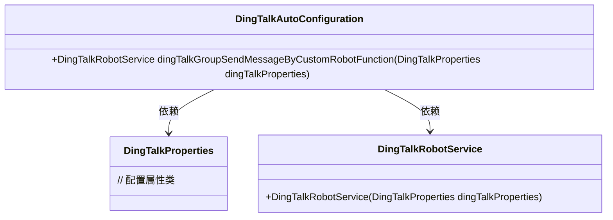
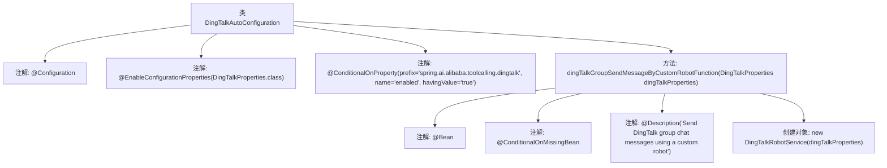

# 基础信息

|      |      |
|------|------|
| 名称 | DingTalkAutoConfiguration |
| 编码语言 | .java |
| 代码路径 | spring-ai-alibaba/community/tool-calls/spring-ai-alibaba-starter-tool-calling-dingtalk/src/main/java/com/alibaba/cloud/ai/toolcalling/dingtalk/DingTalkAutoConfiguration.java |
| 包名 | com.alibaba.cloud.ai.toolcalling.dingtalk |
| 依赖项 | ['org.springframework.boot.autoconfigure.condition.ConditionalOnMissingBean', 'org.springframework.boot.autoconfigure.condition.ConditionalOnProperty', 'org.springframework.boot.context.properties.EnableConfigurationProperties', 'org.springframework.context.annotation.Bean', 'org.springframework.context.annotation.Configuration', 'org.springframework.context.annotation.Description'] |
| 概述说明 | 配置类在属性开启时自动创建钉钉机器人服务Bean。 |

# 说明

配置类中启用了钉钉机器人服务，该服务的启用条件基于一个属性的状态。当该属性被开启时，系统会自动创建一个相应的Bean实例。这一机制确保了钉钉机器人服务在配置属性满足条件时能够自动初始化并投入使用，简化了服务的管理和启动流程。

# 类列表 Class Summary

| 名称   | 类型  | 说明 |
|-------|------|-------------|
| DingTalkAutoConfiguration | class | 配置类启用钉钉机器人服务，条件为属性开启时自动创建Bean。 |

## 类 DingTalkAutoConfiguration

|      |      |
|------|------|
| 访问范围 | @Configuration;@EnableConfigurationProperties(DingTalkProperties.class);@ConditionalOnProperty(prefix = "spring.ai.alibaba.toolcalling.dingtalk", name = "enabled", havingValue = "true");public |
| 类型 | class |
| 名称 | DingTalkAutoConfiguration |
| 说明 | 配置类启用钉钉机器人服务，条件为属性开启时自动创建Bean。 |

### UML类图

**描述：**  
`DingTalkAutoConfiguration` 是一个配置类，用于在特定条件下自动配置 `DingTalkRobotService` 服务。它依赖于 `DingTalkProperties` 类来获取配置属性，并通过 `dingTalkGroupSendMessageByCustomRobotFunction` 方法创建 `DingTalkRobotService` 实例。该配置类仅在 `spring.ai.alibaba.toolcalling.dingtalk.enabled` 属性为 `true` 时生效。

### 内部方法调用关系图

这段代码定义了一个名为 `DingTalkAutoConfiguration` 的配置类，用于在满足特定条件时自动配置一个 `DingTalkRobotService` 的 Bean。该类通过 `@Configuration` 注解标记为配置类，并通过 `@EnableConfigurationProperties` 注解启用 `DingTalkProperties` 类的配置属性。`@ConditionalOnProperty` 注解确保只有在配置文件中 `spring.ai.alibaba.toolcalling.dingtalk.enabled` 属性为 `true` 时，该类才会生效。`dingTalkGroupSendMessageByCustomRobotFunction` 方法负责创建并返回一个 `DingTalkRobotService` 实例，且该 Bean 只有在当前上下文中不存在相同类型的 Bean 时才会被创建。

### 字段列表 Field List

| 名称  | 类型  | 说明 |
|-------|-------|------|

### 方法列表 Method List

| 名称  | 类型  | 说明 |
|-------|-------|------|
| dingTalkGroupSendMessageByCustomRobotFunction | DingTalkRobotService | 自定义机器人发送钉钉群聊消息服务。 |

