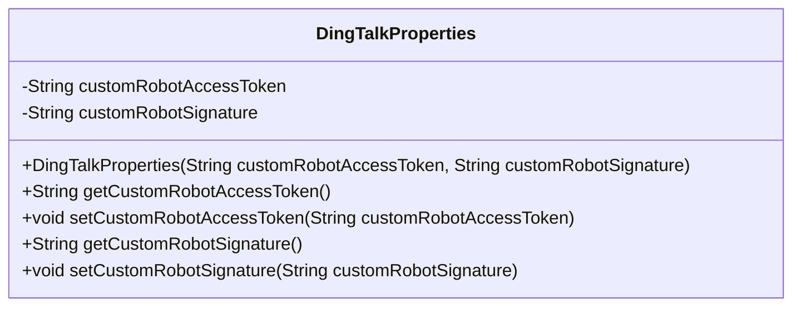
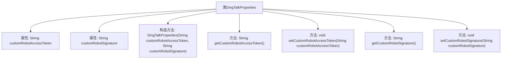

# 基础信息

|      |      |
|------|------|
| 名称 | DingTalkProperties |
| 编码语言 | .java |
| 代码路径 | spring-ai-alibaba/community/tool-calls/spring-ai-alibaba-starter-tool-calling-dingtalk/src/main/java/com/alibaba/cloud/ai/toolcalling/dingtalk/DingTalkProperties.java |
| 包名 | com.alibaba.cloud.ai.toolcalling.dingtalk |
| 依赖项 | ['org.springframework.boot.context.properties.ConfigurationProperties'] |
| 概述说明 | DingTalkProperties类配置钉钉机器人访问令牌和签名。 |

# 说明

DingTalkProperties类用于配置钉钉机器人的访问令牌和签名信息。通过该类，用户可以设置和管理与钉钉机器人通信所需的认证参数，确保安全且有效的消息传递。

# 类列表 Class Summary

| 名称   | 类型  | 说明 |
|-------|------|-------------|
| DingTalkProperties | class | DingTalkProperties类配置钉钉机器人访问令牌和签名。 |

## 类 DingTalkProperties

|      |      |
|------|------|
| 访问范围 | @ConfigurationProperties(prefix = "spring.ai.alibaba.toolcalling.dingtalk");public |
| 类型 | class |
| 名称 | DingTalkProperties |
| 说明 | DingTalkProperties类配置钉钉机器人访问令牌和签名。 |

### UML类图

**描述：**  
`DingTalkProperties` 类是一个配置属性类，用于管理钉钉自定义机器人的访问令牌和签名。它包含两个私有属性 `customRobotAccessToken` 和 `customRobotSignature`，分别表示机器人的访问令牌和签名。类中提供了构造函数、getter 和 setter 方法，以便外部代码可以访问和修改这些属性。该类通常用于与钉钉机器人相关的配置管理。

### 内部方法调用关系图

这段代码定义了一个名为`DingTalkProperties`的类，用于管理与钉钉自定义机器人相关的配置属性。类中包含两个私有属性`customRobotAccessToken`和`customRobotSignature`，分别表示自定义机器人的访问令牌和签名。类提供了一个构造方法用于初始化这两个属性，并提供了相应的getter和setter方法用于访问和修改这些属性。代码通过`@ConfigurationProperties`注解将类与配置文件中的特定前缀`spring.ai.alibaba.toolcalling.dingtalk`绑定，以便自动加载配置。

### 字段列表 Field List

| 名称  | 类型  | 说明 |
|-------|-------|------|
| customRobotAccessToken | String | 定义私有字符串变量customRobotAccessToken。 |
| customRobotSignature | String | 自定义机器人签名字符串。 |

### 方法列表 Method List

| 名称  | 类型  | 说明 |
|-------|-------|------|
| getCustomRobotAccessToken | String | 获取自定义机器人访问令牌的方法。 |
| getCustomRobotSignature | String | 获取自定义机器人签名的方法。 |
| setCustomRobotAccessToken | void | 设置自定义机器人访问令牌的方法。 |
| setCustomRobotSignature | void | 设置自定义机器人签名的方法。 |

