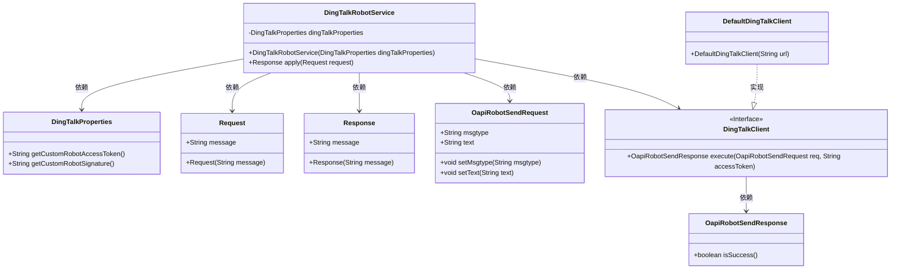
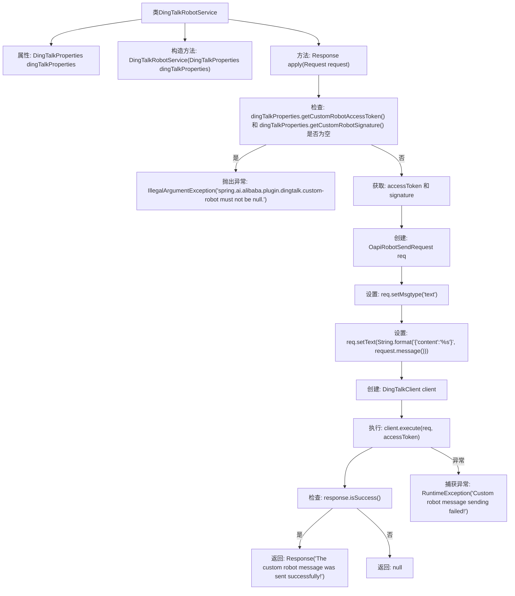

# 基础信息

|      |      |
|------|------|
| 名称 | DingTalkRobotService |
| 编码语言 | .java |
| 代码路径 | spring-ai-alibaba/community/tool-calls/spring-ai-alibaba-starter-tool-calling-dingtalk/src/main/java/com/alibaba/cloud/ai/toolcalling/dingtalk/DingTalkRobotService.java |
| 包名 | com.alibaba.cloud.ai.toolcalling.dingtalk |
| 依赖项 | ['com.dingtalk.api.DefaultDingTalkClient', 'com.dingtalk.api.DingTalkClient', 'com.dingtalk.api.request.OapiRobotSendRequest', 'com.dingtalk.api.response.OapiRobotSendResponse', 'com.fasterxml.jackson.annotation.JsonClassDescription', 'com.fasterxml.jackson.annotation.JsonProperty', 'com.fasterxml.jackson.annotation.JsonPropertyDescription', 'org.springframework.util.ObjectUtils', 'java.util.function.Function'] |
| 概述说明 | 钉钉机器人服务类实现消息发送，验证令牌和签名，处理请求并返回响应。 |

# 说明

钉钉机器人服务类主要用于实现消息发送功能。该类负责验证请求中的令牌和签名，确保请求的合法性和安全性。在处理请求时，服务类会执行相应的逻辑操作，并生成适当的响应返回给调用方。整个过程涵盖了消息发送的核心流程，包括验证、处理和响应，确保与钉钉机器人的交互顺利进行。

# 类列表 Class Summary

| 名称   | 类型  | 说明 |
|-------|------|-------------|
| DingTalkRobotService | class | 钉钉机器人服务类，实现消息发送功能，验证令牌和签名，处理请求并返回响应。 |

## 类 DingTalkRobotService

|      |      |
|------|------|
| 访问范围 | public |
| 类型 | class |
| 名称 | DingTalkRobotService |
| 说明 | 钉钉机器人服务类，实现消息发送功能，验证令牌和签名，处理请求并返回响应。 |

### UML类图

### 描述
`DingTalkRobotService` 是一个用于发送钉钉群聊消息的服务类，实现了 `Function` 接口。它依赖于 `DingTalkProperties` 获取访问令牌和签名，并使用 `OapiRobotSendRequest` 构建请求体。通过 `DingTalkClient` 发送请求，并根据 `OapiRobotSendResponse` 判断是否发送成功。`DefaultDingTalkClient` 是 `DingTalkClient` 接口的实现类，负责实际的请求执行。

### 内部方法调用关系图

**描述：**
该流程图展示了 `DingTalkRobotService` 类的核心逻辑。首先，类通过构造函数初始化 `DingTalkProperties` 属性。在 `apply` 方法中，首先检查 `accessToken` 和 `signature` 是否为空，若为空则抛出异常。若不为空，则创建并设置 `OapiRobotSendRequest` 对象，随后通过 `DingTalkClient` 执行请求。若请求成功，返回成功响应；若失败，则抛出异常并返回 `null`。

### 字段列表 Field List

| 名称  | 类型  | 说明 |
|-------|-------|------|
| dingTalkProperties | DingTalkProperties | 私有常量DingTalkProperties属性。 |

### 方法列表 Method List

| 名称  | 类型  | 说明 |
|-------|-------|------|
| apply | Response | 该方法验证钉钉机器人配置并发送消息，成功返回响应，失败抛出异常。 |

