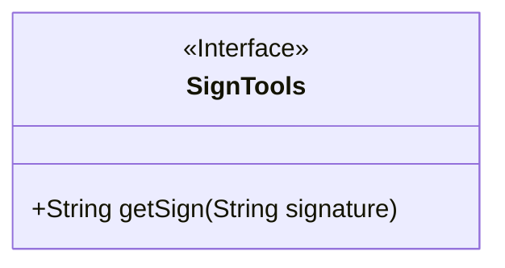
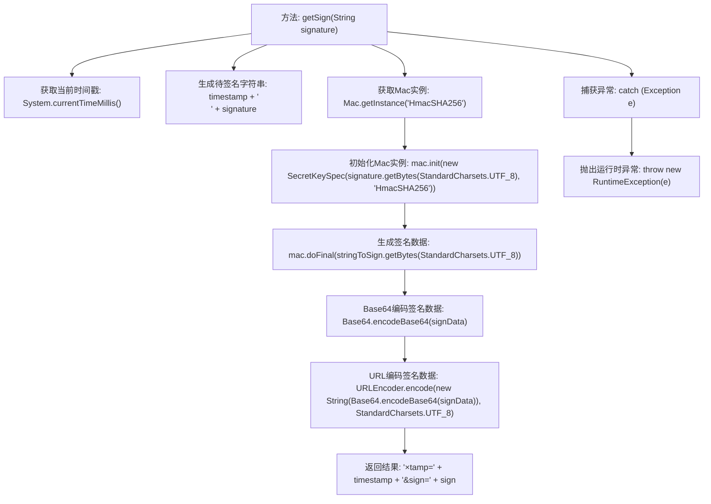

# 基础信息

|      |      |
|------|------|
| 名称 | SignTools |
| 编码语言 | .java |
| 代码路径 | spring-ai-alibaba/community/tool-calls/spring-ai-alibaba-starter-tool-calling-dingtalk/src/main/java/com/alibaba/cloud/ai/toolcalling/dingtalk/SignTools.java |
| 包名 | com.alibaba.cloud.ai.toolcalling.dingtalk |
| 依赖项 | ['org.apache.commons.codec.binary.Base64', 'javax.crypto.Mac', 'javax.crypto.spec.SecretKeySpec', 'java.net.URLEncoder', 'java.nio.charset.StandardCharsets'] |
| 概述说明 | SignTools类生成带时间戳和签名的URL参数。 |

# 说明

SignTools类用于生成包含时间戳和签名的URL参数。通过该类，可以自动在URL中添加当前时间戳和基于特定算法生成的签名，以确保请求的时效性和安全性。时间戳用于标识请求的生成时间，而签名则用于验证请求的完整性和来源，防止数据被篡改或伪造。这种方法常用于API请求中，以增强接口的安全性和防止重放攻击。

# 类列表 Class Summary

| 名称   | 类型  | 说明 |
|-------|------|-------------|
| SignTools | class | SignTools类生成包含时间戳和签名的URL参数。 |

## 类 SignTools

|      |      |
|------|------|
| 访问范围 | public |
| 类型 | class |
| 名称 | SignTools |
| 说明 | SignTools类生成包含时间戳和签名的URL参数。 |

### UML类图

类图描述：`SignTools` 类包含一个静态方法 `getSign`，该方法接收一个字符串参数 `signature`，并返回一个包含时间戳和签名的字符串。该方法使用 `HmacSHA256` 算法生成签名，并对结果进行 Base64 编码和 URL 编码。如果在执行过程中发生异常，将抛出 `RuntimeException`。

### 内部方法调用关系图

这段代码的流程图展示了`getSign`方法的执行流程。首先获取当前时间戳，然后生成待签名的字符串。接着，使用HmacSHA256算法初始化Mac实例，并对字符串进行签名。签名数据经过Base64编码和URL编码后，最终返回包含时间戳和签名的字符串。如果在执行过程中发生异常，代码会捕获并抛出运行时异常。

### 字段列表 Field List

| 名称  | 类型  | 说明 |
|-------|-------|------|

### 方法列表 Method List

| 名称  | 类型  | 说明 |
|-------|-------|------|
| getSign | String | 该方法生成带时间戳和签名的URL参数。 |

