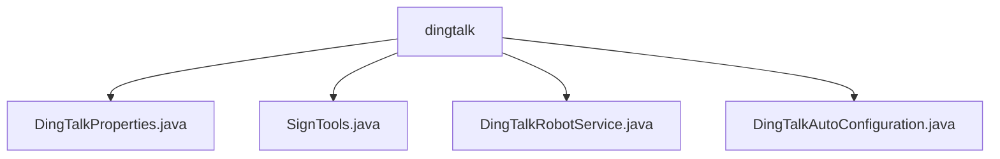

# 基础信息

|      |      |
|------|------|
| 名称 | dingtalk |
| 编码语言 | .java |
| 代码路径 | spring-ai-alibaba/community/tool-calls/spring-ai-alibaba-starter-tool-calling-dingtalk/src/main/java/com/alibaba/cloud/ai/toolcalling/dingtalk |
| 包名 | spring-ai-alibaba.community.tool-calls.spring-ai-alibaba-starter-tool-calling-dingtalk.src.main.java.com.alibaba.cloud.ai.toolcalling.dingtalk |
| 概述说明 | 钉钉机器人配置类管理认证参数，签名工具生成安全URL，服务类处理消息发送，配置类自动启用服务。 |

# 说明

## 概述
该代码模块是一个用于与钉钉机器人进行交互的Spring Boot Starter模块。它提供了配置管理、签名生成、消息发送以及服务自动配置等功能，确保与钉钉机器人的通信安全、高效且易于集成。通过该模块，开发者可以轻松地在Spring Boot应用中集成钉钉机器人，并实现消息的发送与接收。

## 主要业务场景
1. **配置管理**：通过`DingTalkProperties`类，开发者可以配置钉钉机器人的访问令牌和签名信息，确保通信的安全性。
2. **签名生成**：`SignTools`类负责生成包含时间戳和签名的URL参数，确保请求的时效性和安全性，防止数据被篡改或伪造。
3. **消息发送**：`DingTalkRobotService`类实现了消息发送功能，负责验证请求中的令牌和签名，并处理相应的逻辑操作，确保与钉钉机器人的交互顺利进行。
4. **自动配置**：`DingTalkAutoConfiguration`类根据配置属性自动启用钉钉机器人服务，简化了服务的初始化和管理流程。

该模块适用于需要在Spring Boot应用中集成钉钉机器人，并实现安全、高效消息传递的业务场景。

### 包内部结构视图

该流程图展示了 `dingtalk` 目录下的文件层级关系。`dingtalk` 是根节点，包含了四个子节点：`DingTalkProperties.java`、`SignTools.java`、`DingTalkRobotService.java` 和 `DingTalkAutoConfiguration.java`。这些文件均位于 `dingtalk` 目录下，没有进一步的嵌套层级。

# 文件列表 File List

| 名称   | 类型  | 说明 |
|-------|------|-------------|
| [DingTalkRobotService.java](DingTalkRobotService.md) | file | 钉钉机器人服务类实现消息发送，验证令牌和签名，处理请求并返回响应。 |
| [DingTalkProperties.java](DingTalkProperties.md) | file | DingTalkProperties类配置钉钉机器人访问令牌和签名。 |
| [SignTools.java](SignTools.md) | file | SignTools类生成带时间戳和签名的URL参数。 |
| [DingTalkAutoConfiguration.java](DingTalkAutoConfiguration.md) | file | 配置类在属性开启时自动创建钉钉机器人服务Bean。 |

