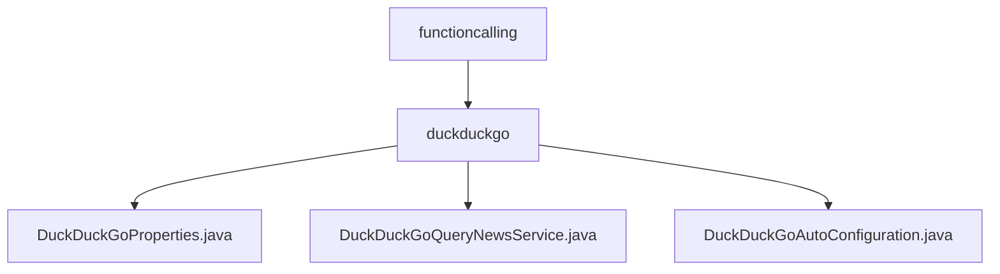

# 基础信息

|      |      |
|------|------|
| 名称 | functioncalling |
| 编码语言 | .java |
| 代码路径 | spring-ai-alibaba/community/tool-calls/spring-ai-alibaba-starter-tool-calling-duckduckgo/src/main/java/com/alibaba/cloud/ai/functioncalling |
| 包名 | spring-ai-alibaba.community.tool-calls.spring-ai-alibaba-starter-tool-calling-duckduckgo.src.main.java.com.alibaba.cloud.ai.functioncalling |
| 概述说明 | DuckDuckGoProperties类管理API密钥，DuckDuckGoQueryNewsService处理新闻查询，配置类自动启用服务。 |

# 说明

## 概述
该代码模块是一个用于与DuckDuckGo服务进行交互的Spring AI Alibaba工具调用模块。它提供了配置管理、新闻查询服务以及自动配置功能，帮助开发者快速集成与DuckDuckGo的API交互。模块设计简洁，易于集成，并确保与DuckDuckGo服务的通信安全且高效。

## 主要业务场景
1. **API密钥管理**：通过`DuckDuckGoProperties`类，用户可以方便地设置和获取与DuckDuckGo服务相关的API密钥，确保通信的安全性。
2. **新闻查询**：`DuckDuckGoQueryNewsService`类负责通过`WebClient`发起新闻查询请求，处理响应数据，并将查询结果返回给调用方，确保新闻信息获取的高效性和准确性。
3. **自动配置**：在`DuckDuckGoAutoConfiguration`类中，当启用DuckDuckGo属性时，系统会自动配置新闻查询服务，确保用户能够无缝访问新闻查询功能，提升系统的自动化程度和用户体验。

### 包内部结构视图

该流程图展示了`functioncalling`目录下的层级关系，其中`duckduckgo`是`functioncalling`的子目录，并且`duckduckgo`目录下包含了三个Java文件：`DuckDuckGoProperties.java`、`DuckDuckGoQueryNewsService.java`和`DuckDuckGoAutoConfiguration.java`。该结构清晰地反映了项目中的模块划分和文件组织方式。

# 文件列表 File List

| 名称   | 类型  | 说明 |
|-------|------|-------------|
| [duckduckgo](duckduckgo/_module.md) | package | DuckDuckGoProperties类管理API密钥，DuckDuckGoQueryNewsService处理新闻查询，配置类自动启用服务。 |

