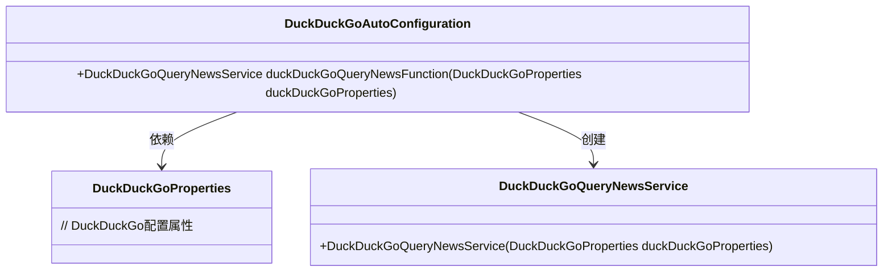
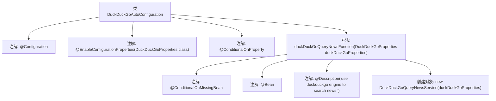

# 基础信息

|      |      |
|------|------|
| 名称 | DuckDuckGoAutoConfiguration |
| 编码语言 | .java |
| 代码路径 | spring-ai-alibaba/community/tool-calls/spring-ai-alibaba-starter-tool-calling-duckduckgo/src/main/java/com/alibaba/cloud/ai/functioncalling/duckduckgo/DuckDuckGoAutoConfiguration.java |
| 包名 | com.alibaba.cloud.ai.functioncalling.duckduckgo |
| 依赖项 | ['org.springframework.boot.autoconfigure.condition.ConditionalOnMissingBean', 'org.springframework.boot.autoconfigure.condition.ConditionalOnProperty', 'org.springframework.boot.context.properties.EnableConfigurationProperties', 'org.springframework.context.annotation.Bean', 'org.springframework.context.annotation.Configuration', 'org.springframework.context.annotation.Description'] |
| 概述说明 | 启用DuckDuckGo属性时自动配置新闻查询服务。 |

# 说明

配置类中启用了DuckDuckGo属性，当该属性被启用时，系统会自动配置查询新闻服务。这一功能确保在启用DuckDuckGo属性的情况下，用户可以无缝访问新闻查询服务，提升了系统的自动化程度和用户体验。

# 类列表 Class Summary

| 名称   | 类型  | 说明 |
|-------|------|-------------|
| DuckDuckGoAutoConfiguration | class | 配置类启用DuckDuckGo属性，条件为启用时自动配置查询新闻服务。 |

## 类 DuckDuckGoAutoConfiguration

|      |      |
|------|------|
| 访问范围 | @Configuration;@EnableConfigurationProperties(DuckDuckGoProperties.class);@ConditionalOnProperty(prefix = "spring.ai.alibaba.functioncalling.duckduckgo", name = "enabled", havingValue = "true",;		matchIfMissing = true);public |
| 类型 | class |
| 名称 | DuckDuckGoAutoConfiguration |
| 说明 | 配置类启用DuckDuckGo属性，条件为启用时自动配置查询新闻服务。 |

### UML类图

这段代码定义了一个名为 `DuckDuckGoAutoConfiguration` 的自动配置类，用于在 Spring 应用中配置 `DuckDuckGoQueryNewsService` 服务。该类依赖于 `DuckDuckGoProperties` 来获取配置属性，并通过 `duckDuckGoQueryNewsFunction` 方法创建 `DuckDuckGoQueryNewsService` 实例。`DuckDuckGoQueryNewsService` 是一个服务类，用于通过 DuckDuckGo 引擎搜索新闻。整个配置在 `spring.ai.alibaba.functioncalling.duckduckgo.enabled` 属性为 `true` 时生效。

### 内部方法调用关系图

这段代码是一个Spring Boot自动配置类，用于根据条件自动配置DuckDuckGo查询新闻服务。类上使用了`@Configuration`注解，表示这是一个配置类，并且通过`@EnableConfigurationProperties`注解启用了`DuckDuckGoProperties`类的配置属性。`@ConditionalOnProperty`注解用于检查配置属性是否启用，如果启用则自动配置`DuckDuckGoQueryNewsService`服务。方法`duckDuckGoQueryNewsFunction`上使用了多个注解，包括`@ConditionalOnMissingBean`、`@Bean`和`@Description`，用于定义Bean的创建和描述。最后，该方法返回一个`DuckDuckGoQueryNewsService`实例。

### 字段列表 Field List

| 名称  | 类型  | 说明 |
|-------|-------|------|

### 方法列表 Method List

| 名称  | 类型  | 说明 |
|-------|-------|------|
| duckDuckGoQueryNewsFunction | DuckDuckGoQueryNewsService | 使用DuckDuckGo引擎查询新闻的服务。 |

