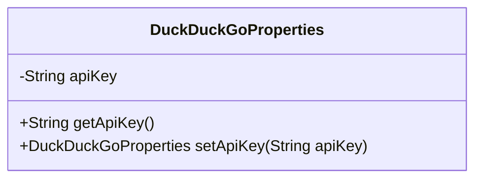
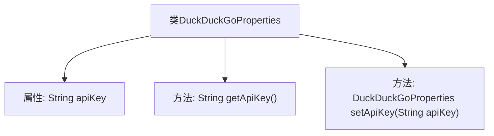

# 基础信息

|      |      |
|------|------|
| 名称 | DuckDuckGoProperties |
| 编码语言 | .java |
| 代码路径 | spring-ai-alibaba/community/tool-calls/spring-ai-alibaba-starter-tool-calling-duckduckgo/src/main/java/com/alibaba/cloud/ai/functioncalling/duckduckgo/DuckDuckGoProperties.java |
| 包名 | com.alibaba.cloud.ai.functioncalling.duckduckgo |
| 依赖项 | ['org.springframework.boot.context.properties.ConfigurationProperties'] |
| 概述说明 | DuckDuckGoProperties类用于配置API密钥。 |

# 说明

DuckDuckGoProperties类用于配置API密钥，提供了管理和存储与DuckDuckGo服务相关的API密钥的功能。通过该类，用户可以方便地设置和获取API密钥，确保与DuckDuckGo服务的通信安全且有效。该类设计简洁，易于集成到现有系统中，帮助开发者快速实现与DuckDuckGo的API交互。

# 类列表 Class Summary

| 名称   | 类型  | 说明 |
|-------|------|-------------|
| DuckDuckGoProperties | class | DuckDuckGoProperties类配置API密钥。 |

## 类 DuckDuckGoProperties

|      |      |
|------|------|
| 访问范围 | @ConfigurationProperties(prefix = "spring.ai.alibaba.toolcalling.duckduckgo");public |
| 类型 | class |
| 名称 | DuckDuckGoProperties |
| 说明 | DuckDuckGoProperties类配置API密钥。 |

### UML类图

这段代码定义了一个名为 `DuckDuckGoProperties` 的类，用于配置与 DuckDuckGo API 相关的属性。类中包含一个私有成员变量 `apiKey`，用于存储 API 密钥。类提供了两个公有方法：`getApiKey()` 用于获取 `apiKey` 的值，`setApiKey(String apiKey)` 用于设置 `apiKey` 并返回当前对象实例，支持链式调用。该类通过 `@ConfigurationProperties` 注解与 Spring 配置绑定，前缀为 `spring.ai.alibaba.toolcalling.duckduckgo`。

### 内部方法调用关系图

这段代码定义了一个名为 `DuckDuckGoProperties` 的类，用于配置与 DuckDuckGo API 相关的属性。类中包含一个私有属性 `apiKey`，以及两个公共方法 `getApiKey()` 和 `setApiKey(String apiKey)`。`getApiKey()` 方法用于获取 `apiKey` 的值，而 `setApiKey(String apiKey)` 方法用于设置 `apiKey` 并返回当前对象实例，支持链式调用。该类使用了 `@ConfigurationProperties` 注解，表明它是一个配置属性类，前缀为 `spring.ai.alibaba.toolcalling.duckduckgo`。

### 字段列表 Field List

| 名称  | 类型  | 说明 |
|-------|-------|------|
| apiKey | String | 定义了一个私有字符串变量apiKey。 |

### 方法列表 Method List

| 名称  | 类型  | 说明 |
|-------|-------|------|
| getApiKey | String | 获取API密钥的方法。 |
| setApiKey | DuckDuckGoProperties | DuckDuckGoProperties类中设置API密钥的方法。 |

