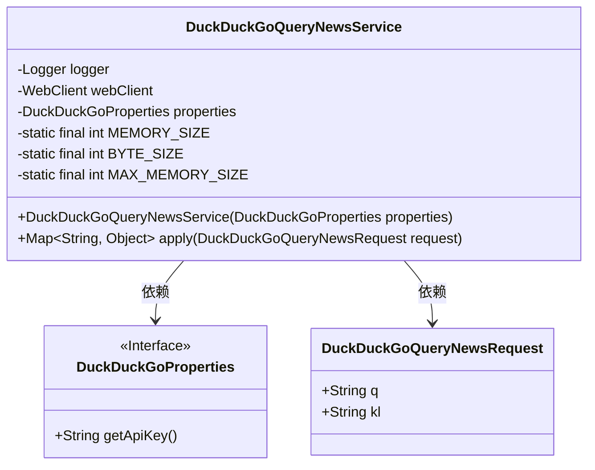
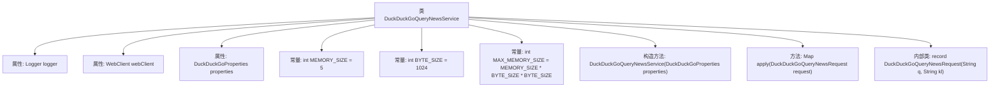
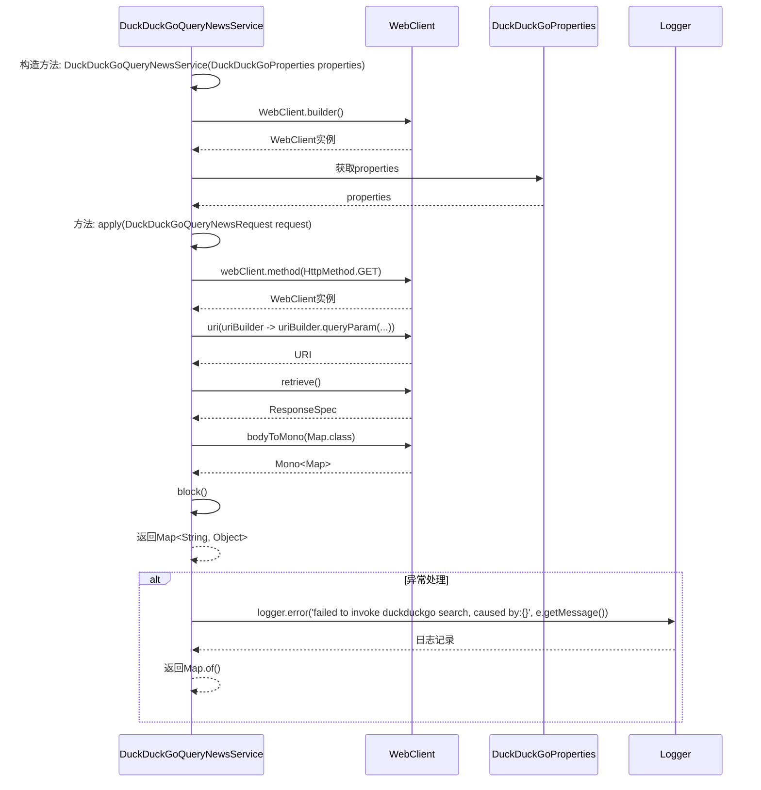

# 基础信息

|      |      |
|------|------|
| 名称 | DuckDuckGoQueryNewsService |
| 编码语言 | .java |
| 代码路径 | spring-ai-alibaba/community/tool-calls/spring-ai-alibaba-starter-tool-calling-duckduckgo/src/main/java/com/alibaba/cloud/ai/functioncalling/duckduckgo/DuckDuckGoQueryNewsService.java |
| 包名 | com.alibaba.cloud.ai.functioncalling.duckduckgo |
| 依赖项 | ['com.fasterxml.jackson.annotation.JsonClassDescription', 'com.fasterxml.jackson.annotation.JsonInclude', 'com.fasterxml.jackson.annotation.JsonProperty', 'com.fasterxml.jackson.annotation.JsonPropertyDescription', 'org.slf4j.Logger', 'org.slf4j.LoggerFactory', 'org.springframework.http.HttpHeaders', 'org.springframework.http.HttpMethod', 'org.springframework.web.reactive.function.client.WebClient', 'java.util.Map', 'java.util.function.Function'] |
| 概述说明 | DuckDuckGoQueryNewsService类使用WebClient查询并处理新闻请求，返回结果。 |

# 说明

DuckDuckGoQueryNewsService类负责通过WebClient进行新闻查询。该类处理查询请求，并将结果返回给调用方。其主要功能包括发起网络请求、处理响应数据以及返回查询结果，确保新闻信息的获取和传递过程高效且准确。

# 类列表 Class Summary

| 名称   | 类型  | 说明 |
|-------|------|-------------|
| DuckDuckGoQueryNewsService | class | DuckDuckGoQueryNewsService类通过WebClient查询新闻，处理请求并返回结果。 |

## 类 DuckDuckGoQueryNewsService

|      |      |
|------|------|
| 访问范围 | public |
| 类型 | class |
| 名称 | DuckDuckGoQueryNewsService |
| 说明 | DuckDuckGoQueryNewsService类通过WebClient查询新闻，处理请求并返回结果。 |

### UML类图

### 描述
`DuckDuckGoQueryNewsService` 是一个服务类，用于通过 `WebClient` 向 DuckDuckGo 新闻搜索 API 发送请求并获取结果。它依赖于 `DuckDuckGoProperties` 接口来获取 API 密钥，并使用 `DuckDuckGoQueryNewsRequest` 记录类来封装请求参数。`apply` 方法负责执行请求并处理可能的异常。

### 内部方法调用关系图

这段代码描述了一个名为 `DuckDuckGoQueryNewsService` 的类，该类用于通过 `WebClient` 向 DuckDuckGo 新闻搜索引擎发送查询请求，并返回查询结果。代码中定义了构造方法来初始化 `WebClient` 和 `DuckDuckGoProperties`，并实现了 `apply` 方法来执行查询请求。在 `apply` 方法中，如果发生异常，会记录错误日志并返回一个空 `Map`。此外，代码中还定义了一个内部记录类 `DuckDuckGoQueryNewsRequest`，用于封装查询请求的参数。

### 字段列表 Field List

| 名称  | 类型  | 说明 |
|-------|-------|------|
| webClient | WebClient | 私有且不可变的WebClient实例。 |
| logger = LoggerFactory.getLogger(DuckDuckGoQueryNewsService.class) | Logger | DuckDuckGo查询新闻服务类中定义了一个私有静态日志记录器。 |
| properties | DuckDuckGoProperties | 私有且不可变的DuckDuckGo属性对象。 |
| BYTE_SIZE = 1024 | int | 定义常量BYTE_SIZE，值为1024。 |
| MAX_MEMORY_SIZE = MEMORY_SIZE * BYTE_SIZE * BYTE_SIZE | int | 定义常量MAX_MEMORY_SIZE，值为MEMORY_SIZE乘以BYTE_SIZE的平方。 |
| MEMORY_SIZE = 5 | int | 定义了一个私有静态常量MEMORY_SIZE，值为5。 |

### 方法列表 Method List

| 名称  | 类型  | 说明 |
|-------|-------|------|
| apply | Map<String, Object> | 重写方法，通过WebClient发送GET请求，处理DuckDuckGo新闻查询，捕获异常并记录错误。 |

