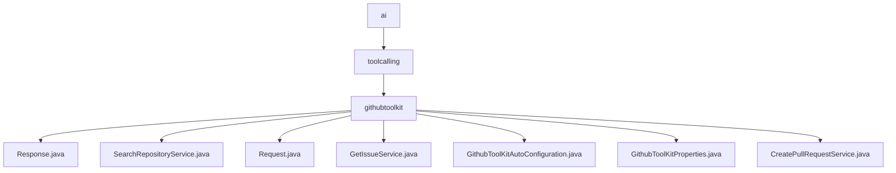

# 基础信息

|      |      |
|------|------|
| 名称 | ai |
| 编码语言 | .java |
| 代码路径 | spring-ai-alibaba/community/tool-calls/spring-ai-alibaba-starter-tool-calling-githubtoolkit/src/main/java/com/alibaba/cloud/ai |
| 包名 | spring-ai-alibaba.community.tool-calls.spring-ai-alibaba-starter-tool-calling-githubtoolkit.src.main.java.com.alibaba.cloud.ai |
| 概述说明 | 通过GitHub API实现仓库搜索、问题获取和拉取请求创建等功能。 |

# 说明

## 概述
该代码模块是一个用于与GitHub API进行交互的工具包，旨在简化开发者在GitHub上执行常见操作的过程。通过一系列服务类和配置类，该模块提供了搜索仓库、获取问题、创建拉取请求等功能，帮助开发者更高效地管理和协作GitHub项目。模块还提供了配置管理功能，允许开发者灵活设置与GitHub API交互所需的参数，如身份验证token、仓库所有者和仓库名称等。

## 主要业务场景
1. **仓库搜索**：通过调用GitHub API搜索仓库，并解析返回的JSON数据，提取关键信息以供进一步分析或使用。
2. **获取问题**：发送API请求获取GitHub仓库中的问题信息，并对响应数据进行解析，便于开发者查看和处理问题。
3. **创建拉取请求**：构建请求参数，调用GitHub API提交拉取请求，并解析响应数据，确保拉取请求的正确创建和状态反馈。
4. **配置管理**：通过配置类管理GitHub API交互所需的参数，如token、owner和repository，确保代码能够正确访问和操作指定的GitHub资源。
5. **自动化操作**：通过整合上述功能，开发者可以自动化执行常见的GitHub操作，如搜索仓库、查看问题、发起拉取请求等，提升开发效率和协作体验。

### 包内部结构视图

该流程图展示了 `spring-ai-alibaba` 项目中 `githubtoolkit` 模块的层级结构。`ai` 是顶级目录，其下包含 `toolcalling` 子目录，`toolcalling` 下又包含 `githubtoolkit` 子目录。`githubtoolkit` 目录中包含了多个 Java 文件，如 `Response.java`、`SearchRepositoryService.java` 等，这些文件分别处理不同的功能，如请求、响应、仓库搜索等。整个结构清晰地展示了模块的组织方式及其功能分布。

# 文件列表 File List

| 名称   | 类型  | 说明 |
|-------|------|-------------|
| [toolcalling](toolcalling/_module.md) | package | 通过GitHub API实现仓库搜索、问题获取和拉取请求创建等功能。 |

