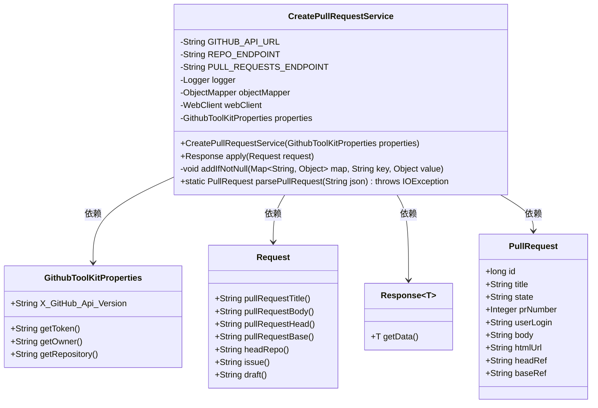
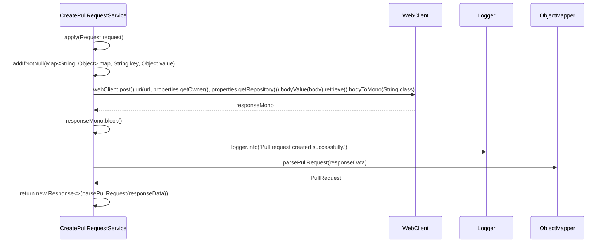

# 基础信息

|      |      |
|------|------|
| 名称 | CreatePullRequestService |
| 编码语言 | .java |
| 代码路径 | spring-ai-alibaba/community/tool-calls/spring-ai-alibaba-starter-tool-calling-githubtoolkit/src/main/java/com/alibaba/cloud/ai/toolcalling/githubtoolkit/CreatePullRequestService.java |
| 包名 | com.alibaba.cloud.ai.toolcalling.githubtoolkit |
| 依赖项 | ['com.fasterxml.jackson.annotation.JsonClassDescription', 'com.fasterxml.jackson.databind.JsonNode', 'com.fasterxml.jackson.databind.ObjectMapper', 'org.slf4j.Logger', 'org.slf4j.LoggerFactory', 'org.springframework.http.HttpHeaders', 'org.springframework.web.reactive.function.client.WebClient', 'org.springframework.web.reactive.function.client.WebClientResponseException', 'reactor.core.publisher.Mono', 'java.io.IOException', 'java.util.HashMap', 'java.util.Map', 'java.util.function.Function'] |
| 概述说明 | GitHub拉取请求服务类，处理API调用与响应。 |

# 说明

该服务类用于创建GitHub拉取请求，主要功能包括调用GitHub API以提交拉取请求，并处理API的响应。服务类负责构建请求参数，执行API调用，并解析返回的响应数据，确保拉取请求的正确创建和状态反馈。通过该服务类，用户可以自动化地在GitHub仓库中发起拉取请求，简化了操作流程。

# 类列表 Class Summary

| 名称   | 类型  | 说明 |
|-------|------|-------------|
| CreatePullRequestService | class | 创建GitHub拉取请求的服务类，包含API调用和响应处理。 |

## 类 CreatePullRequestService

|      |      |
|------|------|
| 访问范围 | @JsonClassDescription("Create a pull request operation");public |
| 类型 | class |
| 名称 | CreatePullRequestService |
| 说明 | 创建GitHub拉取请求的服务类，包含API调用和响应处理。 |

### UML类图

这段代码定义了一个 `CreatePullRequestService` 类，用于通过 GitHub API 创建拉取请求。该类依赖于 `GithubToolKitProperties` 来获取 GitHub API 的配置信息，如 token、仓库所有者等。`CreatePullRequestService` 实现了 `Function<Request, Response>` 接口，通过 `apply` 方法处理请求并返回响应。`Request` 类封装了创建拉取请求所需的参数，`Response` 类封装了响应数据，`PullRequest` 类则封装了拉取请求的详细信息。代码中还包含了对 GitHub API 的调用和错误处理逻辑。

### 内部方法调用关系图

```mermaid
graph TD
    A["类CreatePullRequestService"]
    B["属性: String GITHUB_API_URL"]
    C["属性: String REPO_ENDPOINT"]
    D["属性: String PULL_REQUESTS_ENDPOINT"]
    E["属性: Logger logger"]
    F["属性: ObjectMapper objectMapper"]
    G["属性: WebClient webClient"]
    H["属性: GithubToolKitProperties properties"]
    I["构造方法: CreatePullRequestService(GithubToolKitProperties properties)"]
    J["方法: Response apply(Request request)"]
    K["方法: void addIfNotNull(Map<String, Object> map, String key, Object value)"]
    L["方法: PullRequest parsePullRequest(String json)"]
    M["内部类: PullRequest"]

    A --> B
    A --> C
    A --> D
    A --> E
    A --> F
    A --> G
    A --> H
    A --> I
    A --> J
    A --> K
    A --> L
    A --> M
```

### 描述：
这段代码实现了一个用于创建GitHub Pull Request的服务类`CreatePullRequestService`。它通过`WebClient`向GitHub API发送POST请求，并根据请求参数构建请求体。代码中包含了多个辅助方法，如`addIfNotNull`用于向Map中添加非空值，`parsePullRequest`用于解析API返回的JSON数据并转换为`PullRequest`对象。整个流程通过`apply`方法触发，并在出现异常时记录错误日志。

### 字段列表 Field List

| 名称  | 类型  | 说明 |
|-------|-------|------|
| objectMapper = new ObjectMapper() | ObjectMapper | 初始化一个私有的静态ObjectMapper对象。 |
| webClient | WebClient | 私有WebClient实例。 |
| GITHUB_API_URL = "https://api.github.com" | String | 定义GitHub API的URL常量为https://api.github.com。 |
| logger = LoggerFactory.getLogger(CreatePullRequestService.class) | Logger | CreatePullRequestService类中声明了一个静态的Logger实例。 |
| REPO_ENDPOINT = "/repos/{owner}/{repo}" | String | 定义私有静态常量REPO_ENDPOINT，值为"/repos/{owner}/{repo}"。 |
| PULL_REQUESTS_ENDPOINT = "/pulls" | String | 定义了受保护的静态常量PULL_REQUESTS_ENDPOINT，值为"/pulls"。 |
| properties | GithubToolKitProperties | 私有不可变的Github工具包属性实例。 |

### 方法列表 Method List

| 名称  | 类型  | 说明 |
|-------|-------|------|
| addIfNotNull | void | 方法`addIfNotNull`检查值非空后将其加入映射。 |
| parsePullRequest | PullRequest | 解析JSON生成PullRequest对象，包含ID、标题、状态等信息。 |
| apply | Response | 通过GitHub API创建拉取请求，处理请求参数并捕获异常。 |

